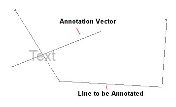
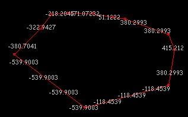
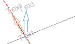
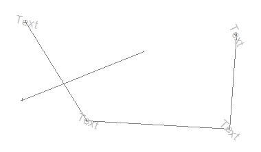

# Annotation Position

Note: These settings relate to the format of data object overlays in 2D plot projections. See [Projection Overlay Types](<../PLOTS_LOGS/Projection%20Overlay%20Types.md>).

To access this screen:

  1. Display the [Format Display](<format%20display%20dialog_overlays.md>) screen.

  2. Add a label and click **Position**.

Configure the relative positions of all specified plot label items. This screen is used to determine the relative position of the label (and if more than one item is included within the label, the label group).

To position plot sheet labels relative to their associated data item(s):

  1. Display the **Annotation Position** screen.

  2. Select a Position Relative to Point. This is the position of the label in relation to a data point.

  3. In the **Points to Label** group, determine which points on a strings are annotated:

     * Specific Points Align annotation with the start, middle or end of a string. Alternatively, select Annotation Vectors to align annotation along a separate vector. 

Note: To make use of this option, digitize an annotation vector string first so that it appears on your plot. like this.:  
  
;>)

The following options are available for positioning labels along the annotation vector string:

       * Start point

       * Mid point

       * End point

       * **Annotation vectors** At the point a previously defined annotation vector crosses the target line. This is useful for labelling intersections of string data.

       * % along Enter a percentage along the string at which to position the label.

Note: The direction of the string is important with this option.

     * Centre of Gravity Add annotation to the selected string's centre of gravity.
     * All Points Display a label at the position of each string vertex.

     * All Edges If selected, each string edge (that is, the spline between points) will be annotated. The value that is described will be the mean average for the data column that was selected on the [Reset Labels](<Format%20Display%20Dialog_Reset%20Labels.md>) screen. For example, if a string segment began at X value 0 and ended at 100, the label would be added to the X=50 position, and be described as such.

     * At intervals This setting allows you to define labels at predetermined intervals. These intervals can either be the values represented by 'real world' coordinates (e.g. 50 meters) or as a unit represented by screen distances (generally in millimeters). These mutually-exclusive options (Data units and Drawing units) are available only when At intervals is checked.  
  

  4. Choose Position Offset settings:

     * Use Horizontal and Vertical to determine a relative distance from the string 'interval point' upon which annotation is displayed. 

Note: These settings are relative to the orientation of the data on screen. For example, setting a Horizontal offset of '50' will draw annotation 50 meters (as a represented distance) to the right of the defined interval origin (which could be a vertex, edge or specific interval distance - see above). Negative values are possible; setting a negative Horizontal distance will position annotation to the screen left of the interval point and setting a negative Vertical distance will force annotation to be displayed directly below the reference point.  

     * You can either offset your labels in a direction relative to the existing label orientation (Label) or you can move them vertically or horizontally in relation to the page borders (Page). For example, in the image below, the orange arrow indicates the Label option in effect whilst the blue option represents the Page option.

  5. Choose label Rotation Angle settings:

     * Parallel The label is drawn perpendicular to the line segment (or normal of vertex) being annotated. 

       * If Follow Direction is checked, labels follow the direction of the string. This could be used, for example, to indicate the direction in to which terrain morphology is rising via contour string labels.

     * Perpendicular: Display the label perpendicularly to the target string edge.

     * Fixed Angle Enable rotated annotation. Add a value (in degrees) or use the spin buttons to specify the rotation angle.

     * Use Column If rotation data is present within the selected object's database, select the field containing those values.

     * Dip If your data object contains a numeric column containing dip and dip direction values, these can be applied to your labels. Select the column representing the dip and direction then apply it your object. 

For example, the image below represents a geological feature object with four vertices. Each vertex in the table is supported by a dip (**TEXTDIP**) and dip direction (**TEXTDIPD**) attribute. When the label is applied with these columns specified, and the **All points** option is used (see above) each label instance is oriented according to a record-specific value:  
  

     * Flip Column Add a data column to your object containing negative (-1) and non-negative (0) numbers, indicating if labels should be flipped (actually, rotated 180 degrees). Select the attribute containing the flip codes and check this option. 

Note: Negative numbers in the column trigger a 'flip' of the label at the corresponding location (if one is displayed) and any non-negative number will ensure labelling is applied without flipping. This setting will be applied in conjunction with other settings, such as offset, dip and so on.

  6. Choose the **Label Size**. Check Use Column to set the size of each label based on object attribute data values. All numeric columns of the data object are listed.

  7. Click **OK** to return to the **Format Display (Labels)** screen.

Related topics and activities:

  * [The Format Display Screen](<Format%20Overlays%20Dialog.md>)

  * [Formatting Plot Sheet Overlays](<Formatting%203D%20Objects.md>)

  * [The Labels tab](<Format%20Display%20Dialog_Overlays_Labels.md>)