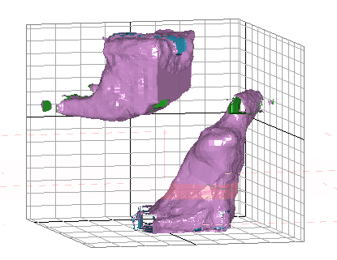
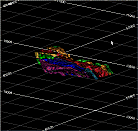
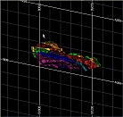
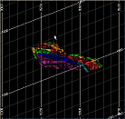
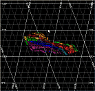
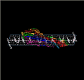
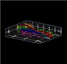
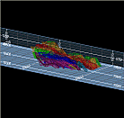
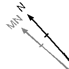

# Projection Grid Options

To access this screen:

  * Insert a grid into a **Plots** sheet projection. See 

  * Double-click a plot sheet **Grids** item anywhere in the **Sheets** or **Project Data** control bars.

  * Right-click a plot sheet **Grids** item anywhere in the **Sheets** or **Project Data** control bars and select **Grid Properties**.

### Grid Settings

Grid options are presented over the following tabs, and contain the same settings as those presented for 3D window grids.

  * **Grid Options** See [Grid Properties: Options](<VR_Grids_Options.md>).

  * **Advanced Options** See [Grid Properties: Advanced Options](<VR_Grids_Advanced_Options.md>).

  * **More Line Formatting** See [Grid Properties: More Line Formatting](<VR_Grids_More_Line_Formatting.md>).

Grids are a type of overlay, although instead of influencing the display of 3D object data, they determine how a grid displays in either a 3D window or a plot sheet projection.

### About Grids

Grids typically indicate dimensions along the axes of the data display. One of the limitations of a standard flat grid is that it is often difficult to sense or interpret the extent of a 3D data object in a direction that is not orthogonal to the view. In the past, this conundrum has been resolved by allowing non-orthogonal grids to be viewed in the Design and Plots windows, and this type of measure is a very useful aid for denoting a measurement that is perpendicular to the viewing direction. For example;

;>)

The display above shows grid lines around the 'hull' of the loaded data. You can also align grids with any world axis, or around the current section, or anywhere else.

### Grid Types

Plots window grids have additional basic types, compared to 3D window grids. This is because a projection can present data in either a 2D or 3D context, or a mixture of both with multiple projections on the same sheet. See [Sections and Projections](<../PLOTS_LOGS/alignviewwithsection.md>). As such, the **Grid Type** menu is where you should start, to define the basic type of grid you want. 

The following grid types are available:

 |  Horizontal (XY) An infinite or restricted plane in XY.  
---|---  
 |  East-West (XZ) An infinite or restricted plane in XZ.  
 |  North-South (YZ) An infinite or restricted plane in YZ.  
 |  Viewplane  Shows all activated axes, aligned to the viewplane (the view that is orthogonal to the data being viewed).  
 |  Section Plane For the currently active section, a grid is applied showing up to 3 axes. This grid is not necessarily orthogonal to the view, instead it is shown aligned to a section - meaning the grid 'plane' can be seen at a non-orthogonal angle.  
 |  3D Hull  
Show all 3 axes planar grids. Grids of this type can be infinite in 1 or more directions, or restricted to defined dimensions in any of these directions.   
 |  Custom Display a grid in any of the XYZ directions using any of the properties available.  
  
### North Arrow Grid

The [Plot Item Library](<../PLOTS_LOGS/plotitemlibrary.md>) permits you to associate a **[north arrow plot item](<../PLOTS_LOGS/NorthArrow.md>)** with a grid. This arrow, although it will always face to the north _of the grid_ , can be used to set up any directional arrow on a plot. This is possible as the default 3D grid overlay in the Plots window can be associated with an arrow plot item.

Once added, an arrow can be managed independently of the world coordinates represented by the projection. If a local coordinate system is selected for the grid, the arrow can point anywhere you like. For example, as the coordinate system of a grid can be set independently from that of the 'world', you could, if you wished, add a directional arrow to indicate both true and magnetic north, using two separate plot items.

Related topics and activities

  * [Grid Properties: Options](<VR_Grids_Options.md>)

  * [Grid Properties: Advanced Options](<VR_Grids_Advanced_Options.md>)

  * [Grid Properties: More Line Formatting](<VR_Grids_More_Line_Formatting.md>)

  * [Plot Overlays](<../PLOTS_LOGS/Plots-overlays.md>)

  * [North Arrow Plot Item](<../PLOTS_LOGS/NorthArrow.md>)