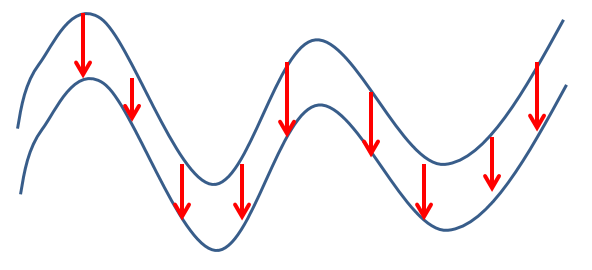
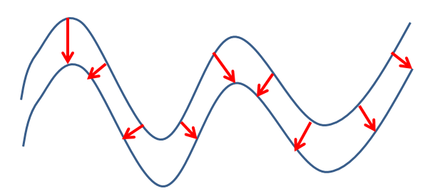
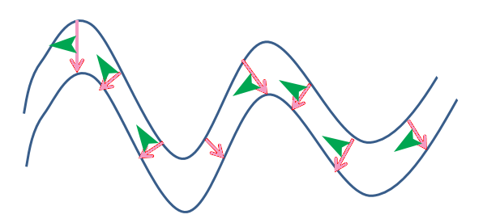
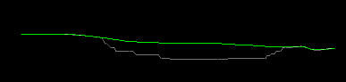
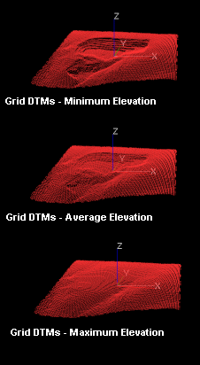
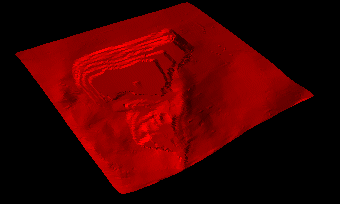

# Create Grid DTMs

To access this screen:

  * In the Command line, type and run the command [grid-dtms](<../command_help/grid-dtms.md>).

  * Use the quick key combination "grd".

Create an elevation profile, constructed from a grid of points, to highlight the maximum, minimum or average elevations of multiple wireframe objects, typically surfaces.

**Note** : In conjunction with [dtm-create ("md")](<../command_help/dtm-create.md>) , The grid-dtms command can be used as alternative to the [wireframe-surface-merge](<../command_help/wireframe-surface-merge.md>) command , providing more options as to how the surfaces are combined. However, since the grid representation may be quite dense, large triangle count wireframe surfaces may result, so it may be advisable to [decimate](<Wireframe%20Decimate%20Dialog.md>) the final wireframes.

##  Thickness and Dip Calculations

Thickness is the distance inside a wireframe from one side to the other. In some cases this may be measured within a closed wireframe, but in others multiple DTMs may represent the interfaces between different volumes. Note that sense of what is inside a wireframe is determined by the direction of the triangle the point is on. For properly verified objects, this should always underneath true DTMs, and inside of fully-closed wireframes.

Vertical Thickness This is measured directly upwards or downwards (whatever points inside the wireframe), until it hits another triangle from this wireframe, or another on the list. If no other wireframe is hit in this direction, an Absent thickness will be recorded.  
;>)  
Vertical Thickness of a Seam in Section View  

Horizontal Thickness This is measured in a direction perpendicular to the triangle, but forced to be horizontal. This distance is measured in this direction until it hits another triangle from this wireframe, or another on the list. If no other wireframe is hit in this direction, an Absent thickness will be recorded. For vertical triangles, Horizontal Thickness and True Thickness will be the same.

True Thickness This is measured perpendicularly to the triangle in 3D space, until it hits another triangle from this wireframe, or another on the list. If no other wireframe is hit in this direction, an Absent thickness will be recorded. For horizontal triangles, True Thickness and Vertical Thickness will be the same.  
  
;>)  
True Thickness of a Seam in Section View

**True Dip** This measured perpendicularly to the axis used for true thickness (see above) calculations). This can help to identify differences between geological surfaces and decide on a particular mining method, for example.

;>)

True Dip of a Seam in Section View (green arrows)

## Grid DTM Example

In the image below, two wireframe intersections are shown overlaid in a vertical section, representing an unmined topography (green) and open pit profile (grey).

The following image represents the matrix of points generated when the Combine Elevations option is set to Minimum, Average and Maximum respectively. In this example, a grid increment of '10' was used to prevent the generation of a large density of grid points:

These grid points can further used to generate a wireframe surface using the SURTRI process (either from the command line, or via Wireframes | Wireframing Processes | Create DTM. The resulting wireframe can then be used in other processes as required. Please note that the resultant surface will appear 'smoother', but may have lost some of the original definition present in the original wireframe surface. 

Activity steps:

  1. Display the **Grid DTMs** screen.
  2. Choose how points data is **Output** to a points data object:

     * _Current Object_ \- points will be added to the current points data object. This option will be disabled if there is no current object.

     * _New Object_ \- points will be written to a new points object using the object name provided.

  3. Define the orientation, origin, extents, and point spacing of the 2D grid:

**Orientation** defines the position of the 2D grid plane. **Azimuth** and **Dip** may be entered explicitly. In addition to standard axes orientations (_Horizontal_ , _North-South_ , _West-East_), the current active view _Viewplane_ (view direction) can be used, or any existing _3D Section_. See **[3D Sections](<../VR_Help/Sections.md>)**.

  4. Define the **Spacing** for the grid of points. **X** and **Y** can be set independently.

**Note** : Grid points are created on a 2D plane of arbitrary orientation in 3D space. The points then projected perpendicularly to that plane until they hit the target surfaces. The origin of the projection is always assumed to be outside of the data, regardless of where the origin point is defined. For example, a horizontal grid could be positioned below a wireframe, but points would register surfaces both above and below it

  5. By default, the grid will cover all of the target wireframes selected. However this may be constrained by selecting the Use constraints option. This allows the position of the grid **Origin** , and **Number of Points** in each direction, to be specified:
     * Origin\- the origin of the grid in world coordinates. Note that the coordinate perpendicular to the 2D grid plane is not important. For example, for a horizontal grid, the choice of Z coordinate will not have an effect.

     * Number of points \- the number of points in the local X and Y directions.

  6. Review the list of **Objects** which can be targets for the projected grid of points. Select or deselect objects that will be used to form a grid of points. The pick button is used to interactively select objects by clicking on them in a 3D view.

**Tip** : Hover your cursor over a truncated object name to display it in full.

  7. Where a projected grid point encounters more than one surface, Surface Chosen determines where the final output grid point is located:

     * Highest places each point at the surface with the greatest elevation

     * Lowest uses the smallest elevation, 

     * Average places each point at the average of the elevation encountered (e.g. half way between 2 surfaces).

**Note** : For non-horizontal planes, the same concept applies, but the distance is relative to the perpendicular of the grid orientation, and the options terminology changes to reflect that its no longer elevation-bound. For non-horizontal planes, the options are Nearest, Furthest and Average. For example, with a North-South section, the Nearest surfaces found would be the most Westerly, with the Furthest positioned more to the East.

  8. Where a grid point falls directly on a surface (i.e. the Highest, Lowest, Nearest and Furthest Surface options), the point may inherit attributes from the wireframe triangle it falls upon. Choose how to **Write Attributes** :

     * _Copy Wireframe Data_ \- If selected, this will copy all the attributes from the wireframe triangle to the grid point

     * _Vertical Thickness_ \- If selected, this will output the calculated vertical thickness of the wireframe to the user-specified field in the points object.

     * _Horizontal Thickness_ \- If selected, this will output the calculated horizontal thickness of the wireframe to the user-specified field in the points object.

     * _True Thickness_ \- If selected, this will output the calculated true thickness of the wireframe to the user-specified field in the points object.

     * _True Dip_ \- Output the dip (the angle perpendicular to the true thickness 'line'. This can help to identify differences between geological surfaces and decide on a particular mining method, for example.

See "Thickness Calculations", above.

  9. Click **OK**.

Points data is generated on a grid, in the selected object, at the elevations set.

### grid-dtms Automation

This command can be scripted. Here's an example of a Javascript function that generates a fully-constrained set of points. The supported parameters for this command are:
    
    
    // Azimuth=<decimal>              grid orientation azimuth
    
    
    // Dip=<decimal>                  grid orientation dip
    
    
    // ConX=<decimal>                 constraints origin x
    
    
    // ConY=<decimal>                 constraints origin y
    
    
    // ConZ=<decimal>                 constraints origin x
    
    
    // ConNumX=<integer>              constraints number of points x
    
    
    // ConNumY=<integer>              constraints number of points y
    
    
    // CopyWfData=[true|false]        write attributes copy wireframe
    
    
    // VertThick=<string>             write attributes vertical column
    
    
    // HoriThick=<string>             write attributes horizontal column
    
    
    // Truethick=<string>             write attributes true thickness column
    
    
    // DistMode=[first|average|last]  surface chosen distance
    
    
    // SpaceX=<decimal>               spacing x
    
    
    // SpeceX=<decimal>               spacing y

Snippet:
    
    
    oDmApp.ActiveProject.Data.LoadFile(ProjDir + "/topotr.dm");  
  
---  
      
    
    var objTopo = oDmApp.ActiveProject.Data.LastObjectAdded;  
      
    
    var vCommand = "grid-dtms ";  
      
    
    var vExtras =  
      
    
    "SpaceX=" + "5" +  
      
    
    "; SpaceY=" + "5" +  
      
    
    "; DistMode=" + "first" +  
      
    
    "; Azimuth=" + "0" +  
      
    
    "; Dip=" + "0" +  
      
    
    "; ConX=" + "6000" +  
      
    
    "; ConY=" + "5500" +  
      
    
    "; ConZ=" + "200" +  
      
    
    "; ConNumX=" + "20" +  
      
    
    "; ConNumY=" + "40" +  
      
    
    "; CopyWfData=" + "true" +  
      
    
    "; VertThick=" + "VERT" +  
      
    
    "; HoriThick=" + "HORI" +  
      
    
    "; TrueThick=" + "TRUE" +  
      
    
    ";"  
      
    
    oDmApp.ParseCommand(vCommand+vExtras);  
      
    
    var saveobj    = oDmApp.ActiveProject.Data.LastObjectAdded;  
      
    
    saveobj.SaveAsDatamineFile("Grid_Points1_Sanity", oDmApp.ActiveProject.ExtendedPrecision, true, "");  
  
Related topics and activities

  * [3D Sections](<../VR_Help/Sections.md>)
  * [grid-dtms command](<../command_help/grid-dtms.md>)