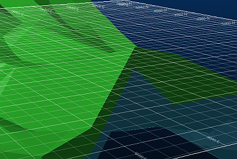

# Grid Properties

Note: A Datamine [eLearning course](<https://datamine.learnupon.com/>) is available that covers functions described in this topic. Contact your local Datamine office for more details.

To access this screen:

  * Create a new grid overlay.

  * Double-click an existing grid overlay.

The **Grid Properties** screen is used to add one or more 3D grids to the target 3D view or loaded data object. A grid can be a useful reference for data extents, or where location of data at a particular point within a grid is important. 

Grids allow the overall dimensions of a wireframe object along the X, Y and Z axes to be effectively displayed in the 3D window. Whereas 2D grids make it difficult to interpret the extents of a 3D data object in a direction that is not orthogonal to the view, 3D grids provide more visually-informative feedback of the dimensions of the object using either 3D hulls, or flat grids applied to sections.

You can apply grids independently of loaded data or grids that fit to the hull of a loaded 3D object. Regardless, an array of formatting options are available.

A default grid is available for every 3D window, but it can be disabled if required. Other grids can be added and controlled independently.

**Note:** The settings described here apply to the currently active **3D** window and all linked external windows. [Independent](<Independent_3D_Windows.md>) 3D windows are unaffected. 

The following tabs are available on the **Grid Properties** screen:

  * **Options** Define the grid type and display mode and basic line formatting. Annotation and global grid colour are defined here too.

See [Grid Options](<VR_Grids_Options.md>).

  * **Advanced Options** Define the local / world coordinates, grid constraints and labels here.

See [Advanced Grid Options](<VR_Grids_Advanced_Options.md>).

  * **More Line Formatting** Visualization options are here. You can also choose the major and minor line weight(s) and intensity(s). 

See [More Line Formatting](<VR_Grids_More_Line_Formatting.md>).

  * **Templates** Create reusable grid templates here. Useful for creating a group of related but differing grids. 

See [Grid Templates](<VR_Grids_Templates.md>).

To add a new grid:

  1. Open the **[Sheets](<Sheets%20Control%20Bar%20Overview.md>)** or **Project Data** control bar.

  2. Right-click the **Grids** folder.

  3. Select **New** and either **> > 3D Hull** grid or **> > Section** grid - see below for more information,

  4. A new grid entry (called "Grid") will appear in the **Grids** folder.

  5. Format the new grid item either by double-clicking/tapping its icon or right-clicking and selecting **Grid Properties...**

**Note:** Right-clicking a grid in the Grids folder allows you to rename, copy or delete it, as well as access the Grid Properties screen.

To change the grid type:

Grids are either of the _section_ or _3D hull_ type. 

A **section** type is aligned with the currently active section (or the default section if other sections exist) in a 3D window, for example:

;>)

A **3D hull** grid will align with the 3 visible faces of a cutaway cuboid (or a single plane, if the data is on the same plane), wrapped around a target 3D object, for example:

;>)

  1. Open **Grid Properties** by double-clicking the grid item in the control bar.

  2. Expand Grid Type and align the grid with the _Default section_ , the _< Active Section>_, or the _3D Hull_ of a loaded object.

  3. If you are setting up a 3D hull grid type, define the data:

     1. Activate **Advanced Options**

     2. In **Constraints** , align the grid with _All Data_ or a loaded data object and apply your changes.

To change the display mode of a grid:

Display Mode lets you control how a grid is presented alongside loaded 3D object data,

  * Normal displays only the areas of the grid which should be visible in the 3D world:

;>)

  * Show Hidden Lines displays all areas of the grid - areas which should not be visible in the active 3D window are shown using a broken line style:

;>)

  * Always on Top displays all areas of the grid using the same line style, regardless of whether they should be visible in the active 3D window:

;>)

  1. Open **Grid Properties** by double-clicking the grid item in the control bar.

  2. On the **Options** tab, choose the **Display Mode**.

  3. Apply your changes.

Related topics and activities:

  * [Grid Properties: Options](<VR_Grids_Options.md>)

  * [Grid Properties: Advanced Options](<VR_Grids_Advanced_Options.md>)

  * [Grid Properties: More Line Formatting](<VR_Grids_More_Line_Formatting.md>)

  * [Grid Properties: Templates](<VR_Grids_Templates.md>)