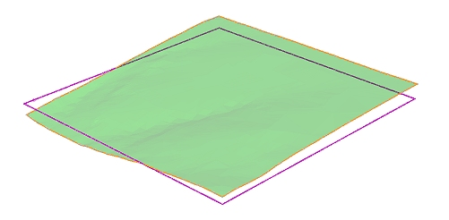

# Hull to Strings

To access this screen:

  *   * **Wireframe** ribbon **> > Plane >> Hull to Strings**.

  * Using the **[command line](<Command_Toolbar.md>)** , enter "convert-wf-hull"

  * Use the quick key combination "hts".

  * Display the **[Find Command](<findcommand.md>)** screen, locate **convert-wf-hull** and click **Run**.

Create string data from the hull (outline) of an existing wireframe object or partial object. The orientation of the plane to be used to create the cross-sectional string object is configurable.

You can either output a string that lines up with the selected plane (a "2D" boundary), or you can output a string object representing the elevation of the boundary of each point of the object (a "3D" boundary), for example, in the image below, the same topography wireframe surface has been converted to a hull string. The orange string represents the output of a horizontal projection with the Use elevation check box disabled, whilst the purple line shows the default setting, that is, projecting the boundary line to the currently active section:

;>)

This screen makes use of the [convert-wf-hull](<../command_help/convert-wf-hull.md>) command.

Due to the complex nature of this command, certain arrangements of wireframe structure can pose numerical tolerance problems when a wireframe object has not been properly 'preconditioned'. This may result in less than perfect results, but the good news is there are a couple of easy things you can do in these cases to resolve the situation:

  * Use your boolean tolerance ([Wireframe Settings](<Project%20Settings_Wireframing.md>)). This set of options can be utilized to choose how close strings points can be before they are snapped together. If you have a problem with many individual segments, you can try increasing the boolean tolerance before running the command. The actual setting is determined by the overall structure of your data set, so experiment to find the best results.

  * On occasion, when there are many faces perpendicular (or almost perpendicular) to the plane, this command may deliver unexpected results. The presence of these faces can make it very difficult to work out what constitutes an 'outside' edge, and may result in some gaps in the resulting string. In these cases, a small adjustment to the rotation of the plane (e.g. changing the Inclination from 90 to 89.5) is often enough to resolve the ambiguity in the calculations involved and allow a more integral string object to be created.

The string segments generated are planar and are generated at the average "depth" of the wireframe that is being hulled. Thus the orientation of the view plane affects the hull created but not the position.

**Note** : This command supports [**flexible wireframe selection**](<Wireframe_Selection_Concept.md>).

To create string data representing the outline of wireframe data:

  1. Ensure at least one wireframe object is loaded.

  2. Display the Hull to Strings screen.

  3. Select the relevant wireframe Object. Alternatively, select wireframe triangles (which can be in any object or objects) and choose Selected triangles.

  4. Specify the centre point of the plane (the **Plane Reference Point**) used to bisect the wireframe object to create a cross-sectional string.

  5. Set the orientation for the bisection plane using one of the following methods:
     * Choose a preset to orient the section either Horizontally, in a North-South direction or in an East-West direction through the defined Plane Reference Point. 
     * Set an Azimuth and Inclination manually to achieve a particular plane orientation.
     * Select **3D Section** and pick a section from the list. All defined sections appear here.
     * Use the current viewplane (Use View Plane) to bisect your wireframe data or select any wireframe face (a triangle), selected or otherwise, on screen that is used as a basis for creating a bisection plane.
  6. Choose **String Output** options:

     * Output a boundary string that aligns with the current section by unchecking Use elevation or create boundary that follows the 3D 'elevation' of the target object by checking it.

     * If you only want the outermost boundary to be created (this could avoid creating closed strings around internal voids, for example) you can select the Outer boundary only option. If left unselected, strings will be generated at all intersections of the input wireframe data and the defined plane.

     * Choose if you wish to generate data in the **Current object** or another (or a new one by typing a new name).

  7. Click OK to generate data based on the settings supplied. 

Related topics and activities

  * [convert-wf-hull ("hts")](<../command_help/convert-wf-hull.md>)

  * [Boolean operations](<boolean_operations.md>)

  * [BOOLEAN Process](<../Process_Help_XML/boolean.md>)

  * [Selecting Wireframe Data](<Wireframe_Selection_Concept.md>)

  * [convert-wireframe-slice-string](<../command_help/convert-wireframe-slice-string.md>)