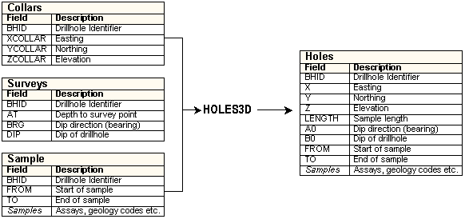

# Interpreting Drillhole Data

Drillhole data describes columns of material from specific locations with each column being fixed by its collar coordinates, and its azimuth, dip and length. In reality, a column is normally a drill core which can be analyzed along its length for rock types, assays etc.

Your application takes separate collars files, survey files (azimuth, dip etc) and sample files (assays, lithology etc. with "to" and "from" values), and, using the **[HOLES3D](<../Process_Help_XML/holes3d.md>)** process, desurveys them into a single desurveyed drillhole file.

**Note** : A surveys file is optional. If not specified, drillholes are considered vertical.

Related topics and activities

  * [Desurvey Methods](<Drillhole%20Representation%20in%20Studio.md>)

  *