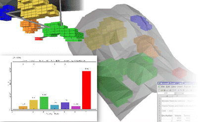

# Introducing MRO

**Mineable Reserves Optimizer** (MRO) from Datamine analyses a geological model and, using practical mining constraints, delineates optimal mineable reserves. 

;>)

It creates and evaluates three dimensional envelopes of material taking into account factors such as the minimum size, shape and orientation of the mining units, and the minimum head grade of the mined material. 

The envelopes can then be sequenced to determine the best order in which they should be extracted and the path of extraction. This takes into account both the positive value defined by the grade or dollar value of the material and also the negative value of fixed and variable costs of mining, transportation and processing.