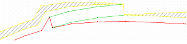
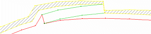

# Percentage Berm Offset

To access this screen:

  * Using the **[command line](<Command_Toolbar.md>)** , enter "road-berm-offset-percentage"

  * Display the **[Find Command](<findcommand.md>)** screen, locate **road-berm-offset-percentage** and click **Run**.

Berm tapering gradually reduces the width of the berm where the berm meets the road in an open pit design.

When used in combination with the commands berm-outside-taper-switch and berm-inside-taper-switch, this command will reduce the width of the berm where it meets the road by the supplied percentage.

You must specify the percentage of the width of the berm at the place where the berm meets the road. The default value (100%) reduces the width of the berm to nothing over its length. Supplying a value of 0% does not reduce the width of the berm anywhere.

For example:

Offset = 100%:

Offset = 50%:

Related topics and activities

  * road-berm-offset-percentage

  * berm-outside-taper-switch
  * berm-inside-taper-switch

  * road-design-string-pair

  * road-design-string-single