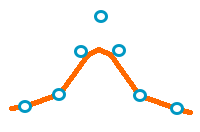
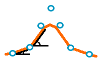
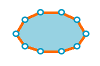
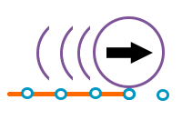
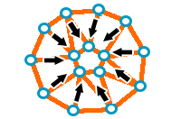
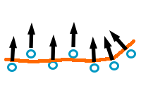
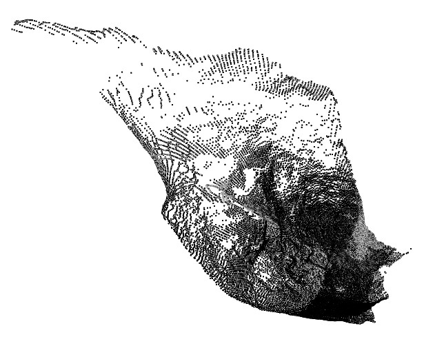
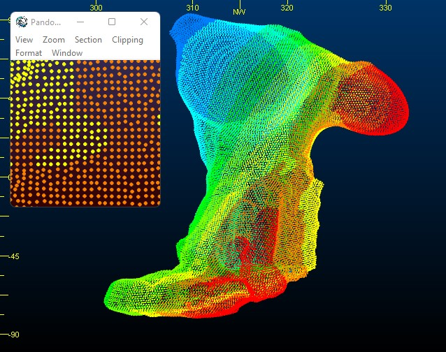
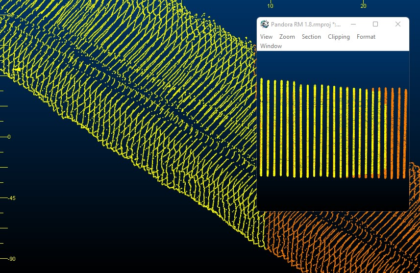
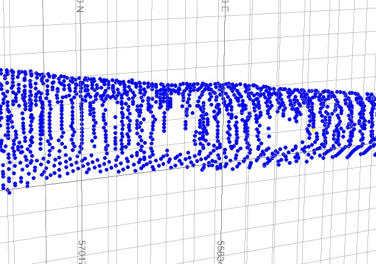

# Point Reconstruction Methods and Tips

Your application supports several surface reconstruction methods. Some require point data to include normal directions and some, which perform a Delauney triangulation, don't. In Studio products, the former use a Gaussian surface calculation to solve a 3D Laplacian system and interpolate the surface between known data points to represent obvious geometrical trends. In the latter, tesselation is performed, linking points with edges to form surface triangles. 

Your ultimate choice of surfacing method depends on the nature of your input data, which can vary significantly from one capture device, environment or project to the next.

Some surfacing options can be accessed using the **[PTCLD2WF](<../Process_Help_XML/ptcld2wf.md>)** process. One further method - the **Balanced** method - is available (along with all other methods) via the [Point Reconstruction Console](<point-reconstruction-console.md>). 

If you are familiar with Datamine processes, or just prefer to use them, the **PTCLD2WF** process provides all surfacing methods other than **Balanced** , which can only be access via the **Point Reconstruction Console**. The interactive console lets you access all surfacing options in Studio, provides scenario management, auto loading of data and other features. Generally, the interactive console is recommended for reconstructing surface data.

Which method is suitable for your data depends on a range of criteria, including:

  * Point data pattern regularity. 

  * Point data density and the extent of declustering required.

  * Extent of data 'noise', that is, errant points generated by data collection or preprocessing.

  * The general shape implied by a point cloud (e.g. a primitive-like cavity shape, such as a stope may require a different surfacing method to a grid of development drives, cubbies and so on.

  * Absolute point-to-surface adjacency requirements.

  * Processing time requirements.

### Poisson Method

This method is accessed using the **PTCLD2WF** process where _@WFMETHOD=1_. It is selected using the [**Define Scenario**](<point-reconstruction-define-scenario-screen.md>) screen of the **Point Reconstruction Console**.

This method reconstructs a surface by solving a _Poisson_ system (solving a 3D Laplacian system with positional value constraints). This method requires normal data to be associated with input points. Data that implies a relatively simple, singular mass, where data points are relatively evenly distributed, are often good candidates for this method. As an interpolative method, the generated surface may not lie precisely on all input points, instead forming a trend between points in 3D space.

This method cannot process point data without normal specifications. This method is supported by these parameters; _@DEPTH_ , _@WIDTH_ , _@SAMPNODE_ and _@PTWEIGHT_.

### Smooth Signed Distance (SSD) Method

This method is accessed using the **PTCLD2WF** process where _@WFMETHOD=2_. It is selected using the **Define Scenario** panel of the **Point Reconstruction Console**.

This method reconstructs a surface by solving for a _Smooth Signed Distance_ function (solving a 3D bi-Laplacian system with positional value and gradient constraints). Can be moderately more accurate than Poisson option but may also take longer. Data that implies a relatively simple, singular mass, where data points are relatively evenly distributed, are often good candidates for this method. As an interpolative method, the generated surface may not lie precisely on all input points, instead forming a trend between points in 3D space.

This method cannot process point data without normal specifications. This method is supported by these parameters; _@DEPTH_ , _@WIDTH_ , _@SAMPNODE_ and _@PTWEIGHT_.

### Watertight Method

This method is accessed using the **PTCLD2WF** process where _@WFMETHOD=3_. It is selected using the **Define Scenario** panel of the **Point Reconstruction Console**.

This method reconstructs a surface using a Delauney triangulation method and will generally produce a watertight volume. This method doesn't require (or use) any process parameters. If any are specified, they are ignored. Input points data can be of any arrangement and, whilst interpolation is minimized, point-to-surface adherence may still be inexact in places of sharp directional changes.

### Ball Pivot Method

This method is accessed using the **PTCLD2WF** process where _@WFMETHOD=4_. It is selected using the **Define Scenario** panel of the **Point Reconstruction Console**.

Reconstructs a surface using a Delauney triangulation method by simulation the path of a ball rolling across the input data. The only parameter used by this method is _@RADIUS_ which determines the radius of the rolling ball (with higher values tending to produce more general shapes). If any other paramters are specified, they are ignored. 

### Fast Advance Method

This method is accessed using the **PTCLD2WF** process where _@WFMETHOD=5_. It is selected using the **Define Scenario** panel of the **Point Reconstruction Console**.

Reconstructs a surface using a fast advancing front method. It can be useful for a rapidly generated initial data preview, particular where input data is dense and regularly spaced. For data that is irregularly spaced (that is, the inter-point distance varies significantly throughout the data, or clusters of outliers exist) one of the other methods is likely to produce more sensible results. It's very quick, but may be imprecise or fail to produce a sensible output for complex data inputs. No additional parameters are supported for this method.

### Balanced Method

This method is only available via the **Define Scenario** panel of the **Point Reconstruction Console**.

An optimized, rapid surfacing routine to find the optimal surface to honour input point data (declustered or otherwise). This method is not available using the **PTCLD2WF** process and uses proprietary controls for calculating normals and generating a surface. This method, whilst similar in its approach to normal calculation as the **PTCLD2WF** process, provides a few more controls to encourage normal direction, including the specification of an internal 'skeleton' from which to radiate normals outwards, which can be useful when modelling shapes with multiple implied trends and directions, such as decline scans.

Surfacing options are unique to this method, and provide a different type of control over the output surface, which is constructed using an interpolative technique, similar to the **Poisson** and **SSD** methods. As an interpolative approach, the output surface may not honour all point positions with 100% accuracy, but this may be desirable where input data is noisy or variable over small distances.

The **Balanced** method can be a good choice if other surfacing methods are unable to give you your expected result.

## Parameter Suggestions

The arrangement of points in 3D space resulting from underground scanning and monitoring systems is infinite. A surface reconstruction calculation involves interpolating the most appropriate 3D surface between those points. To achieve a satisfactory result, some guidance can be offered in the form of additional parameters. PTCLD2WF 

The following examples may help you decide reasonable starting parameters for your point reconstruction scenario.

**Note** : The **Balanced** method referenced below is not available using the **PTCLD2WF** process. It is accessed using the [Point Reconstruction Console](<point-reconstruction-console.md>).

### Banded CMS Data from Fixed Origin

This example relates to data captured from a fixed CMS, resulting in fan of survey points originating from strings of a common origin, captured at regular dip changes. For example:

In this case, data density varies across the data (dense at the origin and less so at distance). This variation in density tends to make interpolated solutions struggle; the large gaps at distance from the monitoring tool can be misconstrued as air, breaking the resulting wireframe up. 

If input point data adherence is critical, a tesselation method such as the **Ball Pivot** (but make sure your ball radius is large enough to span the largest inter-point gap) or **Watertight** options are recommended. If a smoother output is required, and a surface can pass close to, but not necessarily directly through the input points, a **Poisson** or **SSD** option may be useful.

A fixed declustering method, where an inter-sample distance or octree depth is specified, is recommended. Random declustering with non-uniform point spacing can cause unpredictable (and always unrepeatable) results.

A Balanced method may also be suitable, although this may depend on the separation of points that are far from the capture device.

### Regularly-spaced CMS Input

This example relates to a cavity scan resulting in a dense, uniformly separated points in a grid arrangement. 

In this case, the level of interpolation required is relatively low (points are never that distant from other points). As such, a Poisson (1) or SSD (2) solution is likely to provide a good result, as will Delaunay triangulation methods (3, 4 or 5).

If you're going for complete point adherence (=100% data accuracy), a triangulation method may be more appropriate, but if you want to ignore outlier or aberrant data and produce a more general (potentially smoother) result, an interpolative approach such as Poisson or SSD may be a better choice.

Any declustering method is suitable for this arrangement of input data, but as always, random declustering will produce non-reproducible results.

A Balanced method will generally provide good results with this data input arrangement.

### "Banded" Lidar Scan Data

In this example, scanned points are derived from a mobile LIDAR rig, with data captured at regular intervals along a series of drives.

This data arrangement presents a particular challenge as each 'band' of points contains very closely-spaced points, but the gap between each band is significantly wider than those within each band. A triangulate method (**Ball Pivot** , **Watertight** or **Fast Advance**) may yield better results than **Poisson** , **SSD** and **Balanced** methods as the latter calculate an interpolated solution between points (based on the normal direction of neighbouring points). As point spacing is in two different ranges (within the bands and between the bands), a single set of parameters for interpolation can produce less accurate results.

### Regular but Incomplete Data

Fixed monitoring systems can capture incomplete scenarios due to data 'shadowing' caused by obstacles within the capture zone. 

In this situation, **Poisson** , **SSD** and Balanced methods often yield good results, combined with a relatively high point weight setting (which determines how 'powerful' each point is with regards to positioning surface data). This set up may help to close unwanted gaps whilst still honouring the trend of the data. This is because points will influence surface generation out to a greater distance than if the point weight were arbitrarily low. A triangulated approach (**Ball Pivot** or **Watertight** method may also work well, as they will attempt to bridge the gap using straight edges.

## **Point Reconstruction - Tips**

The huge range of possible point file configurations makes it difficult to provide fixed rules for surfacing data, but the following general rules may help you get a good start with your reconstruction task:

  * Use the **Point Reconstruction Console** 's settings import and export facility to transfer known good surfacing parameters between systems, or set up standard surfacing setting templates for your organization.

  * You can use the **Point Reconstruction Console** to access all **PTCLD2WF** process methods (plus a proprietary **Balanced** method). If accessing process methods, you can record a **PTCLD2WF** macro in the same way as via the process screen.

  * The menu panel on the left of the **Point Reconstruction Console** lists all surfacing parameters specified so far. It updates automatically as parameters are added or changed.

  * Declustering can reduce input points and even encourage a more regular arrangement. It can significantly improve processing times. The downside is that declustering removes real world data and could be at the cost of accuracy. Declustering can be performed regardless of the surface reconstruction method.

  * If you plan to use declustering to minimize the variability of point separation through your input data, using a **Distance** option is recommended (in the **PTCLD2WF** process, this equates to @SSMETHOD=2).

  * If you want reproducible results, don't decluster using the random option. In fact, random removal of points in an irregularly spaced input points file can even cause data surfacing to fail entirely, or to generate nonsensical results.

  * Review your declustered (".._SS.dm(x)") and normal-appended ("..._N.dm(x)") points in the **3D** window to see how declustering and normalization has been performed for a run.

  * The **Fast Advance** method is the least sophisticated, and is generally the quickest. It's not suitable for irregularly-spaced input data, but may be suitable if data is denser and more uniform. Start with this method to preview how simple triangulation is performed, and decide if an interpolative or more sophisticated tesselation technique is preferable.

  * If you just want to surface between points, without interim interpolation or trend detection, a tesselation method such as **Ball Pivot** , **Watertight** or **Fast Advance** are useful. They are also relatively quick to complete and, other than method 4 (which requires a ball radius parameter) the only specifications required are the file to be processed and the name of the output surface file, unless you need to subsample your input data first.

  * **Poisson** , **SSD** and **Balanced** methods use interpolative techniques (to solve a 3D Laplacian system). These can take longer to complete than the other methods, but will consider data and its surrounding points to generate a surface along an implied trend. This can be useful where data is regularly spaced, but incomplete. Output surface data will follow the trend implied by the data points but may not necessarily honour their positions strictly. Normal information must be provided for these methods.

Related topics and activities

  * [Point Cloud Reconstruction](<point-reconstruction.md>)

  * [Point Reconstruction Console](<point-reconstruction-console.md>)

  * **[PTCLD2WF Process](<../Process_Help_XML/ptcld2wf.md>)**