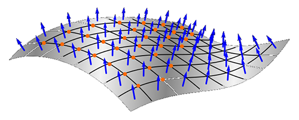
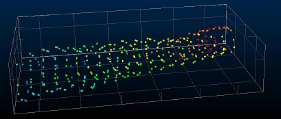
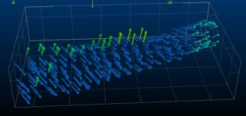
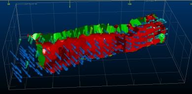
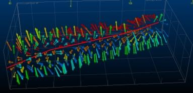
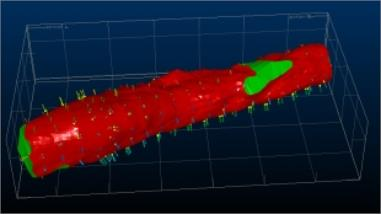

# Calculate Normals

To access this panel:

  * Display the [Point Reconstruction Console](<point-reconstruction-console.md>) and select the **Calculate Normals** panel. This panel is only accessible if an appropriate surface reconstruction method is chosen on the **[Define Scenario](<point-reconstruction-define-scenario-screen.md>)** screen, and the **Calculate Normals** option is checked.

Some of the surface reconstruction methods offered by the Point Reconstruction Console require point normal directions to be available. This information is required if an interpolative technique is chosen, such as the **Poisson** , **SSD** or **Balanced** methods. See [Point Reconstruction Methods and Tips](<point-reconstruction-methods.md>).

A 3D normal direction is defined via three additional fields (NORMALX, NORMALY and NORMALZ), added to the specified **Point cloud for normalizing**. This directional information allows the surface direction to be interpolated between known data points.

**Note** : The term 'normalizing' used here isn't strictly accurate in a mathematical sense; this doesn't refer to, and shouldn't be confused with _normalizing_ in relation to weighting values against another parameter, but instead simply means 'append with normal directional data for each axis'.

This panel is not accessible, nor is it required, if the chosen surface reconstruction method relies on triangulation between points, such as the **Ball Pivot** , **Watertight** or **Fast Advance** methods. Normal directional data is not required to triangulate points in 3D space.

Activity Steps:

*   1. Display the [Point Reconstruction Console](<point-reconstruction-console.md>).
  2. Create, load or import a scenario using the [Create Scenario](<point-reconstruction-create-scenario-screen.md>) panel.
  3. Choose a suitable reconstruction method using the [Define Scenario](<point-reconstruction-define-scenario-screen.md>) panel. Ensure **Subsample input points** is checked.
  4. If required, **[Subsample](<point-reconstruction-subsample-screen.md>)** the input point cloud.
  5. Activate the **Calculate Normals** panel.

  6. Choose a **Point cloud for normalizing**. By default, this is carried over from the **Define Scenario** panel, but can be changed.

  7. Configure point normal calculation parameters for the chosen method. The parameters available depend on the method chosen:

     1. If your surface reconstruction method is **Poisson** or **SSD** :

        * **Specify the number of points used to orient normals** : Normals are calculated in relation to neighbouring point locations. At least three points are needed to fully define the normal of each point in the collection (in 3D space). Higher values allow more points in the vicinity to be considered when calculating normals, meaning higher values can produces less undulating surfaces than smaller, more localized calculations. 

        * **Specify the radius used to compute normals** : The bigger the radius, the more points will be used to compute the local surface model, resulting in generally smoother normals but also (potentially) a longer processing time. A value of zero can be set; in this case, the radius is calculated automatically based on the density and arrangement of input points.

     2. If your surface reconstruction method is **Balanced** :

        * **Specify the number of points used to orient normals** : Normals are calculated in relation to neighbouring point locations. At least three points are needed to fully define the normal of each point in the collection (in 3D space). Higher values allow more points in the vicinity to be considered when calculating normals, meaning higher values can produces less undulating surfaces than smaller, more localized calculations. 

        * Smooth corners? If checked, an attempt is made to generate a shallower normal direction change around implied corners, essentially creating a softer edge where sharp directional changes in surface direction are implied. If unchecked, sharp directional changes are rendered as-is, potentially resulting in sharp edges in the output wireframe.

        * Internal skeleton strings selected. Studio will attempt to find a normal direction for each point that represents the optimal solution, but in some cases, the surface that is required is the result of a more subjective or intuitive process. You can use a loaded string as a basis for orienting normals within your cloud of points. 

Unique to the **Balanced** method, you can encourage normal directions by defining an internal 'skeleton' within the point cloud data. This acts as an origin for normals projected outwards from the string location to each point.

For example, the following points represent scan lines down a tunnel:

In this example, the normal direction for some points is not ideal, and could cause wireframe triangles to be created at an unexpected angle:

Without further information, the output surface is malformed: 

Selecting Pick string(s) and selecting a string in the 3D window, that lies throughout the body of the point cloud, can help 'guide' the normal creation, e.g.:

Resulting in:

  8. Confirm the **Output normals file** name and location. By default, this is the name of the input (unsampled) points file with an "_N" suffix, but can be changed.

  9. **Generate Normals File** and optionally **Auto load** and review the result.

**Tip** : Load the points file with normals and render with 3D labels oriented to the NORMALX, NORMALY and NORMALZ values to see how normal directions have been calculated for each point.

To import or export data to transfer settings between projects and systems:

  * To export the current scenario's settings, click **Export Settings** and specify an .xml file name. This file can be shared with other point reconstruction users.

  * To import previously exported settings, click **Import Settings** and select a point reconstruction .xml file.

The **Point Reconstruction Console** settings update to reflect the imported information.

Related topics and activities

  * [Point Cloud Reconstruction](<point-reconstruction.md>)

  * [Point Reconstruction Console](<point-reconstruction-console.md>)

  * [Resolve Duplicate Scenario](<point-reconstruction-import-duplicate-scenario.md>)

  * [Create Scenario](<point-reconstruction-create-scenario-screen.md>)

  * [Define Scenario](<point-reconstruction-define-scenario-screen.md>)

  * [Subsample](<point-reconstruction-subsample-screen.md>)

  * [Configure Surfacing](<point-reconstruction-surfacing-screen.md>)

  * [Calculate Outputs](<point-reconstruction-outputs-screen.md>)

  * [Point Reconstruction Methods and Tips](<point-reconstruction-methods.md>)

  * [PTCLD2WF Process](<../Process_Help_XML/ptcld2wf.md>)

  * [wireframe-create-from-points ("cwp")](<../command_help/wireframe-create-from-points.md>)