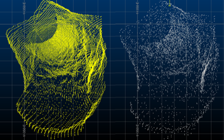

# Subsample

To access this panel:

  * Display the [Point Reconstruction Console](<point-reconstruction-console.md>) and select the **Subsample** panel. This panel is only available if a scenario has been **[created](<point-reconstruction-create-scenario-screen.md>)** and **Subsample input points** is checked on the **[Define Scenario](<point-reconstruction-define-scenario-screen.md>)** panel.

Subsampling input points for surface reconstruction can be useful where:

  * Scanned point data is excessively dense for the surface resolution you need in downstream processes.

  * Variation in point separation distances in raw (not sampled) points is causing previous reconstruction runs to produce undesirable results.

  * A large input file size would otherwise slow down processing unnecessarily.

Balancing data density and accuracy against a practical reconstruction calculation that can be completed within a reasonable timeframe is important. Data capture devices can produce unnecessarily dense or high-resolution captures where reducing the number of input points for reconstruction has trivial or no practical effect on the accuracy of the output wireframe.

An example of a raw input point cloud (left) and cubic subdivision subsampling on the right. Note the absence of data banding.

The level of subsampling, or indeed, if subsampling should be performed at all is dependent heavily on the arrangement and number of points in the raw point cloud. In some cases, subsampling can be performed during the data capture stage, so is unnecessary in your product. 

Should you choose to subsample your data, the output file is generated, by default, using the name of the input cloud plus an "_SS" suffix. However, you can change this if you want.

Once a subsampled file has been generated, it is automatically included as an input to either the **[Calculate Normals](<point-reconstruction-normals-screen.md>)** or **[Calculate Outputs](<point-reconstruction-outputs-screen.md>)** panel, depending on the reconstruction method that was chosen on the [Define Scenario](<point-reconstruction-define-scenario-screen.md>) panel.

Activity Steps:

  1. Display the [Point Reconstruction Console](<point-reconstruction-console.md>).
  2. Create, load or import a scenario using the [Create Scenario](<point-reconstruction-create-scenario-screen.md>) panel.
  3. Choose a reconstruction method using the [Define Scenario](<point-reconstruction-define-scenario-screen.md>) panel. Ensure **Subsample input points** is checked.
  4. Activate the **Subsample** panel.
  5. Choose a **Point cloud to be subsampled**. By default, this is carried over from the **Define Scenario** panel, but can be changed.

  6. **Choose a subsampling method**. This can either be:

     * **Point Distance** : Specify a target distance between points of the data set. This method is useful when trying to reduce the level of point spacing variability in your raw point cloud. Selecting this option displays the following fields:

       * **Current mean** : A read-only field reminding you of the mean average inter-point distance in the **Point cloud to be subsampled**.

       * **Distance** : Define a minimum point separation for all points to be surfaced. Where points are found to be closer than the 2D distance provided, data is removed until the distance is honoured. A higher values produces less dense subsampled points data.

     * **Target Points** : Set the number of points you want to surface. Points are removed randomly to achieve the target. Selecting this option displays the following fields:

       * **Original number** : A read-only field displaying the total number of points in the **Point cloud to be subsampled**.

       * **Target number** : The number of points you want to surface, where a lower number produces less dense subsampled points data.

     * **Cubic Subdivide** : Imagine having a cuboid that surrounds your input points. Divide it in half, then half again, and so on. Continue this over a number of iterations so your scene is full of little cuboids. Finally position a point at the centre of each cuboid and remove the other data. This method lets you specify the number of subdivisions and can be effective if trying to deal with very sporadic input point positions, with a very high variability of point spacing. Selecting this option displays the following field:

       * **Cubic subdivisions** : Specify how many times the point data hull is subdivided before assigning a centre-of-gravity point to each cuboid. Higher numbers tend to produce more dense subsampled points output.

  7. Confirm the name of the **Output subsampled file**. By default, this is the name of the input (unsampled) points file with an "_SS" suffix, but can be changed.

  8. **Generate Subsampled File** and optionally **Auto load** the result to check severity of data reduction.

To import or export data to transfer settings between projects and systems:

  * To export the current scenario's settings, click **Export Settings** and specify an .xml file name. This file can be shared with other point reconstruction users.

  * To import previously exported settings, click **Import Settings** and select a point reconstruction .xml file.

The **Point Reconstruction Console** settings update to reflect the imported information.

Related topics and activities

  * [Point Cloud Reconstruction](<point-reconstruction.md>)

  * [Point Reconstruction Console](<point-reconstruction-console.md>)

  * [Resolve Duplicate Scenario](<point-reconstruction-import-duplicate-scenario.md>)

  * [Create Scenario](<point-reconstruction-create-scenario-screen.md>)

  * [Define Scenario](<point-reconstruction-define-scenario-screen.md>)

  * [Calculate Normals](<point-reconstruction-normals-screen.md>)

  * [Configure Surfacing](<point-reconstruction-surfacing-screen.md>)

  * [Calculate Outputs](<point-reconstruction-outputs-screen.md>)

  * [Point Reconstruction Methods and Tips](<point-reconstruction-methods.md>)

  * [PTCLD2WF Process](<../Process_Help_XML/ptcld2wf.md>)

  * [wireframe-create-from-points ("cwp")](<../command_help/wireframe-create-from-points.md>)