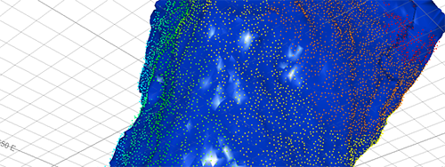

# Point Cloud Reconstruction

Reconstructing a natural surface or volume from survey scan points can be a challenge.

Your application supports several surface reconstruction methods. Some require point data to include normal directions and some, which perform a Delauney triangulation, don't. In Studio products, the former use a Gaussian surface calculation to solve a 3D Laplacian system and interpolate the surface between known data points to represent obvious geometrical trends. In the latter, tesselation is performed, linking points with edges to form surface triangles. 

Your ultimate choice of surfacing method depends on the nature of your input data, which can vary significantly from one capture device, environment or project to the next.

Some surfacing options can be accessed using the **[PTCLD2WF](<../Process_Help_XML/ptcld2wf.md>)** process. One further method - the **Balanced** method - is available (along with all other methods) via the [Point Reconstruction Console](<point-reconstruction-console.md>). 

If you are familiar with Datamine processes, or just prefer to use them, the **PTCLD2WF** process provides all surfacing methods other than **Balanced** , which can only be access via the **Point Reconstruction Console**. The interactive console lets you access all surfacing options in Studio, provides scenario management, auto loading of data and other features. Generally, the interactive console is recommended for reconstructing surface data.

Which method is suitable for your data depends on a range of criteria, including:

  * Point data pattern regularity. 

  * Point data density and the extent of declustering required.

  * Extent of data 'noise', that is, errant points generated by data collection or preprocessing.

  * The general shape implied by a point cloud (e.g. a primitive-like cavity shape, such as a stope may require a different surfacing method to a grid of development drives, cubbies and so on.

  * Absolute point-to-surface adjacency requirements.

  * Processing time requirements.

Your product offers a range of methods for surface reconstruction. These accommodate a wide range of data input scenarios. That said, some experimentation may be required, depending on the density, organization and complexity of input points. 

To make things as simple as possible, the [Point Reconstruction Console](<point-reconstruction-console.md>) offers a workflow-driven system for making decisions about how to surface your data. It's a useful tool for experimenting with different surfacing techniques to arrive at the output volume or surface you expect for subsequent processing (evaluation, model zoning, estimation, planning and so on).

Before you start, it's worth taking a look at our notes on [Point Reconstruction Methods and Tips](<point-reconstruction-methods.md>). This article provides general guidance on the kind of surfacing method and settings that may work effectively for different input point data patterns, consistency and density. 

Many of the surfacing methods are also accessible through the **[PTCLD2WF](<../Process_Help_XML/ptcld2wf.md>)** process, although if you're not familiar with Studio processes, or point cloud reconstruction in Datamine products, the console is recommended to start with. All surfacing methods, plus an additional non-process method (the "Balanced" method), are available there, and guidance is provided throughout the workflow. Another advantage of the console method is that scenarios can be created for easy retrieval of previous surfacing project settings.