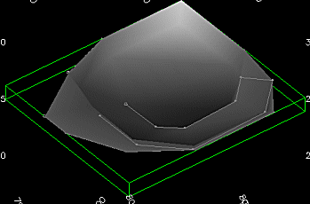
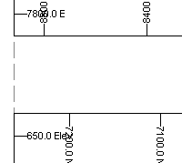

# Properties Control Bar

To show or hide this control bar:

  * **Home** ribbon **> > Show >> Properties Bar**.

  * Using the **[command line](<Command_Toolbar.md>)** , enter "toggle-properties-bar"

  * Use the quick key combination "tpb".

  * Display the **[Find Command](<findcommand.md>)** screen, locate **toggle-properties-bar** and click **Run**.

  * Right click a file in the **Project Files** control bar and select **Properties**.

  * Right click a loaded data object in the **Loaded Data** control bar and select **Properties**.

The Properties control bar is a context sensitive settings table, updated on selection of data in the various data windows of your application.

The contents of this control bar vary depending if a physical file (Project Files or Project Data control bar) or loaded data object (Loaded Data control bar) is selected. 

## Data Properties 

The following displays if a data object is selected in the **Plots** , **Reports** , **Tables** and **Logs** window.

Note: This does not affect 3D window object displays. These can be adjusted using the **[Data Properties](<data%20properties%20control%20bar%20overview.md>)** control bar (and other interactive methods).

General  
---  
Name, Object Name | The name of the currently selected item.  
Full Path | File selections only. The fully qualified path to the physical file.  
Object Type | The [data type](<filetype.md>) of the selected item.  
Description | A description of a loaded data object.  
Share |  Share data property changes with other instances of the same data in other logs, reports, tables, sheets and projections.

  * _Not shared_ Data changes are only represented in the target projection, log sheet, report or table.
  * _Within sheet_ Data changes automatically update all other instances of the data item within the plot sheet (all projections).
  * _Within document_ Data changes automatically update all other instances of the data item within all projections of all plot sheets.

  
Source | For loaded data objects, the underlying data source, if available.  
Store in document | Either _Yes_ or _No_. If _Yes_ , the data object is stored in the project file. If _No_ , the data object is stored in an external file.  
Data Table Properties (loaded objects only)  
No. Columns | The number of attributes in the selected object.  
No. Records | The number of data rows in the selected object.  
Use legend | 

  * _Yes_ indicates the specified Legend is used to colour the object. 
  * _No_ ensures the selected object is coloured using the default solid colour.

  
Tags  
[Name, value] | The name and value of the loaded object's tag.  
Color  
Column | The data attribute currently being used to colour the selected object (using the attribute's associated **Legend**), if one is used.  
Use legend | 

  * _Yes_ indicates the specified Legend is used to colour the object. 
  * _No_ ensures the selected object is coloured using the default solid colour.

  
Color | If **Use legend** is _No_ , this is the colour used to display the object.  
Legend | If **Use legend** is _Yes_ , this is the legend used to colour the object, based on the **Column** 's values.  
Appearance |   
Show bounding box |  Only applies to **Plots** window data. If Yes, a cuboid hull displays around the target data object, for example: ;>)  
Control  
Can select | 

  * _Yes_ Allow this data object to be selected.
  * _No_ Ignore this object when selecting data.

  
Snap | 

  * _Yes_ Allow this data object to be a snap target.
  * _No_ Ignore this object when snapping to data.

  
  
## Plot Sheet Properties

The following options are displayed when a Plan plot sheet is selected (not a plot sheet projection, nor projection section, nor a plot item):

General  
---  
Name | The name of the current plot sheet.  
Auto size plot | 

  * _Yes_ The plot sheet view is automatically scaled to view all plot items, regardless of their size, fitting everything into the viewing area.
  * _No_ The plot sheet scale is not automatically scaled to show all data.

  
Auto name sheet | 

  * _Yes_ Sheets are named automatically on creation.
  * _No_ Sheets must be named manually.

  
Appearance  
Size | The print media currently emulated in the Plots window. Select the drop-down list for more options.  
Page orientation | _Portrait_ or _Landscape_.  
Draw margins |  If _Yes_ , margins of the selected media are shown on the screen as guidelines, for example:   
Show printable area | Displays or hides a slashed line denoting the limits of the printable area for the selected media. Data falling outside these limits is not printed, and may result in printing errors.  
Position  
Width | The width of the sheet in mm.  
Height | The height of the sheet in mm.  
Margins  
Top | The top margin of the sheet in mm.  
Bottom | The bottom margin of the sheet in mm.  
Left | The left margin of the sheet in mm.  
Right | The right margin of the sheet in mm.  
  
## Projection Properties

When a plot sheet projection is selected, two additional ribbons appear: **Section** and **View**. These context-sensitive ribbons provide access to many of the properties listed below, but possibly in a more convenient way. Where a ribbon alternative exists, it is highlighted below.

The following options are displayed when a plot sheet projection is selected:

View Direction  
---  
Share |  If  _Yes_ , share the selected projection's view direction with other projections on the sheet. To activate this facility, more than one projection must have an equivalent **Share** status. Whenever the view direction is changed for any projection, the direction of shared projections is updated automatically.  
View Direction |  Select a preset view direction, automatically updated Azimuth and Dip values (see below).  
Azimuth | The azimuth of the projection's view direction.  
Dip | The dip of the projection's view direction.  
Align with section |  If _Yes_ , the view direction (and associated property fields) update automatically to be orthogonal to the current section definition. Otherwise, custom azimuth and dip values are used.  
View Center  
Share | If _Yes_ , share the selected projection's view center setting with other projections on the sheet with the same property status.  
XYZ | The coordinates of the centre point of the projection's view in 3D.  
Use section mid point | 

  * _Yes_ The centre point according to the section definition is used to centre the data view. Selecting this updates **XYZ** values automatically, overriding any custom values. Tip: Edit the section mid point using the [**Section Properties**](<../VR_Help/Section%20Properties%20Dialog.md>) screen, or the **Section Mid-point** settings further below.
  *   * _No_ Use the current **XYZ** values to determine the view centre point.

  
Appearance  
Opaque | 

  * _Yes_ Hide data that is 'behind' the projection.
  *   * _No_ Allow data behind the projection to be visible. This can be useful when overlaying projections or adding photos with projections overlaid.

  
Section Mid-point  
Easting | The easting of the projection's section mid point (X).  
Northing | The northing of the projection's section mid point (Y).  
Level | The level of the projection's section mid point (Z).  
Section Orientation  
Section orientation | Select a preset to update the **Azimuth** and **Dip** values below automatically.  
Azimuth | Manually override the section definition's azimuth.  
Dip | Manually override the section definition's dip.  
Section Definition  
Share | 

  * _Shared_ Share the section definition with other projections on the sheet. Any other projection that has the same setting is updated whenever the section definition changes.
  * _Not shared_ Section definition changes apply to the target projection only.
  * _Consecutive_ A method by which a projection is automatically assigned a unique section number, normally one higher than the highest recorded on the sheet. For example, if all projections were set to this value, they could be set to section definitions 1,2 and 3 (or 2,3 and 4 etc.) - subsequent alterations to section 1 would affect 2 and 3, but consecutive sections would still be shown. This is a useful way of showing sections either side of a selected central slice in multi-projection sheets.
  * _Locked_ Prevent any changes to the current section definition for the selected section, regardless of any commands run from the menu or command bar. 

  
Section Number | The index number of the current section in the section definition table.  
Title | The name of the section as it appears in the **Sheets** and similar data control bars.  
Sections Table  
Use section table | 

  * _Yes_ Use a loaded section definition table to get the section definition for the active projection.
  *   * _No_ Do not consider loaded section definition table data and form the section based on other values.

  
Section Clipping  
Apply Clipping | If _Yes_ , data is clipped outside of the current section definition's visibility corridor. See [Clipping 3D Data](<../VR_Help/Clipping-Data.md>).  
Share | Not used.  
Width | The total clipping distance (front and back combined).  
Front Clip | The distance to clip in front of the projection's section.  
Back Clip | The distance to clip behind the projection's section.  
Secondary Clipping | Choose if secondary clipping is applied or not. You can apply secondary clipping to _Both_ , _Front_ or _Back_.  
Position  
X |  The distance from the left edge of the sheet to the projection.  
Y | The distance from the top of the sheet to the projection.  
Width | The width of the projection in mm.  
Height | The height of the projection in mm.  
General One or both of these settings can be activated. For example, if both Linked and Live settings are enabled, if data is selected in one projection, it is selected in any other projection on the sheet that has a positive Linked setting, and will also force all linked views to update (if required) in order to show the selected data. By default, all projections are linked, but are not live, meaning that data selection is performed in all projections, but the view scale and direction is not updated.  
Linked | This refers to how data selection is performed in multiple projections. If two (or more) projections are linked, when you select data in one, it becomes selected in the other(s).  
Live | This refers to whether the view of data is automatically updated to show selected data.  
Scale  
Scale | The current scale ratio of the projection.  
Share | If  _Yes_ , the scale of the projection is shared with other projections within the sharing scope.  
Locked | If _Yes_ , scaling settings cannot be edited either via the control bar or interactively (in **Page Layout** mode).  
View Exaggeration  
X | The scaling factor applied to the projection in X.  
Y | The scaling factor applied to the projection in Y.  
Z | The scaling factor applied to the projection in Z.  
  
## Plot Item Selections

Plot item properties depend on the type of plot item selected. Select a link for more information:

  * [Legend Box Properties](<../PLOTS_LOGS/Legend-box-properties.md>)

  * [North Arrow Properties](<../PLOTS_LOGS/North-arrow-properties.md>)

  * [Scale Bar Properties](<../PLOTS_LOGS/Scale-bar-properties.md>)

  * [Symbol Properties](<../PLOTS_LOGS/Symbol-properties.md>)

  * [Text Box Properties](<../PLOTS_LOGS/Text-box-properties.md>)

  * [Title Box Properties](<../PLOTS_LOGS/title%20box%20frame%20properties%20dialog.md>)

**Note** : Some plot items have a location. See [Locatable Plot Items](<../PLOTS_LOGS/Locatable%20Plot%20Items.md>).

Related topics and activities

  * [3D Sections](<../VR_Help/Sections.md>)

  * [Secondary Clipping](<../VR_Help/Secondary_Clipping.md>)

  * [Clipping 3D Data](<../VR_Help/Clipping-Data.md>)

  * [Plot Items](<../PLOTS_LOGS/LogPlotitems.md>)

  * [Plot Item Library](<../PLOTS_LOGS/plotitemlibrary.md>)

  * [Data Properties Control Bar](<data%20properties%20control%20bar%20overview.md>)

  * [Customizing Control Bars](<Customizing.md>)