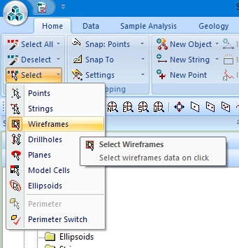
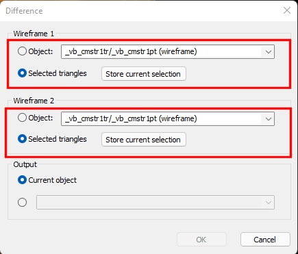

# Selecting Wireframe Data

There are several ways wireframe data can be selected in a 3D window.

Full (object) or partial selection is possible, where a subset of wireframe data can either be constrained to selected triangles, a grouping attribute value, a surface, a filter or other options, as defined on the **[Project Settings](<Project%20Settings_Wireframing.md>)** screen.

In many Studio applications you can enable or disable the selection of wireframe data entirely using Select list's _Wireframes_ option, for example.

;>)

  
You can also disable data selection on an overlay-by-overlay basis. See [Overlay Selection](<OverlaySelectionDialog.md>).

For example, you can choose to pick individual or groups of triangles, or an entire object, or only wireframe data matching the same attribute value (and which attribute), and so on. Providing a wireframe overlay is enabled in the Overlay Selection screen (it will be enabled by default when the object is loaded), wireframe data can be selected.

Once wireframe data is selected, other commands associated with wireframes, such as the boolean and plane wireframe operations, can optionally operate based on your currently selection of wireframe data, which in many cases can be either a loaded data object in full, or a subset of selected wireframe triangles.

For example, the [wireframe-difference](<../command_help/wireframe-difference.md>) command, available in many Studio products, displays the Difference screen which allows either object or selected triangle data editing for either of the inputs:

;>)

Related topics and activities

  * [Selecting 3D Data Interactively](<Selecting3DDataInteractively.md>)

  * [Project Settings](<Project%20Settings_Wireframing.md>)

  * [Project Settings:Wireframing](<Project%20Settings_Wireframing.md>)

  * [Boolean and Plane Wireframe Operations](<boolean_operations.md>)

  * [Current Objects](<Concept_Current_Object.md>)