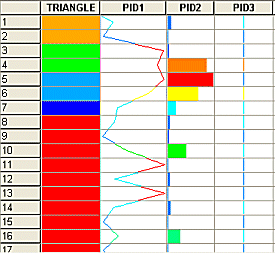
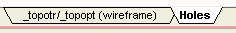

# The Tables Window

The Tables window is one of several ways in which data in memory can be represented. The content of a table is completely definable by the user and, as such, does not necessarily represent the entire contents of any source data file.

Fields may be duplicated, displayed as text or graphs or fields from more than one table source can be viewed in the same table view including composited and system fields:

A table is automatically created whenever a drillhole data source file is loaded into memory. Any data in memory can be viewed as a table but it may be necessary to create the table.

**Note** : If there is no table for some data you have loaded, it does not necessarily mean that the data is not loaded. The Data Object Manager is the easiest way to check this. See [Data Object Manager](<Data%20Manager%20Dialog.md>).

To view a table:

To view a table of loaded data:

  1. Insert a new table using the Manageribbon command Insert >> Sheet >> Table.

  2. Select a table source from the supplied screen.

  3. Enter a name for the table to contain the data selected.

  4. The Tables window is automatically displayed.

If more than one table exists in memory, you can swap between each table using the tabs at the bottom of the data window, for example:

