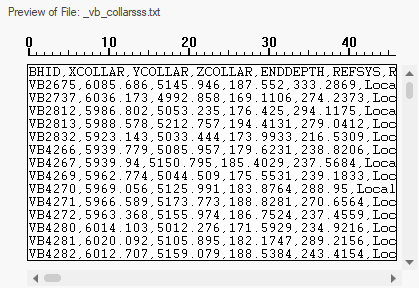
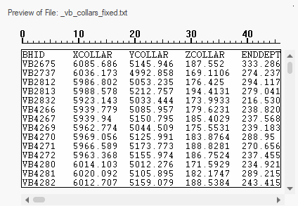
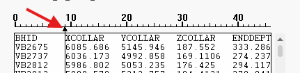

# Edit Fixed Width

To display this screen:

  1. Display the [Text Importer](<text-importer.md>) screen.

  2. Select the **Fixed width** option.

  3. Click **Edit**.

The **Edit Fixed Width** screen is used to interactively define the position(s) at which data values appear in an imported text file. 

This is only relevant to data that has a fixed width format, as opposed to data that is delimited by another character, such as a comma or space.

  * **Delimited** data values are separated by a specific character. This can be any single character (often, a comma or space), for example:
        
        VB_2567, 180.04, 299.15, 36.0, Basalt, 6
        
        VB_2567, 200.005,299.5, 11.0, Limestone, 4

With this option you can choose to either Group consecutive delimiters or not. If checked, multiple subsequent instances of the same delimiter are treated as one. For example ",,," is considered ",".

  * **Fixed width** data is stored in a columnar structure, with each data attribute value starting at a particular position in the file, for example:
        
        VB_2567 180.04  299.15  36.0  Basalt    6
        
        VB_2567 200.005 299.5   11.0  Limestone 4

With this option, you must specify the starting positions of each attribute value within the file. Do this by clicking **Edit** to display the Edit Fixed Width screen.

To set the fixed width values for an ASCII text file to be imported:

  1. Display the **Fixed Width** screen.

  2. **Preview** the file at the bottom of the screen. The starting points for all attributes should be consistent (aligned vertically) and obvious.

For example, this is an example of a comma-delimited file preview and isn't suitable for fixed width formatting:

;>)

This file is suitable for fixed width formatting:

;>)

  3. Click in the preview panel just before the value of an attribute starts. An arrow indicator appears, for example:

  4. Add arrow breaks for all attributes in the file.

Note: You can reposition existing arrows, and if you want to remove an arrow, just slide it to the left or right of another arrow.

  5. Click **OK** to return to the **Text Importer** screen. Your file is rescanned and the preview updated to reflect your fixed width specification.

Related topics and activities

  * [Text Importer](<text-importer.md>)