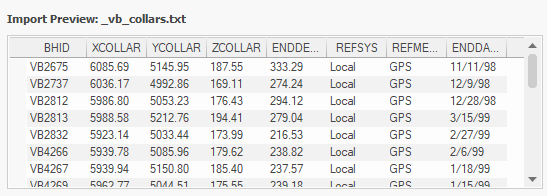
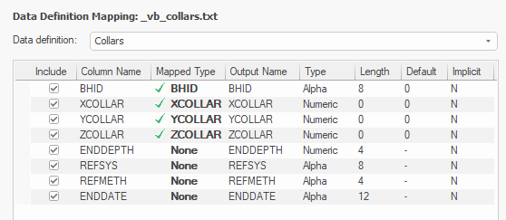
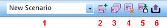

# Text Importer

To access this screen:

  * **Data** ribbon **> > Add to Project >> Text >> Multiple Tables**.

  * Using the **[command line](<Command_Toolbar.md>)** , enter "text-importer"

  * Display the **[Find Command](<findcommand.md>)** screen, locate **text-importer** and click **Run**.

The Text Importer provides configuration options to import ASCII text files.

Similar to the [Text Data Source Driver](<Text%20Wizard.md>), the **Multiple Tables** option displays the **Text Importer** screen. This lets you configure all settings for the import of text data on a single screen, including:

  * Specifying one or more text files to import (multiple files can be batched together and imported together, each with their own parameters).

  * Defining import options such as header row and on which data rows to start or end. 

  * Reading either fixed width or delimited data.

  * Decimating the import of data to read a subset of data rows.

  * Mapping imported data fields to both system and custom fields in the output Datamine file.

Before you import your file, a preview of the first 50 rows of data is available. This is useful to make sure your import settings match the data that is inbound. For example, if you are reading in fixed width table data, your width settings are reflected in the preview table as well.

;>)

The preview panel showing the first 50 expected rows of a collars file

Import information is stored in handy scenario files. These reference both the data to be imported, and the settings used to import them. You can share scenario files with others as well as making sure that, when you re-run your import to capture the latest available data, you're doing it consistently. There's more about scenarios below.

Note: If your application's default data format is ".dmx", you can import up to 2048 attributes in a file. If you are running in the legacy ".dm" mode, you can import up to 256 attributes, depending on the width of alphanumeric fields. See [Datamine File Formats](<Datamine-File-Format.md>).

The Text Importer will create a Datamine file based on your imported data and add a reference to your project, which you can then see in the **Project Files** or **Project Data** control bar. Generated files are not automatically loaded.

**Note** : You can only import data when all system (mandatory) fields for the selected **Data Type** are mapped and included in the import.

Note: Text Importer uses the **[INTEXT](<../Process_Help_XML/intext.md>)** process to import data directly from physical files. The imported file does not have to be loaded in full and so very large text files can be imported and converted in this way.

## Mapping Data

Once an import file is specified, Text Importer attempts to map the data attributes of that file to known system attribute names in Studio. For example, a borehole ID attribute, if it matches an array of known aliases, is matched to the BHID column in a collars file. 

You can map fields however you like, and to make it easier to set up required fields for a given data type, you can pick a **Data definition** in advance. The **Data Definition Mapping** table then highlights those fields that are required for Studio to recognise the selected data type. For example if you select the Collars definition, the fields **XCOLLAR** , **YCOLLAR** and **ZCOLLAR** must be mapped before you can import the file.

;>)

Data Definition Mapping table for a collars data definition

You can map both system and optional fields, and filter incoming attributes to import only the data you need for your project.

## Default Values

Default values can be specified for explicit fields (system or otherwise). In this case, the default value is set in the absence of data in the imported file. Useful for setting a default DENSITY in a block model, for example.

#### Creating New Implicit Fields on Import

You can also _create_ a new field in your imported file even if no such field exists in the source data, providing the field is implicit (the same value for all records).

For example, you may want to define a default number of cells (**NX** , **NY** , **NZ**) in the imported model where no such data exists in the incoming file (or it does exist and you want to change it, essentially reblocking the model), you can set the **Default** value for each field (say, **NX**) to the number of cells required in the X direction, but don't map the system field to a **Column Name**. This means the **NX** field is created on import, with whatever implicit value you specified.

## Model Import

Block models can be imported with the **Text Importer**. Both regular and rotated models are supported, each with their own **Data type**.

If importing a regular model or rotated model, mandatory fields must be mapped to continue (XC, XINC, and so on).

If importing a _rotated_ model, additional fields required to define a rotated model become mandatory (ANGLE1, ROTAXIS1, and so on). You can map these fields to data in the imported file if it is available, and also set a default value to use in the case of missing record data.

For any model import, you can either map or generate IJK data. If **Generate IJK values** is checked, any mapping set for the IJK field is ignored and Studio will automatically generate appropriate IJK values for your model. If unchecked, an **IJK** field mapping becomes mandatory.

Note: The Text Importer using the [IJKGEN](<../Process_Help_XML/ijkgen.md>) process to generate IJK coordinates.

If the raw data contains centroid information (that you will map to XC, YC and ZC), you will need to determine which coordinate system (world or local IJK space) these values represent. If the imported values are in world coordinates, they must be transformed to the local coordinate space for a valid model file to be formed. Choose this using the **XC, YC, ZX are in world coordinates** option, which is unchecked by default.

Note: The **INTEXT** process that powers the Text Importer controls centroid conversion using the **WORLDXYZ** parameter. See [INTEXT Process](<../Process_Help_XML/intext.md>).

## TRACE and ABSENT Data Substitution

The **Absent Data** and **Trace Data** fields allow you to detect and substitute numeric values in numeric fields, and substitute these values for the Datamine format's standard TRACE and ABSENT data indicators in numeric fields (these appear as "-" and "TR" respectively, in Datamine files).

For example, if the original text file had a series of records like this:

ALPHA1 | NUMERIC1 | NUMERIC2  
---|---|---  
alpha_a | 100 | -999  
alpha_b | -999 | 1  
alpha_c | 200 | 2  
alpha_d | 250 | 3  
  
Setting Trace Data to _-999_ and importing the file results in the following, as displayed by Table Editor:

ALPHA1 | NUMERIC1 | NUMERIC2  
---|---|---  
alpha_a | 100 | TR  
alpha_b | TR | 1  
alpha_c | 200 | 2  
alpha_d | 250 | 3  
  
_TR_ is considered by some processes and commands as a tiny but non-zero amount.

Note: You can't currently substitute alphanumeric values and import data as a numeric attribute. For example, you can't substitute values such as _TRACE_ as the import routine then considers the value invalid, and importation stops at that data record. As such, this is a known limitation, but we'll look at making this possible in a future release.

## Locked Files

To use the Text Importer, both the source and (if one exists yet) destination file must be writable. If either are open, say, in another application, you won't be able to generate an export, and one of the following warnings appears when you attempt to change the field mapping table or adjust importation settings:

"Unable to open file for reading" 

"Unable to open file writing"

(Other information also appears, indicating the location of the problematic file.

This is because, each time there is a change, the importer scans the source file to update the information shown on screen, and a check is also made to ensure an export of a DM or DMX file is possible.

To resolve this, use the "Refresh" facility:

  1. Close the open file.

  2. In **Text Importer** , click **Refresh**.

  3. Continue to configure your importation scenario.

  4. Click Import to generate a Datamine file.

## Scenarios

Data used for this tool is stored as a "scenario". This collection of parameters can be exported, imported and managed as a whole, making transfer of information between different systems easy.

Importation scenarios are managed using the toolbar at the top of the screen.

  1. Scenario selection list.
  2. Create a new scenario.
  3. Copy the existing scenario to a new one.
  4. Delete the current scenario.
  5. Import a scenario. 
  6. Export a scenario. 

**Note** : All table columns can be dynamically resized.

**Note** : Text Importer scenario files have the file extension .dminsv.

## Command Automation

You can automate the text-importer command. To do so, an existing text importation scenario file (.dminsv) must exist. You can do this by running the Text Importer tool interactively, configuring a scenario and exporting the scenario file. See Import and Export Scenarios.

If you are unfamiliar with scripting in Studio products, see [Automating Studio Products](<concept_studio%203%20scripting%20overview.md>).

Once you have instantiated a Studio application object, use **ParseCommand**() to call the **text-importer** command with a parameter string. 

Consider the following examples:

#### Re-run an existing scenario

In this example, the previously saved scenario is re-run, meaning the previously imported file or files will be reimported using the same settings:
    
    
    var params = "scenario-filename=myScenario.dminsv";   
  
---  
      
    
    oDmApp.ParseCommand("text-importer " + params);  
  
Import a new text file using the DD from the scenario

In this example, a new file is imported. The data type and mapping are derived from the specified scenario. This is useful if you have data to import that uses the same field configuration as a previously imported file:
    
    
    var params = "scenario-filename=myScenario.dminsv;textfile-paths=fullpath/myTextFile.csv";   
  
---  
      
    
    oDmApp.ParseCommand("text-importer " + params);  
  
#### Import multiple new files using an existing DD

Similar to the above, this example names two new text files to be imported, using an existing data definition and mapping:
    
    
    var params = "scenario-filename=myScenario.dminsv;textfile-paths=fullpath/myTextFile1.csv|fullpath/myTextFile2.csv";   
  
---  
      
    
    oDmApp.ParseCommand("text-importer " + params);  
  
## Import a Text File

To create a new scenario and import data from an ASCII text file:

  1. Display the **Text Importer**.

  2. Using the **Scenarios** toolbar, click **New Scenario** and press ENTER. See "Scenarios" above.

  3. In the Scenario field, edit the default name of the scenario to something appropriate.

  4. Using the Data type list, pick a data type. This determines the mandatory fields that must be mapped to import the file, allowing your application to recognize it as that type. 

Note: If you want to import the file first and set the definition later, that's fine too.

  5. Drag your source text file from Windows Explorer into the **Import Text Files** table area.

     * Summary information about the file displays in the **Import Text Files** table:

       * **Name**

       * Source  The fully qualified path to the data file being imported, either on your PC or a local network.

       * Size

       * Datamine Name  The name to be given to the Datamine file that is created. You can edit this field.

       * Mapped This is either a green tick, meaning all mandatory system fields have been mapped (manually or automatically) or a red cross, indicating that at least one system field hasn't yet been mapped.

     * Where possible, known field names are mapped to system fields for the selected **Data definition** (see above). For example, _BHID_ is mapped automatically to known borehole identification aliases in competitors' products.

     * A preview of the current data import settings appears in the **Import Preview** window. The first 50 rows are shown.

On the far right of the table, a "X" allows you to remove a file from the importation list.

Note: You aren't restricted to importing a single file. Drag as many files as you need to import into the table. You can configure each independently, and store the entire importation exercise as a scenario.

  6. Choose either a Delimiter or **Fixed width** data structure.

     * Delimited data values are separated by a specific character. This can be any single character (often, a comma or space), for example:
           
           VB_2567, 180.04, 299.15, 36.0, Basalt, 6
           
           VB_2567, 200.005,299.5, 11.0, Limestone, 4

With this option you can choose to either Group consecutive delimiters or not. If checked, multiple subsequent instances of the same delimiter are treated as one. For example ",,," is considered ",".

     * Fixed width data is stored in a columnar structure, with each data attribute value starting at a particular position in the file, for example:
           
           VB_2567 180.04  299.15  36.0  Basalt    6
           
           VB_2567 200.005 299.5   11.0  Limestone 4

With this option, you must specify the starting positions of each attribute value within the file. Do this by clicking **Edit** to display the [Edit Fixed Width](<text-importer-fixed-col-width.md>) screen.

  7. Specify how data is read from the file using **Data Lines** options:

     * Start at line All data values above this row number in the table are ignored (unless they are considered a **Header line** \- see below).

     * **Stop at line** All data rows after this are ignored. This should not be lower than Start at line (see above).

     * Header line If your data file has a row of data attribute names, specify the row number here. Commonly, this is the first line of the file (1).

     * Header to upper case If **checked** , attribute names in the generated Datamine file are upper case, regardless of their original format.

     * Decimal character Choose how numeric decimals are separated from integers (either _Dot_ or _Comma_). This is important if your data sources are international.

     * Quote for strings If incoming alphanumeric data is wrapped in, say, speech marks, select the character here. 

     * Comments If your incoming file contains comments, these are typically prefixed with a special character (often, "#"). If selected, lines starting with the selected character are ignored.

     * Incremental records By default, all records in the file are imported if possible. This equates to an incremental setting of 1 (which is the same as unchecking this option). Increasing this to 2 dictates that every other row is read, or 3 to read every third record and so on. 

Note: This can be useful to decimate large data, such as a dense point cloud, for example. You can also decimate and decluster data after import using other commands and processes.

  8. Choose how **Special values** are treated during import:

     * Absent data  Check to pick a character that represents absent data from the source file. This data is substituted with Datamine's absent data character ("-") during import.

**Note** : The value can be either an integer code (0=no quotes, 1=double quotes, 2=single quote) or a single character. Any column delimiter found inside a quoted string will be considered as a normal character. Multiline strings are not supported.

     * Trace data If a particular value indicates a trace numeric value (non-zero but tiny), check and pick a value. This is substituted with the Datamine trace() data indicator on import.

  9. Review the **Data Definition Mapping** table and map fields as required.

     * For non-system fields, check or uncheck **Include** to either add or exclude the attribute from import. 

Note: System fields for the selected **Data definition** must be mapped, and cannot be excluded.

     * **Column Name** The name of the incoming data field and can't be edited.

     * Mapped Type The type of system field represented by **Column Name** (see above) in the generated Datamine file. Use this list of values to map the incoming attributes to required system fields. If all system fields are already mapped, the list only contains _None_.

     * Output Name The name of the mapped field in the output file. By default, the imported attribute name is copied. This cannot be changed for system fields.

     * Type   _Alpha_ or _Numeric_.

     * Length  For alphanumeric fields, the maximum length of values permitted for the imported attribute.

     * **Default** The default value of the field.

     * Implicit  Either _Y_ (meaning a constant value exists throughout the file) or _N_ (explicit, values can be different for each record).

  10. If you are importing block model data, consider checking Generate IJK values to ensure the model can be loaded correctly after import.

Note: Checking this also orders the imported data by ascending IJK value, as required by Studio products.

     * For rotated models, you can also choose how centroid values are treated during the import process. Centroid values in the original file may not be coordinates in the local IJK space. Use XC, YC, ZC are in world coordinates to control how they are interpreted:

       * If **checked** , centroid values are converted from their current world coordinates to the local coordinate system during import. Local coordinates are expected for Datamine models.

       * If **unchecked** , centroid values are imported as is, without conversion.

See Rotated Model Import, above.

  11. If the **Import Preview** looks OK (use the scrollbars to look at all the fields, particularly if you are using the **Fixed width** option), click Import to begin the import process.

The **Text Importer** screen remains displayed during import, but closes once import is complete.

**Note** : You can only import data when all system (mandatory) fields for the selected **Data Type** are mapped and included in the import.

  12. Review your imported file in the **Project Files** or **Project Data** control bar.

From here, you can load and process your imported file.

## Import and Export Scenarios

To export the current session details as a scenario:

  1. Configure and complete the import of one or more text files and review the results.

  2. Using the **Scenarios** toolbar, click **Export scenario**.

  3. Select a folder and file name and click **Save**.

**Note** : Text Importer scenario files have the file extension .dminsv.

To import a scenario:

  1. Export a scenario (see above).

  2. Using the **Scenarios** toolbar, click **Import scenario**.

  3. Locate a previous exported text importation scenario (.dminsv) and click **Open**.

The previously saved settings display.

Related topics and activities

  * [Edit Fixed Width](<text-importer-fixed-col-width.md>)

  * [text-importer](<../command_help/text-importer.md>) (command)

  * [Data Import](<data%20import%20dialog.md>)

  * [Datamine File Formats](<Datamine-File-Format.md>)

  * [Text Wizard](<Text%20Wizard.md>)

  * [Projects and Data](<Projects-and-data-concept.md>)

  * [Project Options](<Options_Project.htm.md>)