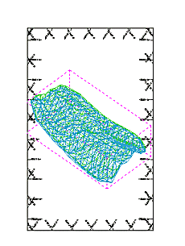
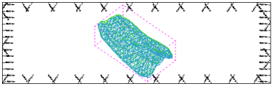

# Size/Scale

To access this screen:

  * Display the [**View Settings**](<Section%20Definition%20Dialog.md>) screen and click the **Size/Scale** tab.

Set scaling properties for the current projection. Scaling doesn't affect data values, only the view of the data.

You also use this screen to define the outer boundaries of the data that the plot projection represents. This is done by defining a cube, outside of which, data is ignored. This is set automatically to the maximum extents of all loaded data, but it can be confined to improve performance.

It is also possible to change the width and height of the projection plot item here.

To set size & scale settings for a projection:

  1. Display a plot sheet containing at least one projection, and select the projection.

  2. **(Plots) View** ribbon >> **Set**.

The **[View Settings](<Section%20Definition%20Dialog.md>)** screen displays.

  3. Display the **Size/Scale** tab.

  4. Choose if the projection and data adjust as changes are made, or not:

     * If **Dynamic** is checked, changes to this screen automatically update the projection and contents.

     * If **Dynamic** is unchecked, changes are only seen when **OK** or **Apply** is clicked.

  5. Set or adjust the size of the projection by altering the **Data Area** **Width** and **Height** values.

This has the effect of scaling data by shrinking or stretching the outlying frame surrounding the data, scaling the data appropriately. For example, a sheet with a data area width of 200 mm, and a height of 150 mm is affected in the following ways:

     * setting a Width of 100mm causes the overall scale to be set at 50%:  

     * setting a Height of 75 mm, with the original 200mm width, causes the scale to be set to 50% as above, but the frame box is a different shape:  
  

**Tip** : It can be useful for **Dynamic** to be checked when adjusting these values, as the projection adjusts as changes are made, which is useful for fine-tuning a layout.

  6. Set the **Total Data Extents** by defining a cube use 6 coordinates (2 sets of X, Y and Z). This doesn't change any data values. Only the view is affected (if data is truncated).

  7. Define the scale of the projection, either by entering a **Scale** value (1:) or with the slider bar.

**Note** : You can also use **Lock Scale** to disable the scale controls.

  8. Click Fit to Page to set the current scale to fit all loaded data the current projection boundary. 

Related topics and activities

  * [View Settings](<Section%20Definition%20Dialog.md>)

    * [Section Definition](<../PLOTS_LOGS/CustomSections.md>)

    * Size/Scale

    * [View Rotation Settings](<../PLOTS_LOGS/Plots-ViewSettings-Rotate.md>)

    * [Section Width Settings](<../PLOTS_LOGS/Plots-ViewSettings-SectionWidth.md>)

    * [Projection Exaggeration Settings](<../PLOTS_LOGS/Plots-ViewSettings-Exaggeration.md>)

  * [Sections and Projections](<../PLOTS_LOGS/alignviewwithsection.md>)

  * [Projection Overlay Types](<../PLOTS_LOGS/Projection%20Overlay%20Types.md>)

  * [Add a Sheet or Projection](<../PLOTS_LOGS/insertsection.md>)

  * [Section Definition](<../PLOTS_LOGS/CustomSections.md>)

  * [Clipping Plots Data](<../PLOTS_LOGS/ClipView.md>)

  * [Zoom, Scale & Pan](<../PLOTS_LOGS/Zooming.md>)

  * [Align Sections](<../PLOTS_LOGS/alignsection.md>)