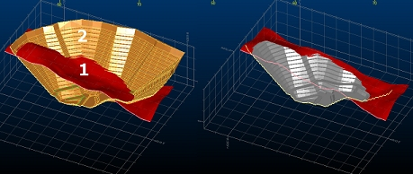
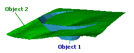
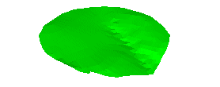
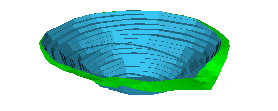
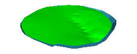

# Update DTM

To access this screen:

  * Using the **[command line](<Command_Toolbar.md>)** , enter "wireframe-surface-merge"

  * Use the quick key combination "udt".

  * Display the **[Find Command](<findcommand.md>)** screen, locate **wireframe-surface-merge** and click **Run**.

Perform a surface operation to update one wireframe DTM surface (or partial surface) with another. It is also known as the "Update Hull" command.

This function generates a new surface using the second wireframe data to update the surface elevation in preference to the first. The resultant surface area is the union of the first and the second wireframe surface, so there is no restriction that the second surface be bounded by the first.

The operation of the command can be likened to using a cookie cutter at the boundary of the second surface to cut out the first surface, and inserting the second surface into the first. Where there is a gap at the interface between the first and second surface, the gap is closed off with triangles, modelling the cut and fill relationship between the two surfaces.

Consider the image below, showing a cutaway view of a topography (first surface) and pit bowl (second surface):

;>)

The image on the right shows the cutaway result of running the Update DTM command.

Provided the second surface is bounded by the first the cut and fill wireframe solids can be generated by projecting the two surfaces with the [wireframe-surface-project](<../command_help/wireframe-surface-project.md>) command to an elevation beyond the range of the two surfaces, and then completing wireframe- difference and [wireframe-intersection](<../command_help/wireframe-intersection.md>) operations on these surface solids as follows:

  1. project the first surface data down to the lower elevation (A)

  2. project the second surface data down to the lower elevation (B)

  3. project the second surface data up to the upper elevation (C)

  4. create the fill wireframe as the difference B minus A

  5. create the cut volume as the intersection of C and A

If the surface bounded by one or more closed strings is required, this can be found by the following sequence of operations:

  1. project the strings up and down to elevations beyond the range of the surface

  2. link the upper and lower strings into a single wireframe group

  3. intersect the original surface with the string surface(s) using the wireframe-merge command

  4. delete the string wireframe surfaces, and the components of the original surface within or outside the strings as required.

If instead of the complete result of the [wireframe-surface-merge](<../command_help/wireframe-surface-merge.md>) command it was sufficient to replace the first surface with the second in the region of overlap then the [wireframe-verify](<../command_help/wireframe-verify.md>) command could be used to generate the boundary string at the limit of the second surface, and then the previous command sequence could be used to do the cookie cutter operation on the first surface before adding the second. The surfaces are not guaranteed to be coincident on the boundary with this method.

Additional controls are available to manage how the source DTM is modified with respect to whether it is 'dug out' or 'raised' according to the interaction of the two surfaces. These options are explained in detail below.

To update a DTM with another DTM:

  1. Load the wireframe data to intersect. This can be open or closed.

  2. Run the **wireframe-surface-merge** command.

  3. Choose a loaded wireframe object for **DTM 1** (the default is the current object) or selected wireframe triangle data (Selected triangles). You can select triangle data whilst the **Update DTM** screen is displayed. See [Selecting Wireframe Data](<Wireframe_Selection_Concept.md>).

**Note** : if choosing **Selected triangles** , only selected wireframe data is used to generate intersection strings. 

  4. Choose the data to use for **DTM 2**. As above, object data or selected triangles can be used.

  5. Choose which DTM should act as the 'modifier', using the following **Options** :
     * Excavate DTM 1 with DTM 2: the elevation of **DTM 1** is set the minimum of its current elevation, or the elevation of **DTM 2**.
     * Elevate DTM 1 with DTM 2: the elevation of **DTM 1** is set to the maximum of its current elevation, or the elevation of **DTM 2**.

For both Excavate and Elevate options, if a jump between elevations on an open edge of object 2 causes a break in the resultant surface, this gap is filled with vertical triangles. 

Note: the two options are not exclusive, and if both are selected, the elevation of **DTM 1** is the same as the elevation of **DTM 2** wherever they overlap in the XY plane. This is the default setting as it matches legacy behaviour for this function.

Consider the following examples, where a surface topography and pit DTM are loaded into memory. Object 1, in this case, is the pit and Object 2 is represented by the topography:

Options| What Happens| Result  
---|---|---  
Excavate Option SelectedElevate Option Selected| The elevation of the pit is set to be the same as the topography (object 2) wherever they overlap. The resulting DTM represents the overall boundaries of the pit, but with each point snapped to the topography.The attributes for the resulting object, in this case, are taken from the topography, as each point on the merged object is derived from that surface.|   
Excavate Option SelectedElevate Option Disabled| The elevation of the pit DTM is set the minimum elevation represented by both objects. In effect, the points of the pit wireframe are 'dropped' onto the nearest available surface, resulting in an object that matches the boundaries of the pit, but the minimum possible elevations.Note in the example how a mixture of both pit and topography values are used to represent the merged object, hence both attributes are shown.|   
Excavate Option DisabledElevate Option Selected| As above, but maximum values for elevation are used when both objects are taken into account.Again, note how points for the new merged object are derived from both original DTMs, so both attributes are represented.|   
  6. Create **Output** data either within the Current object, an existing wireframe object (pick it from the list) or a new object (type a new name).

  7. Click **OK**.

Related topics and activities

  * **[wireframe-surface-merge](<../command_help/wireframe-surface-merge.md>)** (command)

  * [Volume between DTMs](<Wireframe%20Volume%20between%20intersecting%20DTMs.md>)

  * [Volume under Intersecting DTM](<Wireframe%20Volume%20under%20Intersecting%20DTM%20Dialog.md>)

  * [Wireframe Project to Plane](<Wireframe%20Project%20To%20Plane%20Dialog.md>)