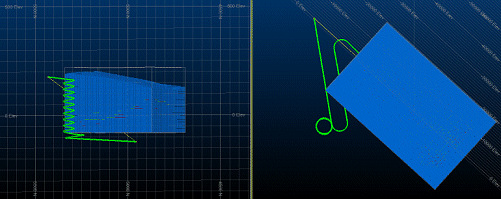

# Exclusion Zones

To access these controls:

  * Display the [Decline Optimizer](<DeclineOptimizerDialog.md>) screen and select the **Path Control** tab.

Define those areas where decline points are prohibited during optimal decline generation.

Two types of exclusion objects can be specified; strings or block models. Points on the decline are tested to see if they would violate the barrier. A Distance increment for barrier test is used to define the frequency along the decline with which points are tested for violating the barrier.

If string objects are used the decline points are rejected if they are within the perimeters contained within the string object. The test is made in the XY plane.

If model objects are used the decline points are rejected if they are within model cells. Only the major cell size of the model is used. If a sub cell exists at any IJK location then that IJK location is considered to be filled by a full cell for the purpose of barrier testing.

For example, the image below shows a (deliberately simple) example of how a spiral decline has been calculated, using the input model (shown as blocks) as an exclusion zone (in this scenario, spirals have been permitted):

;>)

Related topics and activities

  * [Decline Optimizer Introduction](<DeclineOptimizerDialog.md>)