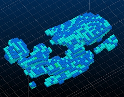

 |  MSO - Block Model Guidance Providing the ideal input to MSO  
---|---  
  
# MSO - Information on Input Block Models

The following discusses the general block model requirements and good practice for data that is input to Mineable Shape Optimizer (MSO).

The block model must spatially represent the location of the mineralization.

Regularised models that use a percentage populated field are not applicable for MSO. These models however can be converted by over-printing cells filled within the mineralization wireframe(s) over the regularised model to create a sub-celled model. The cell size and the level of sub-celling used in the block model will determine the precision of the orebody representation.

Models should ideally have an enclosing envelope of waste cells modelled around the mineralization. The surrounding waste is required for cases where a sub-stope may be mined adjacent to a full stope using waste pillar criteria (an MSO requirement). If sub-stopes are not required, then non-mineralized waste cells can be filtered from the block model to reduce run times.

Models should ideally avoid absent data (e.g. -), especially for the DENSITY field, the cut-off evaluation field or any other reported field(s). For the situation where cells have absent values or where cells are missing from within the stope-shape, the default value supplied for each field is applied. Careful consideration is required regarding the default values selected, especially regarding the optimization field. For example, if the optimization field is a metal grade field then zero may be appropriate, but if the optimization field is a value field (e.g. net smelter return dollar value) then a negative number representing the cost to mine (and process) waste may be more appropriate than a zero value.

The block model cell size should ideally correlate with the definition of the mineralized zone such that several cells define the stope width (XZ/YZ strike orientation) or stope height (XY/YX plan orientation). One or two cells representing the stope width/height would generally be too coarse to represent the ore-body grade distribution.

The model must have definitions for the size and number of cells, origin and optional rotation (if applicable) and be able to be expressed with the Datamine Studio model definition conventions.

The model definitions used internally by MSO are the set of fields [IJK, XC, YC, ZC, XINC, YINC, ZINC, NX, NY, NZ, XMORIG, YMORIG, and ZMORIG], which coincide nicely with the default fields generated for a Datamine block model.

For rotated models, the optional rotation fields [X0, Y0, Z0, ANGLE1, ANGLE2, ANGLE3, ROTAXIS1, ROTAXIS2, and ROTAXIS3] are also used internally by MSO. The rotation point [X0, Y0, Z0] used is at the origin of the model. Again, these model fields are generated by default using Datamine products.

 |  Related Topics  
---|---  
| [MSO Introduction](<MSOv3_default.md>)