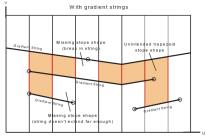
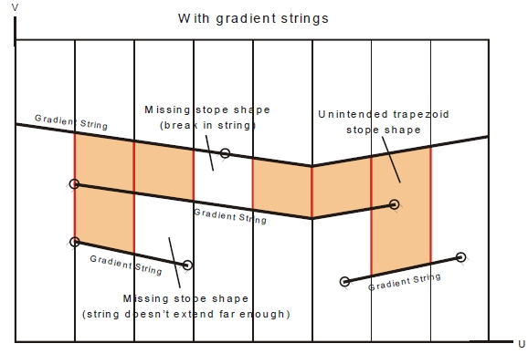
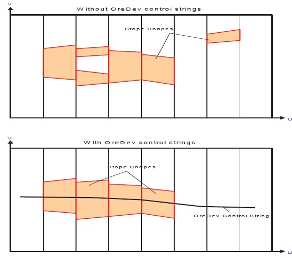

 |  MSO Control Strings Using string data to control stope shape generation  
---|---  
  
# MSO Control Strings

   

Control strings provide additional constraints on the shape or position of a stope. This can be dictated in one of two ways:

  1. Where the string projection in the UV plane is used to define the face shape, or
  2. Where the string position in the W dimension controls the position of the stope.

An example of (1) would be to allow gradients on levels, and an example of (2) would be to control the position of stopes and pillars.

The best location for these control strings will only be known after a preliminary run without control-strings has been completed.

A multiple optimization run approach should be used to guide the optimal placement of the control-strings. In the first pass, a regular optimization can be completed without the control strings. The first pass result is then used to guide the location of the control strings, and a second optimization run is conducted to define the stope-shapes that honour the control-strings. Alternatively, in cases where level development data already exists, control strings may be created from that information.

Control strings can be supplied for each of the framework orientation cases as detailed below.

  
Orientation Frameworks

Control-string functions for XZ | YZ orientation frameworks, and for XY | YX frameworks, both of which extend along the U-axis.

  
Gradient Control Strings

The gradient control string is used to define the gradients of levels along the orebody strike axis (variable V-axis). The strings would typically be used for orebodies with an extensive strike length, such that the difference in elevation from the level access point to the level strike extremity is significant. The gradient control-string will change the framework geometry, as shown below:

A stope face is created where a pair of gradient strings intersects adjacent sections. Ideally the control-strings should have the same orientation as the stope-framework U-axis.

Care is required to ensure that adjacent strings extend to intersect all sections. This will avoid unintended trapezoidal shapes, or unintended gaps, as shown below:

Gradient control strings are specified during level definition, using the [Shape](<MSO3_Shape_Shape_Framework_Settings.md>) panel.  

  
Ore Development (OreDev) Control Strings

The OreDev control-string is used to define level layouts on fixed elevations (horizontal gradient) using development centrelines.

A stope cannot be created unless its floor is located on a control string, and a stope floor cannot be located on more than one control string.

 |  OreDev strings do not change the framework, and should be added as an option to a second-pass run. The strings are typically used to control the location of stopes and pillars from section to section. They define practical level layouts by constraining the transverse lateral extents of stope-shapes for parallel lodes (i.e. W-axis direction). The strings can also be used to constrain the strike extents (U-axis) to say remove strike outliers.  
---|---  
  
The seed / annealed stope-section-ends lying at floor level must straddle the string in order to be accepted. The strings ideally run along the floor of the stopes (but if above, they will be projected to the floor position) and assume horizontal levels. The intent of this control-string is to remove transverse pillars and transverse outliers. They may be used for dropping out irregular pillars. This function may combine transverse stopes, creating more practical but less optimal stope-shapes. You can see an example of this in the image above.

Ore Development control strings are specified during level definition, using the [Shape](<MSO3_Shape_Shape_Framework_Settings.md>) panel.

 |  Related Topics  
---|---  
| [MSO Key Shape Concepts](<MSO3_Shape_Diagram.md>)   
[Slice Method Overview](<MSO3_Slice_Method.md>)   
[MSO Shape Frameworks](<MSO3_Frameworks_Concept.md>)   
[MSO Tips and Guidelines](<MSO3_Tips.md>)   
[MSO Block Models](<MSO3_BlockModels_Guidance.md>)   
[MSO Angle Conventions](<MSO3_Framework_Angles.md>)   
[MSO Rotated Frameworks](<MSO3_Rotated%20Frameworks.md>)  
  
Copyright Datamine Corporate Limited  
JMN 20045_00_EN