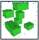
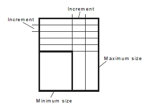
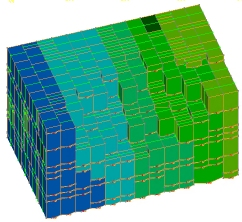
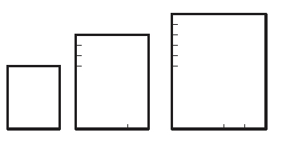
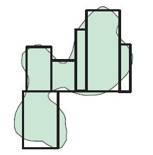
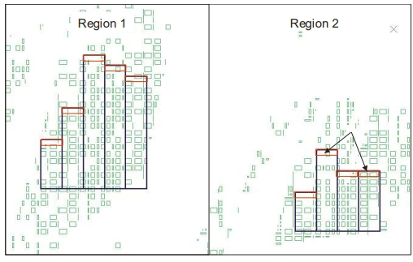
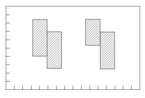
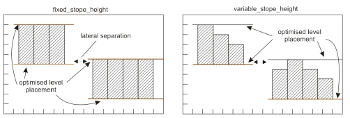
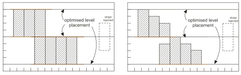
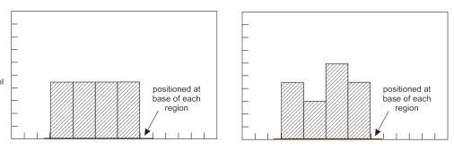

 |  MSO - Controls - Prism Method Prism method shape framework controls  
---|---  
  
# MSO - Controls - Prism Method

### To access this dialog:

  * Using the MSO ribbon, define a prism shape framework and and select Controls.

The Controls panel, part of the MSO workflow, is used to define the base geometries for stope shapes to be created. 

This topic covers the stope shape generation controls relevent to the [Prism](<MSO3_Prism_Method.md>) method.

Prism Method Controls

For a [Prism](<MSO3_Prism_Method.md>) method, this panel is used to define the axis increments and either to specify the stope shape dimensions for each of the U, V and W axes, or to define a list of stope shape dimensions in tabular form.

This section contains the following areas:

  * Axis Increments
  * Stope Layout
  * Sub-Level Definitions
  * Waste Pillar Separation

Axis Increments

Define a grid increment in the U, V and W directions.

Prism frameworks are not orientation specific but the intervals must be regular. A grid increment is also defined for each axis, within regions (i.e. sub-set volumes of the total Prism framework). Shapes from the stope-volume library will normally have dimensions that are an integer multiple of the grid increment and can result in stopes located at any grid increment.

The full framework definition may contain several regions that may be independent or contiguous abutments. This could be likened to a mine-site with mine sub-districts / areas / zones. The framework region(s) however must be rectangular in shape. Regions are user-defined to make stoping geometric sense e.g. to span a group of levels or to span a group of sections or to span a group of levels and sections. The library of stope-volumes is applied to each region in turn with each region optimized independently. One use of regions is to force stope-volumes to honour say a regular level spacing or a regular section width (i.e. regular primary and secondary stopes).

The framework region(s) are further defined by regular grid increments in the UVW axes. This allows stopes-volumes to position with the bottom left hand corner at any grid increment, providing the stope-volume completely fits into the region. This "gridding" provides a stope framework for floating stope-shape volumes within each framework region.

Stope Layout

There are two available options:

  * Stope Shape Dimensions: the stope-shape sizes in the stope-shape library can be specified quickly by using the Minimum and Maximum size and step increments for each axis - note that the minimum must be a multiple of the Axis Increment for the same axis.  
  
This method, selecting a stope by a range specification, is represented by the image below:  
  
  
  
In the following example, a stope layout with the following range specification is created:

  *     * U: Min: 10, Max: 20, Axis Step: 10

    * V: Min: 10, Max: 20, Axis Step: 10

    * W Min: 10, Max: 20, Axis Step: 10

Colored according to stope number, the output wireframes are as follows:  
  

Using the same input model and keeping all other parameters as above, but doubling the Maximum size in all 3 axes, and doubling the Axis Step value, e.g.:

  1.      * U: Min: 10, Max: 40, Axis Step: 20

     * V: Min: 10, Max: 40, Axis Step: 20

     * W Min: 10, Max: 40, Axis Step: 20

...creates the following output (also colored on stope number) - note the change in the general stope alignment:  
  

  * Stope Shape Dimension List: alternatively, the library can be explicitly defined giving specific axis dimensions for each stope-shape. The optimized shape combination can match the shape and position of stopes from the stope-shape library to the ore outline to maximize ore extraction, and total value.  
  
Select this option to display a table. Add or edit rows to specify the dimensions in UVW. Setting a stope size by discrete shapes (a subset of the range specification) allows an optimal shape combination to be calculated e.g.:  
  
  

Sub-Level Definitions

By default the position of stopes is only constrained by the framework extents, the region boundaries (defined by the axis intervals) and the grid increment. The location of sublevels is not automatically constrained, and this solution provides the first estimate of the optimal set of stope dimensions to maximise value or metal. A visual inspection of the solution might assist to identify optimal level locations.

The combination of stope-shapes that can be considered within each region can be further constrained by forcing the sublevel locations to be applied in the solution. Using these common sublevel options is described below.

 |  Note that executing a case run with these additional options can result in an exponential increase in processing time.  
---|---  
  
There are three options open for setting up sub-level constraints:

  * Local Sub-Level: allows levels to vary within a region, but vertically over-lapping stopes within a minimum horizontal separation distance must have the same floor level (i.e. adjacent stopes that overlap in the vertical sense cannot have an offset in the floor, although they can optionally be displaced from a regular grid in the X,Y space). The effect is to cluster stopes into groups with each group having a shared set of sublevels.

  * Mine Sub-Level: this option requires that all stopes honor the set of levels found in the optimization run (i.e. selects the best of feasible solutions). For example, a stope optimization solution where one stope is located at, say, 10m above a common-level (of say 40m) shared by other stopes would not be feasible or allowed.

  * Base Sub-Level: anchors the stope floor levels to each regions minimum Z value.  
  
When using a Base Sub-Level it is possible to specify Crown Dilution. Optimizing the base sub-level and crown dilution are useful tools applicable to Block Cave Analysis. For example:  
  
  
For the above options, you can choose whether to permit variable stope heights. Enabling the Use Variable Stope Height option allows variable height stopes to be created between sub-levels (e.g. it allows the creation of say half-height, three quarter height if these stope-shape options are specified in the shape library).

  * Manual Sub-Level: with this option, stope floors can be set arbitrarily by Z value, using the table provided.

Sub-Level Constraint Examples:

Consider the following unconstrained output:

If constrained according to a local sub-level specification, and a minimum Separation Distance, the two images below show the difference between outputs where variable stope heights are not permitted (left) and when they are permitted (right):  
  

Similarly, where a constraint has been set to honor levels found in the optimization (Mine Sub-Level option), the left and right images show fixed and variable stope height outputs:

As a final example, compare the outputs for the Base Sub-level option:

Waste Pillar Separation

If two stopes do not abut then the optimization solution must provide a minimum waste pillar between stope-shapes.

Waste pillar separation between stope-volumes is specified by enabling the Waste Pillar Separation radio button, then setting a minimum value for the U, V and W axes.

 |  Related Topics  
---|---  
| [Slice Method Overview](<MSO3_Slice_Method.md>)   
[MSO Shape Frameworks](<MSO3_Frameworks_Concept.md>)   
[MSO Angle Conventions](<MSO3_Framework_Angles.md>)   
[MSO Key Shape Concepts](<MSO3_Shape_Diagram.md>)