 |  MSO - Controls - Slice Method Slice method shape framework controls  
---|---  
  
# MSO - Controls - Slice Method

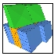

### To access this dialog:

  * Using the MSO ribbon, define a slice shape framework and and select Controls.

The Controls panel, part of the MSO workflow, is used to define the base geometries for stope shapes to be created. 

This topic covers the stope shape generation controls relevent to the [Slice](<MSO3_Slice_Method.md>) method.

For a [Slice](<MSO3_Slice_Method.md>) method, this panel is used to define the slice interval and stope width, plus dilution and dip and strike angle settings. Ultimately, these settings define the 'rules' by which optimal stope shapes will be generated in order to match the [economic](<MSOv3_Economics.md>), [orientation](<MSOv3_Orientation.md>) and [shape framework](<MSOv3_Shape.md>) settings you have already defined.

Another important aspect of this panel is the choice of whether full and/or sub-stope shapes are created.

This section contains the following areas:

  * Slice Intervals - Considerations
  * Stope Width Settings
  * Managing Stope Dilution
  * Dip and Strike Angles
  * Stope Thickness Ratios
  * Narrow Ore Situations
  * Full Stopes and Sub-stopes
  * Panel Field Details

Slice Interval Considerations (Slice Method)

MSO generates thin slices (seed-slices) across the mineralized zones that are aggregated into seed-shapes that satisfy stope and pillar width constraints and cut-off. This is known as the "Slice Method". This method optimizes strike-by-height/width projections of stope-shapes in the transverse orebody direction (width/thickness), depending on its orientation (vertical or horizontal).

The seed-slice orientation and seed-slice interval are key parameters for the successful generation of the seed-shape. A seed-shape cannot be formed without seed-slice(s) above cut-off. A stope-shape cannot be generated without a seed-shape.

[View a high-level overview of MSO shape geometry parameters here...](<MSO3_Shape_Diagram.md>)

Although the seed-slice interval definition is not specifically a stope-shape geometry parameter, its selection has implications regarding the accuracy of the stope-shapes and processing speed.

The slice interval ideally should be an integer divisor of:

  * the minimum mining width,

  * half the pillar width between transverse stopes, and

  * the dilution widths for near/far or hangingwall/footwall surfaces.

The seed-slice interval should typically be set to get a minimum of 3 to 5 intervals in the minimum stope width.

If the slice interval is not an integer divisor then inaccuracies may occur at the seed stage because the seed-shape and pillar shape can only be multiples of the seed-slice intervals. If ore lenses are widely spaced, the choice of slice interval will be less critical. However if the ore lenses are closely spaced and the optimal pillar width is close to the minimum pillar width, then the choice of slice interval will be more critical. If there is a single lens then the choice is less critical.

The number of seed-slice intervals across the orebody can be up to a maximum of 4096 in Version 3. The seed-slice generation process gets proportionately slower as the number of slice intervals increases. Hence careful selection of seed-slice interval, minimum stope width, minimum pillar width between stopes and dilution skin intervals is required to not exceed this limit and/or to keep the processing time reasonable. The maximum number of seed-slice intervals allowed is not constrained by the W dimension of the framework, but it is constrained by the maximum distance along the tube (W-axis) that would contain the slices.

As an example, a 1m slice interval would be appropriate for:

  * 5m minimum mining width,

  * 6m minimum pillar width,

  * 2m hangingwall dilution,

  * 1m footwall dilution,

In the image below, the results of using different seed-slice intervals are illustrated where the orebody has 2 lenses and the lenses are either both high grade, or a combination of high and marginal grade. In case (A) a1.0m interval is modelled which is optimal for the stope and pillar geometry. In case (B) a 1.5m slice is used and while a larger seed-shape must be modelled so that multiples of the interval satisfy the stope and pillar geometry, two stopes are still generated. In case (C) the lower grade lens does not meet cut-off for the larger seed-shape and only one seed-shape is (incorrectly) found.

A slice interval of 1.5 is not an integer divisor, and hence the seed-shapes chosen differ. If both seed-shapes remain economic then nothing is lost because the seed-shapes will be refined in the annealing process, and both slice intervals should return the same final stope-shapes. If the seed generation returned only one seed-shape (because the other was found to be sub-economic) then a seed-slice interval of 1.5 would have been a poor choice.

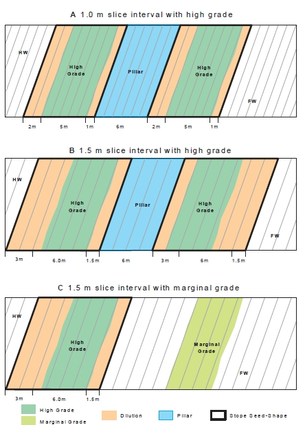

Minimum and Maximum Stope Width Settings (Slice or Boundary Surface Methods)

This section is used to define both the minimum and maximum permissible stope width dimensions, plus the minimum pillar width between stopes.

You also need to decide how the stope width is being defined as either the Apparent Width, True Width on Section or True Width.

You can choose the True Width on Section option as a simpler variation on True Width. With True Width on Section, the true width is based on the stope dip angle on the framework section, and ignores changes in orebody strike when estimating the true width. Note that the pillar width parameter is defined as the distance in the horizontal plane i.e. the apparent pillar width.

Regardless of the Stope Width method adopted, you can set a minimum and maximum mining width as either a fixed value or according to the value of a model field. If you are using model-based values, a default must be chosen to handle data absence in the model object.

In the image below, the Minimum mining width has been set to a constant value of 5 and the Maximum will be set based on the contents of the selected field, setting 12.5 if absent data is found:

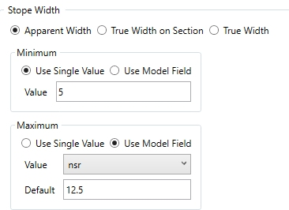

The Minimum mining width parameter is defined as distance in the horizontal plane on the framework section along the W-axis (and consequently measures the apparent width). If the orebody dip is moderate or the strike deviates from the framework axis, then it would be appropriate to make a correction to the width specified to better approximate the intended true width. As an example, if the minimum stope width in the true-width dip-direction was intended to be 10m and the orebody was dipping at 45 degrees, then setting the minimum stope width to 14.1m (horizontal distance) would approximate the intended minimum stope width. Note that the true width is a function of both strike and dip orientation in three dimensions for the general case.

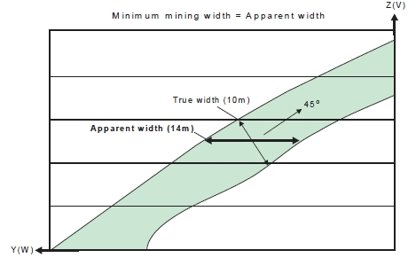

  * If stope wall angle ranges are the same for both the hangingwall and footwall, or roof and floor, then the minimum stope width is checked at the stope corners.

  * If stope wall angle ranges are different, then the minimum stope width is checked at the wall centre, because the optimal seed-shape is measured at the wall centre, and the annealing shape must be measured in the same manner to ensure that a feasible annealing shape is available at the start of annealing.

The Maximum mining width parameter is defined as distance in the horizontal plane on the framework section along the W-axis (and consequently measures the apparent width).

An example use for the maximum stope width is to restrict the transverse dimension for geotechnical purposes (e.g. not to exceed the stable hydraulic radius for the crown face or the strike-face walls).

 |  You can also use the [Options](<MSOv3_Options.md>) panel to [split](<MSOv3_Options.md#split>) the stope width into smaller intervals without pillars. The maximum stope width should be interpreted as maximum stope width between pillars. This "post-processing" approach is preferred over the now discouraged approach of specifying a small (non-zero) pillar width, and a maximum stope width equal to the interval sought, as was used in earlier versions of MSO  
---|---  
  
  
You can also define a Minimum Pillar between Parallel Stopes, which will be applied to honour operational constraints such as equipment size and operability in restricted spaces. As with the Minimum and Maximum mining width controls, you can either choose a single constant value for the run or a model field containing one or more values (and, again, a default value must be set as well). A pillar will separate seed-shapes or stope-shapes if the maximum stope width would otherwise be exceeded, or low grade/waste can be isolated from stope shapes.

Waste cells (representing mineralization below cut-off, or rock without mineralization) surrounding the ore cells are required for runs with sub-stopes, as the location of the mined-out cells is used to force the pillar width between stopes and sub-stopes, and between sub-stopes and sub-stopes.

If the stope wall angle ranges are the same for both the hangingwall and footwall, or roof and floor, then the minimum pillar width is checked at each corner. If the stope wall angle ranges are different, then the minimum pillar width is checked at the wall centre.

Stope Dilution (Slice and Boundary Surface Methods)

Dilution refers to material below cut-off grade that gets blended with ore, thus reducing the grade of excavated material. Dilution in general is impossible to avoid in stoping due to geometries of the orebodies and it is therefore divided into planned and unplanned dilution. The annealed stope shape includes planned dilution which is the waste material necessary to extract the ore. Unplanned dilution is material that originates outside the stope boundaries. 

You can choose from the following dilution methods

  * ELOS: ELOS stands for equivalent linear overbreak-slough

  * ELOS: VOS stands for variable overbreak-slough 

To factor in unplanned dilution that originates from outside the stope boundaries, you can either define a hangingwall / footwall dilution for each stope, or a more general (global) near / far dilution values.

ELOS Dilution

See below for an example of how changing this parameter can affect the resulting stope shape:

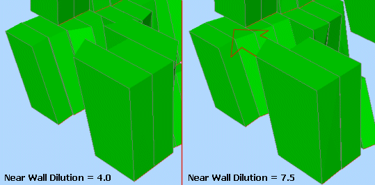

Stope dilution can also be controlled by model fields: if the Use Model Fields check box is selected, you can specify both a Near Dilution Field and a Far Dilution Field from the input model. Only numeric fields are available for selection.

  1. Specify dilution in the context of the Footwall/Hangingwall or Near/Far wall.

  2. Choose to define the dilution width either as either of the following:

     * A fixed parameter (Use Single Values and enter a value for each wall/side)

     * A value that is defined with an attribute field in the block model and is resolved at the block centre (Use Model Fields) and select a numeric field and (optionally) set a default value.

     * Alternatively, if Use Curve Tables is selected (only ELOS supports this option), the dilution width can be specified as a function of stope dimension (available only for the ELOS case). If selected, the stope dimension can be specified for the Near and Far dilution from the options in the Axis drop-down list. For the selected Axis, you can define a Value and Dilution % entry and, if required, construct a table of multiple axis value/dilution lookups.  
  
In summary: by providing data points for a curved table (like with cutoff grade, for example) the dilution interval can be made a function of stope width or other stope geometry parameters. 

VOS Dilution

An alternative method is available, potentially offering greater flexibility in specifying dilution in different orebody types and stoping methods. In Variable Overbreak/Slough (VOS) dilution, the dilution interval is specified for each vertex in the 4/6/8 point shape. For 4pt shapes the dilution is specified at the midpoint to create a 6pt final stope shape.

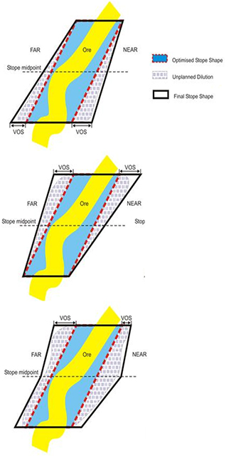

Stope Dip and Strike Angle Ranges (Slice and Boundary Surface Methods)

The strike angle is the angle of any one of the four stope wall edges (measured relative to the U axis of the stope orientation plane).

To start with, it is recommended that strike angles be loosely defined (i.e. using a broad tolerance range) in a preliminary test run in order to give a reasonable upper limit on the number of stopes produced or to maximize stope dimensions. Strike angle parameters would then be progressively refined as required.

One example application would be where stope-shapes are formed in a criss-crossing pattern between parallel lenses which have discontinuous mineralization, and the user wanted to force the stopes to not criss-cross between the lenses. Another example would be the formation of stope-shapes that have rapid or chaotic changes in wall angles, giving the appearance of being malformed (but are actually not). These examples may be considered to be impractical stope-shapes to implement, and hence the wall strike angle changes are smoothed out to better approximate a mineable set of stope shape.

Using this panel, stope strike and dip angles - in a manner similar to dilution settings - are defined as a value range of either edge (i.e. top or bottom) of either wall of the stope-shape (i.e. near/far wall or hangingwall/footwall wall) relative to the frameworks strike axis (i.e. the U-axis).

See below for an example of how the minimum dip angle can constrain the resulting stope shape:

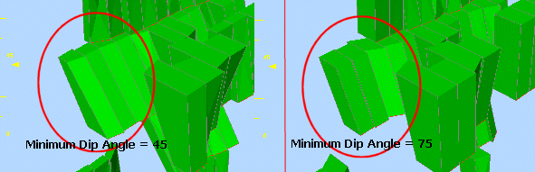

Stope dip and strike angles can be defined explicitly, or can be picked from block model fields. Select the Use Model Fields (Stope Dip Angles) or Use Model Field (Stope Strike Angle) options, then pick a field from the optimization model. You can define a field containing dip or strike angle values representing the Minimum, Minimum Default (used where no minimum value is found, Maximum (plus associated default value), Maximum Change (plus associated default value).

Maximum Stope Thickness Ratio (Slice Method)

The ratio is defined by the end-face wall lengths and the axis direction pairing being considered, described further in the following sub-sections.

Ideally the side length ratios would be loosely defined (broad range) on a preliminary MSO run to maximize the number of stopes produced or to maximise the stope dimensions. The side length ratios would then be progressively refined as required.

An example use of the Maximum Stope Thickness ratio is to force walls (i.e. near / far walls or hangingwall / footwall walls) to be parallel to each other (i.e. a sectional parallelogram) so that all production hole drilling is parallel for a narrow tabular orebody. This is achieved by using a 1:1 ratio, but this ratio should only be used in a final run to ensure that all the required shapes are generated in the annealing phase. Likewise, in the U-axis direction plan view parallelograms can also be specified.

Ratios are specified using two parameters; Top to Bottom and Left to Right; the former is defined as the top edge divided by bottom edge orvice versa, e.g.:  
  
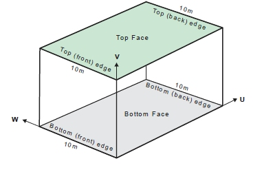

The Left to Right ratio denotes the upper limit for the ratio (longer/shorter) of the front and back edges of the top and bottom face of a stope-shape, e.g.:  
  
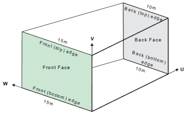

Narrow Ore Situations (Slice Method)

Where the ore grade material is confined to a sharp boundary, surrounded by host rock with zero grade the stope optimization engine has no way to locate the stope walls relative to that sharp boundary - all positions of the stope about the boundary have equal value.

A way to resolve this issue is to (slightly) penalize waste that falls between the ore and the preferred wall position. If the ore is to be centred in the stope then the penalty for one wall should be balanced by the penalty for the other.

The function has been termed "narrow ore" because this would be the primary application, the material above cutoff is typically less than the minimum stope width (see above for more information on width settings). As shown in the figure, if there is material below the cutoff, but above the threshold, and this material falls within the economic stope then that material can be considered part of the "narrow ore".

Narrow ore processing requires a block model for the below waste threshold material to be able to apply the penalty. The penalty is calculated using approximate evaluation techniques.

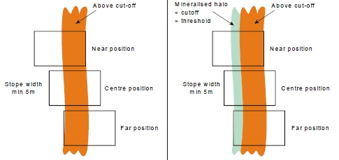

Full-stopes and Sub-stopes (Slice Method)

First, some definitions:

  * Full Stope Shapes: this is the entire framework trapezoid / rectangle shape in the U and V axes. A full stope shape is defined as one that covers one full interval in the U-axis and V-axis (i.e. one section-spacing and one level spacing for the vertical orientation frameworks, or one strike-interval and one contour- interval for horizontal orientation frameworks).

  * Sub Stope Shapes: a regular or irregular sub-interval of the full-shape.

  * Development Shapes: these shapes are defined with dimensions of width and height (typically equivalent to the ore development profile). Select this option to optimize to produce development shapes in economic ore, in addition to producing mineable shapes and sub shapes when economic ore cannot be taken in a mineable shape.

Sub Stope Shapes

Full-shapes (full-stopes) can be sub-divided in either and/or both of the shapes U-axis and V-axis, to create "sub stopes". Defining sub stopes helps maximize resource recovery into stopes, especially at the orebody strike extents or where the mineralization may be patchy or irregular.

 |  A maximum of 25 sub-shapes can be specified in any one run (i.e. 25 different sub-shape U | V dimensions).  
  
---|---  
  
Sub-stope geometries can be regular, irregular rectangular or irregular trapezoid to identify full and partial sub-stope shapes, and optimal combinations of sub-stopes.

Note that sub-stoping requires a model with cells defined in waste/pillar areas in order to honour stope geometry rules for the minimum pillar width between stopes and sub-stopes, and between sub-stopes (in the W-axis). The minimum pillar width function (see the "Mining Widths" section above) requires model cells to be present in order to flag what has already been mined in earlier passes of stopes and sub-stopes. This is necessary so that the minimum pillar width can be maintained between "mined" material and the new sub-stope.

 |  Models should ideally have an enclosing envelope of waste cells modelled around the mineralization. The surrounding waste is required for cases where a sub-stope may be mined adjacent to a full stope using waste pillar criteria. If sub-stopes are not required, then non-mineralized waste cells can be filtered from the block model to reduce run times. [More about MSO input block models...](<MSO3_BlockModels_Guidance.md>)  
---|---  
  
  
MSO provides three distinct methods for sub-stope shape creation - see "Field Details" further below for more details on these options.  

Sub-stope Optimization

You can choose whether to optimize sub stope shapes.

Sub-stope Optimization evaluates all the sub-stopes, and finds the best combination of non-overlapping sub-stopes. The processing time overhead should not be any higher than evaluating a list of sub-stopes.

If the option to Optimize Subshapes is selected, then an optimal choice of sub-shapes is made to maximise the value (or metal). This option can only have an effect when the supplied list of sub-shapes is overlapping.

  * If sub-stopes are optimized, a set of non-overlapping sub-stopes will be selected, and these are the only shapes that will be used on each lens.

  * Without sub-stope optimization, each shape in the list is run in turn, and any lens that can form stopes from that shape will do so at the first opportunity. In the sub-stope optimization case, MSO is looking for the best overall solution with a subset of the shapes, whereas in the non-optimization case it is like a greedy algorithm that will apply a sub-stope at the first available opportunity, and consequently the sub-stopes from one lens might overlap the sub-stopes from another adjacent lens (which cannot occur by definition where sub-stopes are optimized).

If a full stope-shape is included in the sub-shape list then optimization can assess whether a sub-stope captures more value than a full-stope (that is, otherwise forced to mine more included waste).

If you evaluate a list of overlapping sub-stopes on parallel lenses (without sub-stope optimisation) you might get overlapping stope-shapes from one lens to the next and also potentially get a higher value. Note also that if there are multiple lenses and multiple stopes transversely across strike, the lenses are not checked individually for the choice of full stope and sub-stope combinations the full stope-shape is applied to all lenses, and where a full stope does not create an economic stope, a sub-stope will be considered.

Overlapping Sub-stopes

By default, sub-shapes are processed in the order supplied (either from a user supplied list or an automatically generated list), and ore will be mined in the first economic sub-shape encountered in the list. In the case where there are multiple orebody lodes/lenses and potentially multiple stopes transversely across strike, if one lode/lens is successful with a full stope, but not the others, the others will still be considered for sub-stopes.

With overlapping sub-shapes it is logical to supply the largest first, otherwise a smaller sub-shape may remove the opportunity to mine a larger shape in the same position.

The sequential order of evaluation does not guarantee the best combination of sub-shapes is found.

Note that MSO does not check the combination of full-stopes and sub-stopes simultaneously for the set that optimizes the objective (grade / value / calculated value). For example, it could be the case that two solutions exist, one with a full-shape and another with sub-shape(s). Even though the sub-shape solution may have a higher grade/value/calculated value, the full-shape solution will always be generated as the evaluation sequence terminates with the earliest solution found.

More information on the MSO sequencing options for sub-shape optimization are shown in Field Details, below.

  
Panel Field Details (Slice Method):

The information above relates to the following contols on this panel:

Slice Interval: a vital consideration for an optimization scenario, this field is used to define the interval to be used for stope generation (More information...).

Stope Width: another critical element of your optimization settings, define minimum and maximum mining widths (More information...)

Stope Dilution: Dilution refers to material below cut-off grade that gets blended with ore, thus reducing the grade of excavated material. 

if the Use Model Fields check box is selected, you can specify both a Near Dilution Field and a Far Dilution Field from the input model. Only numeric fields are available for selection.

Define your stope dilution settings (More information...)

Stope Dip/Strike Angles: set the Minimum and Maximum permissible angles for dip and strike. You can either calculate independent hangingwall / footwall angles for each stope or use a global near and far definitions across the stope portfolio.

For Stope Dip Angles, you can elect to force the same values for floor and roof or independently specify the angle range for each. Similarly, for Stope Strike Dip Angles, you can choose whether to use a universal setting for Floor Strike Dip Angle and Roof Strike Dip Angles or set them independently.

For both dip and strike angles you can also denote the Maximum Change between concurrent angles in the specified stope sequence, to avoid impractical step changes between stope geometries. This is entered in degrees, with the default being 20 degrees.  
  
Here's an example: in the left image (below), the Minimum Stope Strike Angle is -45 degrees, and the Maximum is +45 degrees, with a maximum permitted change between strings of 20 degrees. In the right image, the minimum is reduced to -25 degrees and the maximum is +25 degrees, with a step change of 10 degrees permitted:  
  
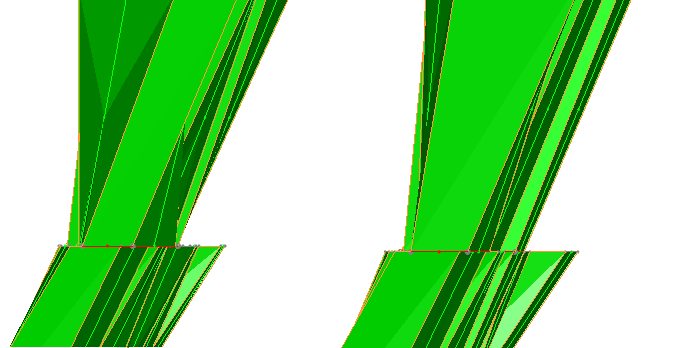  
  
In this particular example, allowing a wider range of strike angle permits a more angular stope shape in order to meet the required objective. The scenario includes a more restricted angle range and change control, so whilst the shape is still optimal, it is optimal whilst honouring the new restrictions (which may be necessary to ensure a maximum angle threshold for a rock type is not breached).  

(More information on dip and strike angles...)

([More general information on angle conventions in MSO...](<MSO3_Framework_Angles.md>))

Maximum Stope Thickness Ratio: this ratio is defined by the end-face wall lengths and the axis direction pairing being considered, described further in the following sub-sections. This value represents the upper limit for the ratio of the top and bottom edges of the front and back face of a mineable shape. (More information...)

Use Narrow Ore: select this checkbox to indicate where the ore grade material is confined to a sharp boundary, surrounded by host rock with zero grade. This is known as the "Narrow Ore Case". The controls in this area are used to define the settings required by MSO to manage this situation, which effectively control the applied penalty:

  * Position \- the required position for the ore, selected using a drop-down list containing the following values; near, far, footwall, hangingwall, centre.

  * Threshold \- a cutoff to identify "waste"

  * Background Value \- a grade or value to be applied to all cells below the waste threshold. This value should be non-zero.  
  
(More information on the Narrow Ore case...)

Stope Layout: define whether to Create Full Stope Shapes or to Create Sub Stope Shapes. If the latter, the following options become available:

  * Optimize Subshapes: choose whether subshapes will be optimized or not.

  * Sub Stope Definition Method: select one of the three available options:

  *     * Discrete Equal Proportions: specify the number of sub-shapes as Strike (U) Divisions and/or Transverse (V) Divisions. The sub-shapes are strictly non-overlapping.

    * Combination of Proportional Shapes: this will automatically generate a list of over-lapping sub-shapes relative to a face position based on a selected Divisions (e.g. 2 for halves, 3 for thirds, 4 for quarters, 5 for fifths) and whether those divisions are Horizontal or Vertical.  
  
This option enables irregular shapes to be defined (e.g. the stope and drive shapes, or the primary and secondary stope-shapes) and would be used without full shapes being specified. A number of automatic configurations of sub-shapes can be supplied where the interval dimension is given on the U or the V-axis (but not both at the same time), and where sub-shapes abut the framework cell boundary. The largest sub-shape is chosen first. These automatic methods have the goal of identifying how stope sub-shapes might be used to find a sub-shape contiguous with an adjacent full shape (or sub-shape).  
  
You choose how these shapes are generated, either using a Forward Sequence (each shape abuts with the adjacent shape wall, advancing from the near side), a Backward Sequence (each shape abuts with the adjacent shape wall, retreating from the far side) or an Alternating Sequence. The three options are best demonstrated by way of example:  
  
In this example, a Horizontal Proportional Division Type is selected (i.e. the U axis forms the basis of subdivision). Divisions is set to [4]. Each of the three options will give rise to a specific sequence of sub-stopes. In the table below, these are shown as minimum and maximum values in U and V directions:  
  
Forward sequence:

Minimum U | Maximum U | Minimum V | Maximum V  
---|---|---|---  
0.00 | 0.75 | 0.0 | 1.0  
0.00 | 0.50 | 0.0 | 1.0  
0.00 | 0.25 | 0.0 | 1.0  
  
  
Backward sequence:

Minimum U | Maximum U | Minimum V | Maximum V  
---|---|---|---  
0.25 | 1.00 | 0.0 | 1.0  
0.50 | 1.00 | 0.0 | 1.0  
0.75 | 1.00 | 0.0 | 1.0  
  
Alternating sequence (sub-stope-shape must abut with the adjacent shape):  
  

Minimum U | Maximum U | Minimum V | Maximum V  
---|---|---|---  
0.00 | 0.75 | 0.0 | 1.0  
0.25 | 1.00 | 0.0 | 1.0  
0.00 | 0.50 | 0.0 | 1.0  
0.50 | 1.00 | 0.0 | 1.0  
0.00 | 0.25 | 0.0 | 1.0  
0.75 | 1.00 | 0.0 | 1.0  
  
Represented visually:   
  
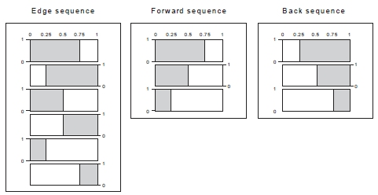

  1.      * Variable Subshapes: using this option, you can specify a list of sub-shapes using proportions as fractions or a predetermined size. Later entries in the list can be overlapping and/or non-overlapping.  
  
Each option can be used to replicate repeating regular patterns, such as for the Room-and-Pillar mining method layout (using a Horizontal framework).  
  
Both _Fraction_ and _Size_ options are defined in the table as minimum and maximum values in Horizontal (U, strike) and Vertical (V, elevation) directions. For each subshape definition, you can specify a Scaling factor.  
  
Up to 25 sub-stopes can be specified for either method and will be processed in the sequence supplied (top-bottom). The sub-stope-shapes considered can overlap. 

**Fraction example** : If using the _Fraction_ option, and you wanted MSO to attempt the creation of a stope-shape using 80% of the section spacing (starting from the lower-coordinate section), then attempt 60% if the 80% doesnt succeed, then 40% if the 60% doesnt succeed, then 20% if the 40% doesnt succeed (e.g. used for maximizing mining at the lode strike extremities) with the fraction values would be:

Horizontal Min | Horizontal Max | Vertical Min | Vertical Max  
---|---|---|---  
0.0 | 0.8 | 0.0 | 1.0  
0.0 | 0.6 | 0.0 | 1.0  
0.0 | 0.4 | 0.0 | 1.0  
0.0 | 0.2 | 0.0 | 1.0  
  
  

With this example, MSO can be visualized as working in sequence from top to bottom until a successful stope-shape was found:  
  
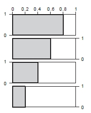  
Polygon Subshapes: using this option, you can specify a list of sub-shapes by defining one or more polygons. 

Polygons are set up as a series of points (defined using the Point List Configuration dialog) and can be defined either as a Fraction or a Size. In any case, you can define a scaling factor for your subshapes and, if required, a cutoff scaling adjustment, which acts as a multiplier for the Scaling value.

This option is open for both [fixed and variable section and level slice frameworks](<MSO3_Shape_Shape_Framework_Settings.md>) but is not available if the Create Full Stope Shapes option is selected above.

(For background information on subshape optimization \- see "Full Stopes, Sub Stopes and Development Shapes", above).

Create Development Shapes: In the stope optimisation run, full-shapes are processed first in a tube, and then sub-shapes (from the remaining ore not mined with a full-shape), and lastly Development Shapes (from the ore that cannot be taken in either full-shapes or sub-shapes).

The Width and Height settings selected here would be typically equivalent to the ore development profile.  
  
Any combination of shapes can be selected in an optimization run, and some overlap in definition is possible. A sub-shape having the same dimension as the full-shape could be specified, but there would not be any value in this if the full-shape had also been selected, as the full-stope would have already formed stopes of that dimension.

 |  Related Topics  
---|---  
| [Slice Method Overview](<MSO3_Slice_Method.md>)   
[MSO Shape Frameworks](<MSO3_Frameworks_Concept.md>)   
[MSO Angle Conventions](<MSO3_Framework_Angles.md>)   
[MSO Key Shape Concepts](<MSO3_Shape_Diagram.md>)