 |  MSO Angle Conventions How angles are described in MSO  
---|---  
  
# MSO Angle Conventions

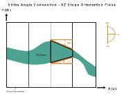

This topic describes how MSO categorizes angle values throughout both documentation and the user interface.

The follow sections are available:

  * Dip Classification Convention
  * Apparent Specification Method for Angle Conventions
  * Angle Convention Examples (by Framework type)

  *     * Strike Convention - Vertical XZ (Plan View)

    * Strike Convention - Vertical YZ (Plan View)

    * Strike Convention - Rotated Vertical XZ

    * Dip Convention - Vertical XZ

    * Dip Convention - Transverse Section XZ

    * Dip Convention - Transverse Section YZ

    * Dip Convention - Horizontal YX

    * Dip Convention - Horizontal XY

    * Dip Convention - Vertical Rotated XZ

  * True Specification Method for Angle Conventions

  * Stope Wall Angle Conventions (Equal or Different)

Dip and Width Parameter Convention

Angles for dip and strike, and widths for stopes and pillars can be specified as either Apparent or True. The True specification is added in Version 3 to allow stope width and dip angles to be specified in a plane perpendicular to the stope strike, and independent of the Framework rotation. If True specification is used then the equivalent Apparent specification is calculated for internal processing based on the orientation of the seed stope, so a good estimate of the seed stope strike and dip is required and this is best controlled by the use of a Stope Control Surface.

Note that the easiest and most intuitive method of specifying the strike and dip angles is to provide a Stope Control Surface wireframe over the full extent of the orebody where stope shapes are to be generated. The Stope Control Surface is generated and displayed in world coordinates, irrespective of the orientation of the model and the stope shape framework. If required, the vendor software can be used to display true dip and strike off this wireframe surface. The Stope Control Surface has priority over the default dip and strike (Vertical XZ|YZ, Section XZ|YZ) and default strike dip and transverse dip (Horizontal XY|YX ) angles.

Specification of strike and dip angles is not needed in the [Prism](<MSO3_Prism_Method.md>) method.

  1. Apparent Dip and Width Specification   
  
The angle conventions are the same for the Vertical XZ|YZ methods and the Section XZ|YZ methods. Strike is measured clockwise from the primary stope shape framework axis (the long section view), looking along the axis in the positive coordinate direction. Dip is measured from the horizontal left axis looking along the primary axis.  
  
For the Horizontal XY|YX method, dip angles are measured downwards from the horizontal on both the primary (the first axis in XY|YX) and secondary (the second axis in XY|YX) axes, and are termed the strike dip angle, and the transverse dip angle respectively.  
  
For rotated stope shape frameworks the strike and dip are measured in the local coordinate system. All angle values are specified in Degrees.

  2. True Dip and Width Specification   
  
Angles for dip and strike are specified as true dip (TRDIP), and true dip direction (TRDIPDIR) respectively. TRDIPDIR ranges [0..360] and TRDIP normally ranges [0..90] but when specifying the stope dip angles the range is [0..180]. TRDIPDIR is found by adding 90 degrees to the bearing of the TRDIP direction.  
  
These angles have the angle conventions that the Datamine Dynamic Anisotropy modelling functions provide in the TRDIP and TRDIPDIR fields, with dip measured positive downwards, and the dip direction measured as a clockwise bearing, with north being zero degrees.

Dip Classification

MSO uses the following nomenclature to describe dip angle types:

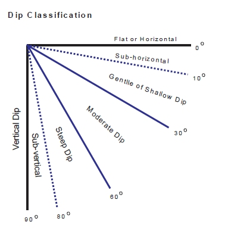

Apparent Specification Method for Angle Conventions

In MSO, all angle values are specified in degrees.

Angles are defined relative to the selected framework orientation (i.e. XZ | YZ | XY | YX)

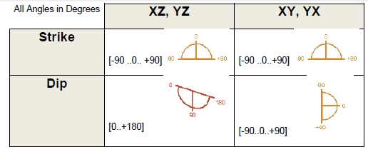

For rotated stope-shape frameworks the strike and dip parameters are measured in the local co-ordinate system

The Strike angle conventions are the same for the various Slice frameworks (i.e. XZ | YZ | XY | YX). Strike is measured positive clockwise from the primary strike-axis (U-axis positive direction) of the selected stope-framework orientation/plane:

For example:

  * 0 degrees = looking along the strike-axis in the positive coordinate direction

  * +90 degrees = looking clockwise at right-angles from the positive strike-axis plane

  * -90 degrees = looking anti-clockwise at right-angles from the positive strike-axis plane).

The strike angle range is [-90 to + 90] degrees.

The Dip angle for XZ | YZ frameworks is measured as 0 degrees from the left-hand-side horizontal axis as you look along the primary strike-axis (U-axis) and increases anticlockwise to +90 degrees vertically down and +180 for the right-hand-side horizontal axis. The dip angle range is [0 to 180] degrees.

The dip angle for XY|YX frameworks is measured positive downwards from the horizontal (and negative upwards) on both the primary axes (the first axis in XY|YX orientation i.e. U-axis) and the secondary axes (the second axis in XY|YX orientation i.e. V-axis) and are termed the strike dip angle, and the transverse dip angle respectively.

The dip angle range is [-90 (upwards) to +90 (downward)] degrees.

Angle Convention Examples (by Framework type)

The following images describe angle scenarios and respective conventions used:

Strike Convention - Vertical XZ (Plan View)

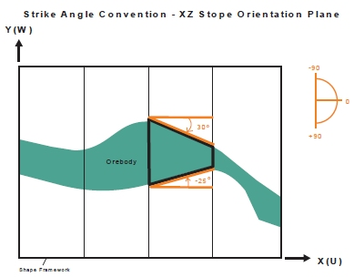

  
Strike Convention - Vertical YZ (Plan View)

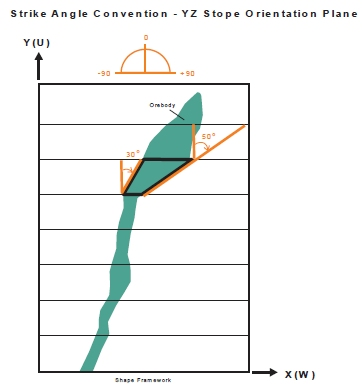

Strike Convention - Rotated Vertical XZ

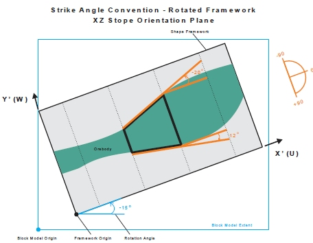

Dip Convention - Vertical YZ

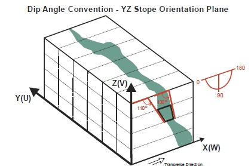

Dip Convention - Transverse Section XZ

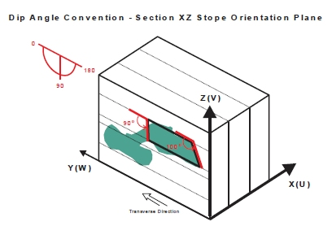

Dip Convention - Transverse Section YZ

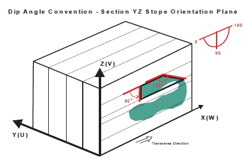

Dip Convention - Horizontal YX

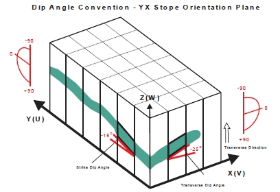

Dip Convention - Horizontal XY

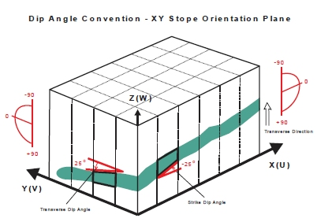

Dip Convention - Vertical Rotated XZ

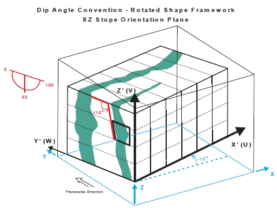

True Specification Method for Angle Conventions

The True specification method is added in Version 3 to allow stope width and dip angles to be specified in a plane perpendicular to the stope strike, and independent of the Framework rotation, and Stope Orientation Plane.

Angles for dip and strike are specified as true dip (TRDIP), and true dip direction (TRDIPDIR) respectively. TRDIPDIR ranges [0..360] and TRDIP normally ranges [0..90] in geological applications. TRDIPDIR is found by adding 90 degrees to the bearing of the TRDIP direction.

These angles have the angle conventions that the Datamine Dynamic Anisotropy modelling functions provide in the TRDIP and TRDIPDIR fields, with dip measured positive downwards, and the dip direction measured as a clockwise bearing, with north being zero degrees.

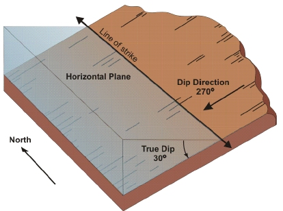

When specifying the stope dip angles, the dip range is extended to [0..180] because a single true dip direction is specified for vertical plane in which the stope dip angles are measured.

Stope Wall Angle Conventions (Equal or Different)

Stope walls are referred to as the near or far, and hangingwall or footwall sides for XZ | YZ oriented stopes and roof or floor sides for XY | YX oriented stopes.

There are two wall-angle range cases as follows:

  * Equal \- using the same angle range for both walls (e.g. 45-90o).
  * Different using independent angle ranges for each wall. For example, this allows setting say a minimum rill dip for the footwall side (e.g. 45-90o) and allowing a flatter minimum dip for the hangingwall side (e.g. 30-90o) a typical requirement for flat-dipping orebodies.

Note that the default dip value for seed-slices cannot fall outside of the near wall and far wall (hangingwall and footwall) range. This requirement also applies to the default strike angle and the strike angle range.

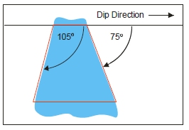

 |  Related Topics  
---|---  
| [MSO Key Shape Concepts](<MSO3_Shape_Diagram.md>)   
[Slice Method Overview](<MSO3_Slice_Method.md>)   
[MSO Shape Frameworks](<MSO3_Frameworks_Concept.md>)   
[MSO Tips and Guidelines](<MSO3_Tips.md>)   
[MSO Control Strings](<MSO3_Control%20Strings.md>)   
[MSO Block Models](<MSO3_BlockModels_Guidance.md>)   
[MSO Rotated Frameworks](<MSO3_Rotated%20Frameworks.md>)  
  
Copyright Datamine Corporate Limited  
JMN 20045_00_EN