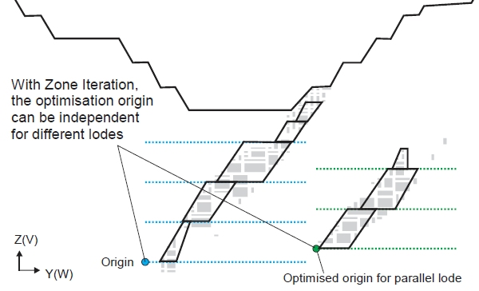
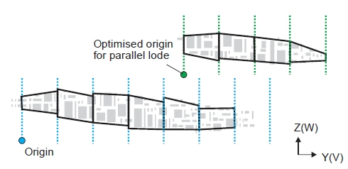

 |  Framework Optimization Description  
---|---  
  
# MSO Framework Optimization Options

### To access these options:

  * Using the Shape panel, Section and Level Intervals group, select Advanced Frameworks. Select the Optimized Regular option.

The selection of start location for levels or sections and spacing for levels and/or sections are key design choices for mine planners.

Datamine's MSO module can be configured using advanced shape framework settings so that the stope-shape framework can be floated in the stope orientation plane (using defined increments). Thi sis a useful way to optimize the start location for both the level and section without changing the dimensions of the level interval (V-axis dimension) or section spacing (U-axis dimension). 

Field Details:

Output Type: the following mutually-exclusive options will determine the extent of stope data that will be generated:

All cases: choose this to output all combinations of the stope size and framework increment to the output files.

Best case: choose this option to only output the stopes for the single framework that generates the best set of stopes.

Optimize Sublevel Intervals: a special case where the sublevel spacing can be variable (rather than a fixed value for every sublevel interval) after the optimization.

Sections and Level Spacing: the stope-shape framework can then be further refined by also changing the level and/or section spacing dimensions. For framework optimization the stope-shape minimum and maximum size and increment are supplied for the axes specified by the stope orientation plane, and the step size for the origin shift along the same axes.

Set your spacing dimensions using the Sections and Levels data entry fields.  
  
Axis Increments: the initial framework specification defines the extent of the volume to be considered. To minimise the number of combinations to be considered, the stope-shape size increment should be a sub-multiple of the stope dimension. You can define your Axis Increments as either a set range and step (independently for sections and levels) or by defining the actual intervals by section and level.

Ranges: select this option to define a Minimum and Maximum increment value plus a Step. The Step should be a sub-multiple of the stope sizes. For example, the stope section sizes might be Minimum = 20 and Maximum = 35 and Step = 5. 

Intervals: select this option to define a table of intervals for both Section and Level.

 |  As the run-time for a large set of increment combinations might be prohibitive, a single test scenario should be run to estimate the likely runtime for all combinations. e.g. nominate a single stope size and no step to ascertain the run-time for a single iteration.  
---|---  
  
Use Different Ore Zones: If a zone field is defined in the block model and each zone is spatially separate, then the framework position and extent will be optimized for each zone. The set of possible zones is nominated by a list that you define in the table below. These zones can be different lodes, pods or even independent mine areas. 

Zone Iteration allows the flexing of the level start location, level interval, and level offset and/or section start location, section interval, and section offset between multiple zones. 

Selecting this option evaluates all combinations of level spacing and offsets of the level start location, and reports the results as a sorted list to guide the design choice. You can use the Output Type drop-down list (see above) to output only the best case.

This option can be used in conjunction with either the Ranges or IntervalsAxis Increments options.

 |  The runtime for a large number of combinations can be prohibitive. A single scenario with all required zones should be run to estimate the likely runtime for all combinations, i.e. a run without zone iteration.  
---|---  
  
  1. Select the Default Field, typically a domain field, to be used for iteration. The Default Value for the field will automatically be displayed, but you can edit it here if you wish.

  2. Enter a table of iteration items. Where the orebody is made up of discrete ore zones, each is evaluated independently, and the sorted list is reported by ore zone. This feature can be useful when there are a significant number of zones to be evaluated, for example where the orebody has many pods.

Below is an example of zone iteration in the section orientation:  
  

In the following image, you can see the result of using zone iteration to optimze the section start location for multiple lodes. The iteration is in the horizontal orientation and there is a fixed section interval.

  
  

 |  Related Topics  
---|---  
| [Advanced Slice Framework Settings](<MSO3_Shape_Framework_Settings_Advanced.md>)  
  
Copyright Datamine Corporate Limited  
JMN 20045_00_EN