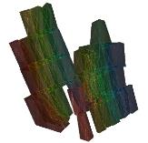
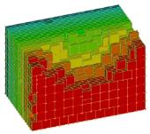
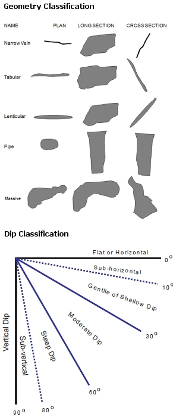

# MSO3_Frameworks_Concept

 |  MSO - Shape Frameworks An overview of the prism and slice methods  
---|---  
  
MSO - Stope Shape Frameworks

 

From a high-level, there are four key steps involved in stope shape generation with MSO.

  1. Seed-slice: analogous to sample intervals across the mineralization in the transverse direction.

  2. Seed-shape: an aggregation of the seed-slices into seed-shapes that satisfy stope and pillar width constraints and cut-off, and other miscellaneous constraints. The role of seed-shape generation is to correctly identify the number and approximate location of stopes, with emphasis on predicting the correct number.

  3. Stope-shape: Seed-shapes that are annealed to form the optimized stope-shape inclusive of internal dilution to form a practical stope-shape. Seed-shapes may be discarded if they fail stope geometry or other stope criteria. In rare cases the annealing process may eliminate a seed-shape to expand an adjacent seed-shape.

  4. Diluted stope-shape: (inclusive of wall skin dilution(s)). As annealing is applied to the undiluted stope-shape, the addition of dilution may cause the stope-shapes to be discarded at this stage if the skin dilution drops the head-grade below cut-off. These marginally sub-economic stopes can also be output for review.

The seed-slice orientation and seed-slice interval are key parameters for the successful generation of the seed-shape. A seed-shape cannot be formed without seed-slice(s) above cut-off. A stope-shape cannot be generated without a seed-shape.

While a geology wireframe is often a good proxy for the stope orientation, the geology wireframe is often far too detailed for the purposes of stope generation. Blindly using the geology wireframe can sometimes lead to unexpected results or missing stopes that arise from kinks and inflections in the geology wireframe surface.

In most cases, and in particular for narrow orebodies, a Stope-Control-Surface (i.e. a surface representing the expected orientation of the stope-shapes) is the preferred method for defining the seed-slice orientation. A complex surface is not required (and generally no more than a few thousand triangles are usually needed even for irregular orebodies). Digitizing cross-section view strings that represent the general dip trend of the orebody (and hence the general dip trend of the stope-shapes) and forming simple wireframe surface from these strings is usually sufficient.

Alternatively, decimating the geology surface (i.e. reducing the number of triangles and hence smoothing) by typically 80% may achieve a similar simplified surface representing the intended dip trend of the stope-shapes.

MSO looks at ALL possible combinations of seed-slices and selects the aggregated seed-slices that yield the highest value above cut-off. MSO operates quite differently to how many users anticipate a typical algorithm might work. A typical heuristic could be to identify grade intervals, retain them if they meet the minimum interval length, and then merge to carry short intervals with other acceptable length intervals. These interval heuristics and similar strategies are not used by MSO as they fail on a number of grounds: - they are not guaranteed to yield the optimal solution, and cannot deal with more complex situations with multiple lenses and variable grade distributions; or specific end-cases where it might be optimal to have waste added to ore, or pillars containing ore; to meet the stope and pillar width parameters.

The seed-slices or aggregates of seed-slices are only added to the seed-shape(s) if the cumulative value of the slice aggregate falls above the cut-off. The only exception would be where the stope geometry or other miscellaneous constraints also had to be satisfied. The grade or value for the aggregated slice-volumes above and below cut-off must be equal-to or greater-than the nominated cut-off to allow inclusion to the stope-shape. The [Economics](<MSOv3_Economics.md>) panel is used to define the optimization method and cut-off concept, and if a head grade is to be considered.

The seed-shapes are annealed to form the optimized stope-shape (prior to the addition of wall skin dilution(s)), that is inclusive of internal dilution to form a practical stope-shape based on the geometry parameters applied. The final stope-shape wireframe includes the dilution skin(s) \- if applicable.

Stope-shape annealing adjusts the stope corners in an iterative fashion to progressively improve the stope value from that obtained at the seed-shape generation stage. The stope-shape wireframe is evaluated against the block model for each adjustment. To generate the final stope-shape, thousands of adjustments might be tested. The overall time taken depends largely on the stope wireframe evaluation procedure, which can be relatively slow. Consequently, the better the initial seed-shape approximates the final stope-shape, the fewer annealing iterations will be required, and the optimizer will complete sooner.

The seed-slices, seed-shapes, and stope-shapes can all be exported to an optional "verification wireframe" file, as specified on the [Scenarios](<MSOv3_Scenarios.md>) panel.  

Seed-Slice Orientation and Seed-Slice Interval

The seed-slice orientations can be defined by using one of (in increasing order of utility):

  * Default dip and strike angle settings (least preferred option).

  * Using Dynamic Anisotropy fields contained within the input block model. "Dynamic Anisotropy" is a specialised interpolation technique that generates a local strike and dip at each cell centre from the orientation of bounding geological wireframes. It is typically used to deal with anisotropy in folded orebodies and has some minor advantages over the "Stope Control Surface", but has the possible disadvantage of being dependant on the model cell size.

  * A Stope Control Surface which is a simple wireframe to define the general orientation expected for the stope-shapes in the mineralized zones of the orebody. This is the most preferred option as it is customized to the specific requirements of MSO, is quite efficient, and is independent of model cell size.  
  
All of the above are defined using the [Scenarios](<MSOv3_Scenarios.md>) panel.

The seed-slice orientation and seed-slice interval are key parameters for the successful generation of the seed-shape. A seed-shape cannot be formed without seed-slice(s) above cut-off. A stope-shape cannot be generated without a seed-shape.

While a geology wireframe is often a good proxy for the stope orientation, the geology wireframe is often far too detailed for the purposes of stope generation. Blindly using the geology wireframe can sometimes lead to unexpected results or missing stopes that arise from kinks and inflections in the geology wireframe surface.

In most cases, and in particular for narrow orebodies, a stope control surface (i.e. a surface representing the expected orientation of the stope-shapes) is the preferred method for defining the seed-slice orientation. A complex surface is not required (and generally no more than a few thousand triangles are usually needed even for irregular orebodies). Digitising cross-section view strings that represent the general dip trend of the orebody (and hence the general dip trend of the stope-shapes) and forming simple wireframe surface from these strings is usually sufficient. Alternatively, decimating the geology surface (i.e. reducing the number of triangles and hence smoothing) by typically 80% may achieve a similar simplified surface representing the intended dip trend of the stope-shapes.

The seed-slice interval should ideally be a sub-multiple of the minimum stope width, the dilution widths on both sides of the stope-shape (near/far or hangingwall / footwall) and half of the minimum pillar width. This requirement at the seed-slice generation stage becomes more important if there are many lenses that will form narrow stope-shapes with a minimum pillar width between lodes. As a general rule, a seed-slice interval that generates a minimum of 3-5 seed-slices for the minimum stope width is recommended. Typically generating more will increase the run time for little benefit, and conversely, generating less will reduce the result quality.

Stope Optimization Methods

The Mineable Shape Optimizer tool supports the following shape frameworks:

  * "Slice Method" which generates and evaluates thin slices across the mineralized zones that are aggregated into seed-shapes (looking at all possible permutations) that satisfy stope and pillar width constraints. The seed-shapes are then annealed to the final optimized stope-shape satisfying the stope and pillar width, stope geometry constraints (e.g. wall dips angles, strike twist, etc.), and other miscellaneous constraints (e.g. zone mixing, exclusion zones, etc.). The result is a set of stope-shapes constrained to the basic limitations of the envisaged mining method.  
  
Slice method frameworks are available in either Standard or Advanced types.  
  
[Standard Slice Framework Settings](<MSO3_Shape_Framework_Settings_Standard.md>)  
[Advanced Slice Framework Settings](<MSO3_Shape_Framework_Settings_Advanced.md>)  

  * "Prism Method" which optimally combines a set of shapes from a library of stope-volumes within regions without allowing overlapping of the generated stopes. It is typically applicable to massive orebodies or wide/thick deposits whose stopes tend to be designed by blocking out the orebody in a grid-like pattern.  
  
[Prism Framework Settings](<MSO3_Shape_Framework_Settings_Prism.md>)  

  * "Boundary Surface Method" for narrow high grade reefs or lenses, where subcell modelling has some spatial accuracy limitations, it can prove more effective to model stope shapes off the geological wireframes directly. The stope walls are modelled as a mesh of points from [3x3] to [6x6] points. Dilution, orebody positioning in the stope, and an option to split the stope into waste and ore components, are provided.   
  
[Boundary Surface Framework Settings](<MSO4_Boundary_Surface_Method.md>)

Which method to use?

The diagram below ("Orebody Classifications") summarizes the various orebody classifications (geometry and dip) that are used in the following table ("Stope Shape Optimizer Methods") to describe a range of mining methods and the corresponding Stope Shape Optimizer method that is most applicable to that mining method.

In certain cases, some of the Stope Shape Optimizer method(s) could potentially be used for high-level assessment (+/-30 to 50%) by applying modifying factors. These are noted where applicable in the table.

Orebody Classifications

Mining Methods |  Orebody Geometries |  Optimization Method  
---|---|---  
Caving Methods |   |  Typical Dip |  Typical Geometry |  Slice  
Vertical Method |  Slice  
Horizontal Method |  Slice  
Section Method |  Prism method  
Block caving |  Vertical to Sub-Vertical |  Massive to Pipe |  |  |  |  √ factorised #  
Sub-level Caving |  Vertical to Sub-Vertical |  Massive to Lenticular |  √ splits W-axis & factorised # |  |  |   
Core and Shell |  Vertical to Sub-Vertical |  Massive to Lenticular |  √ sub-stope & factorised |  |  |  √ factorised #  
Open Stoping Methods |  |  |  |  |  |   
Sub-level Open Stoping** |  Vertical to Sub-Vertical |  Massive to Lenticular |  √ |  √ |  |  √  
Longhole Open Stoping ** |  Sub-vertical to Moderate |  Lenticular to Tabular |  √ |  |  |   
Benching** / Avoca / Modified Avoca |  Sub-vertical to Moderate |  Tabular to Narrow Vein |  √ |  |  √ plunging orebody ## |   
Shrinkage / Vertical Retreat |  Sub-vertical to Moderate |  Tabular to Narrow Vein |  √ |  |  |   
Drifting Methods |  |  |  |  |  |   
Room and Pillar |  Flat to Sub-horizontal |  Lenticular to Tabular |  |  √ sub-stopes |  |  √ factorised #  
Post Pillar Cut and Fill |  Sub-horizontal to Moderate |  Lenticular to Tabular |  |  √ sub-stopes |  |   
Mechanized Cut and Fill |  Flat to Vertical |  Lenticular to Narrow Vein |  √ Narrow orebody ^ |  |  |   
Drift and Fill |  Flat to Vertical |  Lenticular to Narrow Vein |  √ splits W-axis |  |  |   
  
Shape Framework Extents Guidelines

The table below provides guidelines for defining the stope-shape framework parameters for the different orthogonal stope-framework orientations.The extent of the stope-shape framework volume (xextent, yextent,zextent) is defined by [(nx*xinc), (ny*yinc), (nz*zinc)] from a local origin [xmorig,ymorig,zmorig] for regular stope-frameworks.

For irregular stope-shape frameworks, where the stope dimension vary in the U and/or V direction, the extent of the stope-framework volume is determined by the values supplied for (xextent, yextent,zextent), and the notional intervals [xinc,yinc,zinc] for a regular framework will be superseded by an irregular definition (either by supplying control strings and/or user defined levels/section intervals and locations) when defining the tube shapes.

N is the number of intervals in the primary strike direction (U, the stope-shape U-axis), M in the number of intervals in the secondary vertical direction (V, the stope-shape V-axis), and P is the number of intervals in the transverse width direction (W, the stope-shape W-axis).

Framework Orientation |  U-axis "strike" |  V-axis "height" |  W-axis "width" |  NX |  NY |  NZ  
---|---|---|---|---|---|---  
Vertical XZ |  X axis |  Z axis |  Y axis |  N |  1 |  M  
Vertical YZ |  Y axis |  Z axis |  X axis |  1 |  N |  M  
Horizontal XY |  X axis |  Y axis |  Z axis |  N |  M |  1  
Horizontal YX |  Y axis |  X axis |  Z axis |  M |  N |  1  
Transverse Section XZ |  X |  Z |  Y axis |  N |  P |  1  
Transverse Section YZ |  Y axis |  Z axis |  X axis |  P |  N |  1  
[Prism](<MSO3_Prism_Method.md>) XZ |  X axis |  Z axis |  Y axis |  N |  P |  M  
[Prism](<MSO3_Prism_Method.md>) YZ |  Y |  Z |  X |  P |  N |  M  
  
Shape Framework Angle Definitions

Apparent Specification Method for Angle Conventions

In MSO, all angle values are specified in degrees. Angles are defined relative to the selected framework orientation (i.e. XZ|YZ|XY|YX). Table 2.6 summarises the permitted values.

For rotated stope-shape frameworks the strike and dip parameters are measured in the local co-ordinate system

The Strike angle conventions are the same for the various Slice frameworks (i.e. XZ | YZ | XY | YX). Strike is measured positive clockwise from the primary strike-axis (U-axis positive direction) of the selected stope-framework orientation/plane:

For example:

  * 0 degrees = looking along the strike-axis in the positive coordinate direction

  * +90 degrees = looking clockwise at right-angles from the positive strike-axis plane

  * -90 degrees = looking anti-clockwise at right-angles from the positive strike-axis plane).

The strike angle range is [-90 to + 90] degrees.

The Dip angle for XZ | YZ frameworks is measured as 0 degrees from the left-hand-side horizontal axis as you look along the primary strike-axis (U-axis) and increases

anticlockwise to +90 degrees vertically down and +180 for the right-hand-side horizontal axis. The dip angle range is [0 to 180] degrees.

The dip angle for XY|YX frameworks is measured positive downwards from the horizontal (and negative upwards) on both the primary axes (the first axis in XY|YX

orientation i.e. U-axis) and the secondary axes (the second axis in XY|YX orientation i.e. V-axis) and are termed the strike dip angle, and the transverse dip angle respectively.

The dip angle range is [-90 (upwards) to +90 (downward)] degrees.

[For more information on angle concepts use in MSO, click here...](<MSO3_Framework_Angles.md>)

 |  Related Topics  
---|---  
|  [MSO Slice Method](<MSO3_Slice_Method.md>)   
[MSO Prism Method](<MSO3_Prism_Method.md>)   
[MSO Block Models](<MSO3_BlockModels_Guidance.md>)   
[MSO Key Shape Concepts](<MSO3_Shape_Diagram.md>)   
[MSO Control Strings](<MSO3_Control%20Strings.md>)   
[MSO Angle Conventions](<MSO3_Framework_Angles.md>)   
[MSO Rotated Frameworks](<MSO3_Rotated%20Frameworks.md>)   
[MSO Tips and Guidelines](<MSO3_Tips.md>)