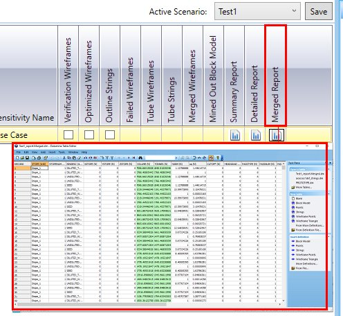
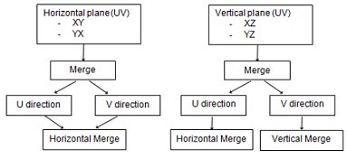
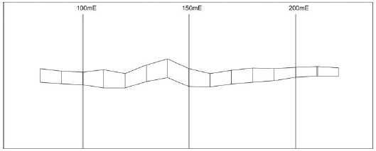
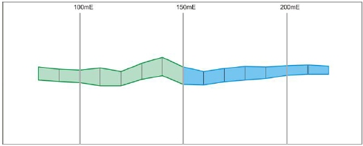
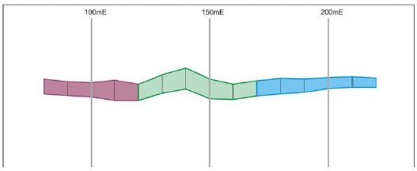
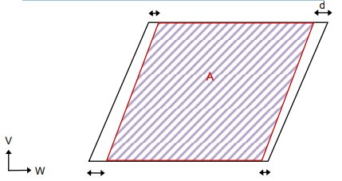
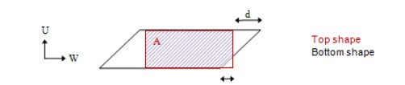
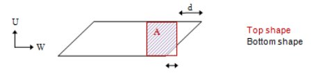

 |  Stope Merging Options Controlling how stope data is combined  
---|---  
  
# MSO Merging Options

### To access this dialog:

  * Using the MSO ribbon, select Options. In Post-Processing Options, select Stope Merging.

Stope Merging

Stope merging is applicable for both full-stope and sub-stopes cases and may be used for the following reasons:

  * To define a maximum that is determined by geotechnical stability (e.g. not to exceed a hydraulic radius criteria).

  * To define a minimum that is determined by economics or mining practicalities (e.g. combining stope-shapes that required small intervals due to variability of the orebody)

  * To define a regularised extraction sequence for stope-shapes (e.g. vertical stacking of primary and secondary stopes)

Details of the two available merge options follow. Note that after applying a merge option, the QUAD number remains the same as prior to the merge. The stope name and stope number are changed to reflect the agglomerated stopes.

If the type of cut-off grade specified on the [Economics](<MSOv3_Economics.md>) panel is either Discrete, Variable or Value from Block Model, you define your merging parameters in terms of the interval, area overlap, corner tolerance, and range distances in U and V directions (either absolutely or on the grid). For Nested cut-off values, stope merging is defined in terms of a maximum gap, offset and overlap in U and/or V directions and a maximum gap (only) in the W direction. Each direction in this context is optionally selected.

The merged wireframe shape is generated by applying a Boolean wireframe merge operation. 

 | 

  * Stope merging cannot be used in conjunction with the Stope Mid-Section Anneal method (see above).
  * The Stope Splitting, Smoothing and Stope Merging options are not mutually exclusive; you can combine splitting and merging operations if you wish.
  * If you enable Stope Merging, you can also configure the output of merged wireframe and string output data using the [Scenarios](<MSOv3_Scenarios.md>) panel.

  
---|---  
  
  
If Stope Merging is enabled, an additional report will be created, This Merged report is accessible on the [Review](<MSOv3_Review.md>) tab after the run is complete, e.g.:  
  

Field Details for Stope Merging (for a Discrete, Variable and Value from Block Model cut-off):

U / V Direction: for these options, the Interval (see below) is not constrained to be on a grid. i.e. shapes will be grouped level by level but not conforming to a grid spacing, just to achieve the target interval. Either of these options will aim to group the stopes at the interval size (regardless of the grid position), but otherwise still work within the min/max stope strike-length limits (Min Range and Max Range).

U /V Direction on Grid: a grid interval, being a multiple of the full stope dimension in the U-axis or V-axis direction, is selected where the framework U or V origin provides the reference U or "V" value.

With this option, the interval is the grid spacing with stopes grouped to be aligned on a grid. This is useful if merged (grouped) stopes must be aligned from level-to-level or section-to-section. The grid option requires stopes to be bounded by grid lines (unless the remaining pieces can be attached within the stope strike-length Min Range and Max Range for U or stope height Min Range and Max Range for V).  
  
  

The Maximum Range value for either grid option must be less than twice the grid interval.

Interval: the interval to be used during merging. The default is 2.

Min / Max Range: with regards to minimum and maximum merge lengths, a whole integer multiple makes good sense as no other outputs can be generated. For example, if you have 5m stopes and you want to group into 15m stopes, your only options are 5m, 10m, 15m for minimum, and 15m, 20m, 25m for maximum. If you want the most stopes output you would have minimum of 5 and maximum of 25 to pick up all the pieces that do not form full 15m aggregations.

Min and Max Range value fields are not displayed if the U Direction on Grid or V Direction on Grid options are selected (see above).

The default minimum value is 0. The default maximum value is 4.

Two tests are used to determine if adjacent shapes within the merge interval specified should be merged:

Corner Tolerance: the maximum distance between corner vertices of the adjacent stope shapes to be considered for a merge.

Area Overlap (%): the minimum area of overlap of the joint area of the abutting faces of two stopes, expressed as a percentage.

Merging Examples

The following examples depict 10m strike-length full stopes, with examples of the grid and interval merge approaches:

   
Full stopes (10m strike) prior to merging

   
Updated stopes after applying U Direction on Grid option with 50m Interval and 30-90 range

   
Updated stopes after applying 50m Interval and 30-70 range

A Horizontal Merge Considering Area Overlap and Corner Tolerance:

  * all four corner pairs of points need to be spaced within the given corner tolerance d, and;

  * the overlapping area A needs to represent at least the given area overlap percentage (based on the union area of the adjacent faces) 

A Vertical Merge Considering Area Overlap and Corner Tolerance:

If at least 3 or the four corner pairs of points are spaced within the given corner tolerance d, and the overlapping area A represents at least the given area overlap percentage (based on the smaller area of the adjacent faces):

If only 2 corner pairs of points are spaced within the given corner tolerance d, in addition to the area overlap percentage test, check that the area of the top shape is smaller than the one of the bottom shape:

 |  Related Topics  
---|---  
| [MSO Introduction  
](<MSO3_Prism_Method.md>)[MSO Slice Method](<MSO3_Slice_Method.md>)   
[MSO Prism Method](<MSO3_Prism_Method.md>)[MSO Stope Splitting](<MSO3_Stope_Splitting.md>)   
[Orientation](<MSOv3_Orientation.md>)   
[Shape](<MSOv3_Shape.md>)   
[Controls](<MSOv3_Control.md>)