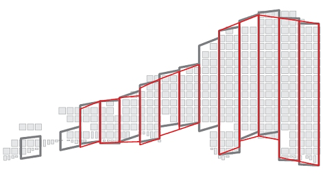

 |  Stope Smoothing MSO stope smoothing options  
---|---  
  
# MSO Smoothing Options

### To access this dialog:

  * Using the MSO ribbon, select Options. In Post-Processing Options, select Stope Smoothing.

Stope Smoothing

MSO stope shapes are optimized on a tube-by-tube basis independently, and consequently, the abutting stope walls will typically not match exactly in position. This may be ideal for abutting stopes that can be mined independently of each other (e.g. primary and secondary long-hole stopes) but this does not occur commonly for geotechnical reasons and/or for the mining method practicalities. A typical example would be a continuous retreat long-hole benching mining method.

 | 

  * Stope smoothing cannot be used in conjunction with the Stope Mid-Section Anneal method (see above).
  * The Stope Splitting, Smoothing and Stope Merging options are not mutually exclusive; you can combine splitting and merging operations if you wish.

  
---|---  
  
The additional smoothing is applied subject to:

  * A maximum allowable gap tolerance between corners of abutting stopes,
  * The smoothed stope-shape not falling below the designated cut-off
  * The stope geometry rules not being violated.

Sub-stope corners are adjusted at the corners adjacent to a full-stope corner, however sub-stopes are not smoothed with other sub-stopes.

In the example below, the grey outline represents the original stope shape, and the red outline the smoothed shape:

Two methods of smoothing are supported: [Average] and [Anneal]. See below for more details.

  
Field Details for Stope Smoothing:

Method: choose from one of the following

  * Fast Anneal:honors the maximum gap and geometry restrictions but investigates a smaller number of possible solutions than the "Anneal Method" (see below).

  * Average: This is the default setting. Stopes corners with gaps that fall within the match_tolerance can be smoothed by taking the average of the corner (W) coordinates. The Average method is very fast but users should be aware that the resultant stope shapes may fail the stope geometry tests, and the logfile should be checked for these errors. 

  * Anneal (default): the Anneal smoothing method does not average. It first tries to minimise the gap while maintaining each of the user supplied stope geometry constraints. For example, if your stope-wall dip range was tight, then it may not necessarily close the gap if the dip limit was violated. It cannot make an economic stope sub-economic. It then tries to improve the value of the resultant stope-shapes without significantly increasing the gaps. So in some runs, only portions of the stope wireframes may be smoothed. Any gaps between stopes that are greater than the maximum allowable tolerance will not be changed. Gaps below the maximum may be partially or completely reduced to zero gaps. Sub-stope corners are adjusted at the corners adjacent to a full-stope corner, however sub-stopes are not smoothed with other sub-stopes.   
  
Prior to smoothing the gaps are analyzed and stopes with more gaps to adjacent stopes and sub-stopes are processed first. i.e. stopes at the centre of the orebody are likely to be smoothed first and stopes at the extremities will be smoothed last. All tubes are processed in sequence in the first pass. As each tube is smoothed, up to 8 other adjacent tubes (with stopes or sub-stopes) will be adjusted. The complexity of the annealing in this additional step can be an order of magnitude greater, and consequently the smoothing run can often take 5-10 times longer than an unsmoothed run, and sometimes more, particularly if there are multiple lenses or parallel orebodies.  
  
The first pass is usually enough to give a good result. There are no parameters to control the time spent on the first pass. Any additional passes are optional, and under user control. The parameters to control additional runs are either by number of passes or by time limit (in minutes). Smoothing can be controlled by either comparing the "gaps" between stope corners, or alternatively the "ratio" of stope edges.   
  
For a version of annealing that uses a smaller number of possible solutions (potentially making it a faster result), see "Fast Anneal", above.

  * Outer Limit: similar to the Average Method (see above) but rather than average the gap the outer most point is used in order to maximise the size of the stope shapes. 

Match Direction: smoothing is an additional step using the same annealing algorithms. This optimizes the shapes not just in a single tube, but taking into account the adjacent tubes. The gaps between the corners of adjacent stope-shapes will be eliminated / minimized from one tube to the next in order to:

  * Create a smooth transition vertically (V) and/or horizontally (U) for vertical framework orientations, or;
  * Create a smooth transition in the U and/or V axes for the far/near wall for horizontal framework orientations.

The default setting is UV, meaning stopes will be smoothed in the direction of both the U and V axes.

Match Tolerance: smoothing does not average. It first tries to minimise the gap while maintaining each of the user supplied stope geometry constraints. For example, if your stope-wall dip range was tight, then it may not necessarily close the gap if the dip limit was violated. It cannot make an economic stope sub-economic. It then tries to improve the value of the resultant stope-shapes without significantly increasing the gaps.

So in some runs, only portions of the stope wireframes may be smoothed. Any gaps between stopes that are greater than the maximum allowable Match Tolerance will not be changed. Gaps below the maximum may be partially or completely reduced to zero gaps.

Multi-Pass Limit (Anneal option only): set the maximum number of additional smoothing passes. The first pass is usually enough to give a good result.

Time Limit (Anneal option only): set the maximum number of time (in hours) that are permitted for smoothing, regardless of the number set above.

 |  Related Topics  
---|---  
| [MSO Introduction  
](<MSO3_Prism_Method.md>)[MSO Slice Method](<MSO3_Slice_Method.md>)   
[MSO Prism Method](<MSO3_Prism_Method.md>)[MSO Stope Splitting](<MSO3_Stope_Splitting.md>)   
[Orientation](<MSOv3_Orientation.md>)   
[Shape](<MSOv3_Shape.md>)   
[Controls](<MSOv3_Control.md>)