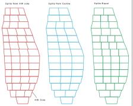
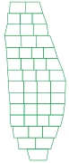
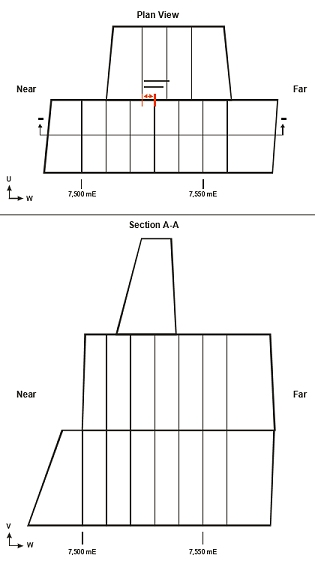
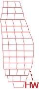
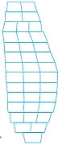

 |  Stope Splitting Options Control how optimal stope shapes are split  
---|---  
  
# MSO Splitting Options

### To access this dialog:

  * Using the MSO ribbon, select Options. In Post-Processing Options, select Stope Splitting.

Stope splitting subdivides stope-shapes according to rules. 

It is generally applicable for stope-shapes that are wider than their maximum stable wall span(s) or for sub-setting very wide ore bodies. It may also have some conceptual design application for drift and fill and mechanized cut and fill type mining methods by setting split widths to development width and using a minimum and maximum tolerance on the split width. It may also be applicable for establishing shapes that correspond with blast ring increments such as for the transverse SLC mining method.

You can choose to split in the Transverse direction (the default), using a Model Field, using a Fixed Width, or in the Longitudinal direction (U-axis and/or V-axis). Note that longitudinal splitting is equivalent to applying U-axis (and/or V-axis) sub-stopes from a full stope.

 | 

  * Stope splitting cannot be used in conjunction with the Stope Mid-Section Anneal method (see above).
  * The Stope Splitting, Smoothing and Stope Merging options are not mutually exclusive; you can combine splitting and merging operations if you wish.

  
---|---  
  
Field Details for Transverse Stope Splitting

Transverse \- Split Type: Transverse splitting options are as follows:

  * Split Equal: attempt to split stope shapes to result in equal volumes, e.g.:  
  

  * Split on Grid: offset the split wall positions between adjoining stopes (i.e. adjacent in the U-axis sense) by using an offset from the stope-framework grid for a staggered checkerboard pattern.  
  
For example, the following example shows the effect of splitting on a grid with an Offset of 5m, an Interval of 10m, a Min Range of 8m and a Max Range of 15m:  
  

  * Split on Grid and Anneal: split on a regular stope-framework grid with annealing to create a checkerboard pattern (for abutting open stoping layouts. 

  * Split from Near/Far Side (vertical framework only): split from the near of far side of the stope.

  * Split from Footwall (vertical framework only): split from footwall with the final split adjusted to tolerance settings.

  * Split from Hangingwall (vertical framework only): split from hangingwall with the final split adjusted to tolerance settings, e.g.:  

  * Split from Floor/Roof (horizontal framework only): split from floor or roof with the final split adjusted to tolerance settings.

  * Split from Centre: split from a centred stope. It places the first stope central to the transverse width i.e. not on either side of the centre. The "centre" is defined as being at the mid-stope height, e.g.:  
  

Transverse - Interval / Offset / Min Range / Max Range: the dimensions of split stopes is determined by an Interval(default = 50), a minimum and a maximum length. In most cases the un-split stope length will not be an exact multiple of the "interval", and so the Min Range (default = 30) and Max Range (default = 70) values will need to be selected to take into account all possible split sizes. These values are referenced from the stope centroid position.

The Offset field is only valid/used when either the [Split on Grid] or [Split on Grid and Anneal] splitting options are chosen.

Transverse - Force Vertical Internal Walls: select this option to ensure all internal walls (splits) are vertical.

Transverse - Force Vertical External Walls: select this option to ensure all external walls (splits) are vertical.

Transverse - Use Fixed Internal Wall Angle: as an alternative to the Force Vertical options (see above), you can optionally configure the internal wall angle when using stope splitting. Select this check box and enter a Wall Angle to be use (using the convention 90 = vertical).

Additional fields:

Force Vertical Internal/External Walls: you can choose to ensure internal and/or external stope walls are designed vertically using either or both of these check boxes. These options are available for any selected Split Type.

Use Fixed Internal Wall Angle: only available if both Force Vertical... check boxes above are disabled, this field allows you to set a constant wall angle for internal walls (90 = vertical).

Use Average Strike: only available if at least one of the Force Vertical... check boxes or the Use Fixed Internal Wall Angle check box is selected.

First Offset: define the offset distance to use for the first split. This is available for all split types other than Center, Split Equal, Split on Grid and Anneal. Also requires that one of the Force Vertical... check boxes is enabled.  
  

Field Details for 'Use Model Field' Stope Splitting

Selecting the Use Model Field option allows you to define a numeric attribute in the input model that will be used to determine stop widths. Absent data in the selected attribute can be handled by entering your own Default value.

Field Details for 'Fixed Width' Stope Splitting

Selecting the Fixed Width option allows you to specify a static stop width throughout the output stope data. This is specified as a Width. Optionally, you can force vertical walls at split positions.  

Field Details for 'Longitudinal'Stope Splitting

Longitudinal splitting is equivalent to applying U-axis (and/or V-axis) sub-stopes from a full stope. Selecting this option lets you define the number of splits in the U or V direction (not both). A maximum of 5 splits is permitted along the U or V axis.

[More examples of Stope Splitting...](<MSO3_Stope_Splitting.md>)

 |  Related Topics  
---|---  
| [MSO Introduction](<MSO3_Prism_Method.md>)[MSO Stope Splitting Examples](<MSO3_Stope_Splitting.md>)[Stope Smoothing Options](<MSO3_Options_Smoothing.md>)[Stope Merging Options](<MSO3_Options_Merging.md>)