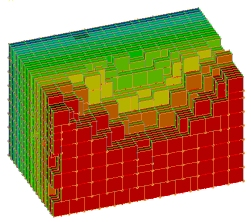
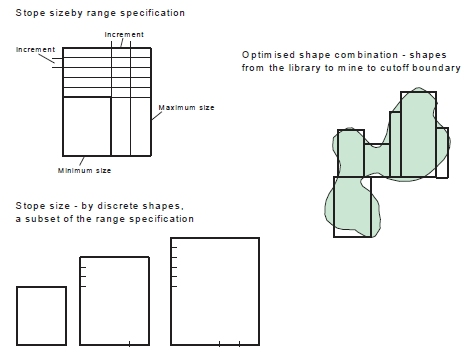
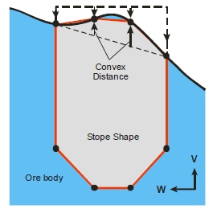
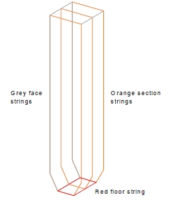

 |  MSO - Prism Method A detailed overview of MSO's Prism Method  
---|---  
  
# MSO - Prism Method

Introduction

The Prism Method of stope shape optimization is typically applicable to massive orebodies or wide/thick deposits whose stopes tend to be designed by blocking out the orebody in a grid-like pattern.

The Prism Method allows the user to define a library of possible stope-volumes by using permutations of stope length, width and height (as rectangular prisms). The library of stope-volumes can be defined as rectangular-prisms or defined as prisms with a centralised undercut-trough (i.e. a shape like an inverted milk-carton). The stope-library can be developed quickly by using minimum, maximum and step increments for each axis or the library can be explicitly defined giving specific axis dimensions for each stope-volume.

The Prism Method optimally combines the stope-volumes within each framework "region" with no overlapping of either regular or various irregular stope-volumes (i.e. it selects the optimum non-overlapping combination of rectangular stope-volumes). The goal of the optimisation is to select the set of non-overlapping stope-shapes that maximises value for the material to be extracted by the selected stope-shapes. All possible combinations of shapes and positions are considered in the optimisation.

As an example, a typical goal of optimally combining stope-volumes with different dimensions (e.g. a small footprint stope adjacent to a large footprint stope) is to determine the optimal orebody footprint.

This shape framework is defined using the [Shape](<MSOv3_Shape.md>) panel.  

Comparison with the [Slice](<MSO3_Slice_Method.md>) Method

The Prism method is a different style of stope optimization to the [Slice](<MSO3_Slice_Method.md>) method. With the Slice method the stope-shape framework is decomposed into individual geometric tubes based on the level and section dimension for the Vertical case, and the stope-shape (or sub-shape) is an optimization over the width of the orebody, with a two stage process to

  * Firstly define the seed-shape, and
  * Secondly to anneal the final stope-shape.

The Prism method also requires a stope-shape framework, but uses the decomposition of the framework extents to define sub-problems. The framework extent is subdivided in regular intervals, much like regular quadrilaterals, except that the subdivision is three dimensional rather than two dimensional, and each subdivided volume is referred to as a region, whereas the Slice method subdivision is two-dimensional to form a tube. Stope-shapes are defined as a fixed set of shapes defined by the footprint and height, and the optimization problem is defined as identifying a combination of non-overlapping stope-shapes from the set provided to maximise value or grade within each independent region.

Although the geometric formulation of the problem is different, the same evaluation options are available for cut-off, optimization and reporting fields, inclusion/exclusion, filters etc. as applies to the Slice method.

[More about the Slice method...](<MSO3_Slice_Method.md>)   
  
[More about Prism Stope Orientation Options (Stope Shape Selection Wizard)...](<MSO3_Shape_Stope_Generation_Settings.md>)

Prism Method Framework \- Details

Prism frameworks are not orientation-specific but the X|Y|Z intervals must be regular. A grid increment is also defined for each axis, within regions (i.e. sub-set volumes of the total Prism framework). Shapes from the stope-volume library will normally have dimensions that are an integer multiple of the grid increment and can result in stopes located at any grid increment.

The full framework definition may contain several regions that may be independent or contiguous abutments. This could be likened to a mine-site with mine sub-districts/areas/ zones. The framework region(s), however, must be rectangular in shape. Regions are user defined to make stoping geometric sense e.g. to span a group of levels or to span a group of sections or to span a group of levels and sections. The library of stope-volumes is applied to each region in turn with each region optimized independently. One use of regions is to force stope-volumes to honour say a regular level spacing or a regular section width (i.e. regular primary and secondary stopes).

The framework region(s) are further defined by regular grid increments in the X|Y|Z axes. This allows stopes-volumes to position with the bottom left hand corner at any grid increment, providing the stope-volume completely fits into the region. This gridding provides a stope framework for floating stope-shape volumes within each framework region.

Stopes from the library would typically have dimensions that are an integer multiple of the grid increment, otherwise gaps would occur between adjacent stopes. The size of the grid increments might in some cases be the minimum stope dimension.

As an example, using a region dimension of [100, 100, 250] (X|Y|Z), stope library dimensions defined by [30, 40, 10] for X and Y axes (minimum, maximum and step size) and [50,250,50] for the Z axis (minimum, maximum and step size) and a region grid increment of [20, 20, 50] (X|Y|Z) the following stope combinations are possible.

The possible X or Y axis combinations are: 1x40 (starting at either 0, 20, 40 or 60 grid interval in the region), 2x40 (starting at either 0/40, 0/60, 20/60 grid interval in the region), 1x30 (starting at either 0, 20, 40, 60 grid interval in the region), 2x30 (starting at either 0/40, 20/60 grid interval in the region), 3x30 (not possible due to 20 grid increment), 2x30 plus 1x40 (not possible due to 20 increment) in either X or Y axis.

The possible Z axis combinations are: 1x250 (starting at 0 grid interval in the region), 1x200 (starting at either 0, 50 grid interval in the region), 1x150 (starting at either 0, 50, 100 grid interval in the region), 1x100 (starting at either 0, 50, 100, 150 grid interval in the region), 2x100 (starting at 0/150 grid interval in the region), 1x50 (starting at either 0, 50, 100, 150, 200 grid interval in the region), 2x50 (starting at either 0/100, 0/150, 0/200, 50/150, 50/200, 100/200 grid interval in the region) and 3x50 (starting at 0, 100 and 200 grid intervals). Note that for the 2x100 case the 0/100 and 50/150 grid intervals starts are made redundant by the 1x200 case with 0 or 50 grid interval starts. This is because the set of largest stope-volumes is solved for.

Prism Method Stope Shapes

Using this method, stope-shapes can be either:

  * Rectangular (with square being a sub-set of rectangular), or
  * Truncated Rectangular, shaped like an inverted milk-carton to represent a trough-undercut for mucking extraction.

Specification of default strike angle and dip angle are not needed in the Prism Method, however, a framework orientation (i.e. XZ|YZ) is required to define the orientation of the trough undercut.

 |  Annealing of stope-volumes is not available in the current implementation of MSO.  
---|---  
  
The stope-shape sizes in the stope-shape library can be specified quickly by using the minimum and maximum size and step increments for each axis, or the library can be explicitly defined giving specific axis dimensions for each stope-shape as depicted in the image below. The optimized shape combination can match the shape and position of stopes from the stope-shape library to the ore outline to maximise ore extraction, and total value.

Once a Prism framework is chosen ([Shape](<MSOv3_Shape.md>) panel), you are then prompted to select a Prism Geometry option (the only available option at this time). At this point you are offered a choice of four stope orientations:

  * Prism XZ Framework: X axis = U direction, Z-axis = V direction, Y axis = W-direction
  * Prism YZ Framework: Y axis = U direction, Z-axis = V direction, X axis = W-direction
  * Prism XY Framework: X axis = U direction, Y-axis = V direction, Z axis = W-direction
  * Prism YX Framework: Y axis = U direction, X-axis = V direction, Z axis = W-direction

Trough Undercuts

MSO accounts for the waste dilution and/or ore loss regarding the shape of the trough-undercut during the optimization process. The undercut provides an optimized rectangular stope-shape with the two bottom edges bevelled off parallel to the orientation axis to form the trough-undercut side walls.

Trough undercuts are defined using the [Refinement](<MSOv3_Refinement.md>) panel, presuming a Prism framework, geometry and orientation have been selected beforehand.

The trough-undercut shape is defined by:

  1. Trough-undercut width at base
  2. Minimum trough-undercut wall angle from the base of the trough
  3. Position of the trough-undercut - centre, left or right alignments are possible

The two shape configurations are illustrated below, in particular, the parameters for the shaped prism trough-undercut stope-volume.

Prism Shapes with and without Trough Undercut

Shape Refinement - Crown Shape Annealing ("Use Crown Side")

The techniques employed for shape refinement in the [Slice](<MSO3_Slice_Method.md>) Method can also be applied in the Prism method. A Prism shape can be understood as wireframe generated from two 8 point outlines, with two points introduced for the trough, and two equally spaced located on the stope roof, and this shape can be used as a seed shape for further annealing.

A variation on the shape refinement method allows the 4 points on the roof to be annealed with the points constrained to a vertical path, and the intermediate points between the stope corners constrained by a convex/concave distance.

As above, the crowning configuration is specified using the [Refinement](<MSOv3_Refinement.md>) panel and is only available if a prism framework has been selected beforehand.

It is assumed that the seed shape must be economic, and that the crown shape annealing can then improve the stope shape. Run times will be significantly greater because each feasible shape must be subjected to the crown shape annealing, and then the best non-overlapping solution (based on the seed shape limits) optimized.

Prism Method - Output Strings

In addition to optimized volumes, the Prism method will also generate a set of construction strings. The Prism strings produced are as depicted below and include:

  * the trough profile face strings (when the undercut trough option is enabled),
  * the section strings,
  * the intermediate section string(s) (when this option is enabled),
  * the floor string.

 |  Related Topics  
---|---  
| [MSO Introduction](<MSOv3_default.md>)   
[MSO Shape Framework Concept](<MSO3_Frameworks_Concept.md>)   
[MSO Slice Method](<MSO3_Slice_Method.md>)   
[The Shape Panel](<MSOv3_Shape.md>)   
[Refinement](<MSOv3_Refinement.md>)   
[Scenarios](<MSOv3_Scenarios.md>)