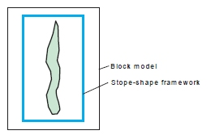
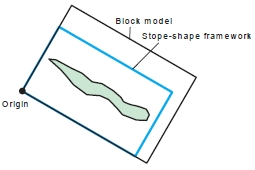
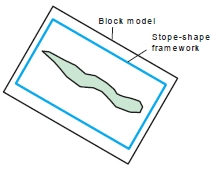
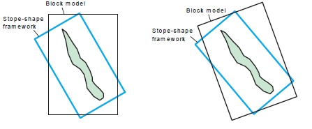
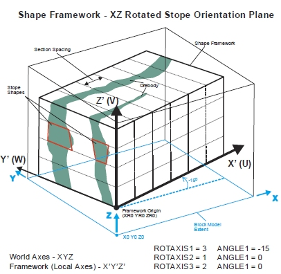
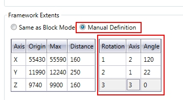

 |  MSO - Rotated Shape Frameworks Understanding how MSO behaves in a rotated world  
---|---  
  
# MSO - Rotated Shape Frameworks

Frameworks, like the geological block models, can be defined as Un-rotated or Rotated. For most cases, users deal with un-rotated frameworks which are easier to understand and faster to process due to simpler geometric calculations.

An example of where a rotated framework may be utilized is where an orebody may have a strike orientation of 300 degrees/120 degrees azimuth and dip sub-vertically 70 degrees to the east. The most logical un-rotated stope-shape framework orientation to select, in this example case, would be the Slice Method Vertical XZ framework, such that stope annealing occurs in the transverse W-axis direction (i.e. in the north-south azimuth with bearing of 0/180o).

However, this stope-shape framework may be re-oriented to be more parallel with the primary strike-axis of the orebody such that W-axis annealing occurs at right-angles to the orebody (e.g. azimuth bearing of 30/210 degrees). This example could also be further complicated whereby the block model framework has also been rotated such that its orientation is more favorable for geological interpolation purposes.

The block model rotations may be the same or different to the stope-shape framework rotations. The rotated block model is defined in local coordinates and world coordinates via rotation parameters. The following describes the various cases.

  
Rotated Framework Combinations

The orientation of the stope-shape framework is defined and operates independently of the block model framework orientation.

It is always advised that the location and extents of a rotated framework be checked visually against the mineralized portion of a block model to ensure that stopes can be generated where they are expected.

The stope-shape framework and block model combinations are reported in the output [report](<MSOv3_Review.md>) as:

  * Neither the block model nor the stope-shape framework are rotated (MODROT=1)
  * The block model and stope-shape framework are both rotated, and have the same rotation definitions (MODROT=2).
  * The block model and stope-shape framework are both rotated, and the axes are parallel but offset (MODROT=3). Note that this case also requires the rotations of model and framework to be identical
  * One or both of the block model and stope-shape framework are rotated, but do not have equal rotation angles (MODROT=4).

Block model and stope-shape framework rotations have impacts on runtime performance (especially for the MODROT=4 case).

Some examples:

Both model and shape framework un-rotated:

Model and shape framework both rotated (same origin/parameters)

Model and shape framework rotated (axes parallel but offset)

One or both model and shape framework rotated but unequal rotation angles

  * For un-rotated cases, the stope-shape frameworks implicitly use world coordinates [X, Y, Z] i.e. both the level coordinates and section coordinates are defined in the world coordinates.

  * For un-rotated cases, the world coordinates define the framework extents (minimum and maximum) and the step sizes are entered directly to the user interface. This defines the x, y and z extents and the number of steps based on the step size.

Rotated frameworks use local coordinates [X,Y,Z] and world coordinates [X,Y,Z] to specify the framework origin point (both local and world). The coordinates for the local framework origin are typically set as [0, 0, 0] or even [0, 0, level elevation], and use of the world coordinates for the local framework origin should be avoided for simplicity. A specific requirement is that the rotation point and the origin of the framework must be coincident.

The specification of the framework is equivalent to specifying a model origin, extent, cell size and rotation for a block model.

The stope-shape framework reference point is defined internally as world coordinates at the bottom left-hand-side corner of the stope-shape framework [x0, y0, z0]. The origin and dimensions are then redefined in local coordinates [xr0, yr0, zr0].

The shape framework orientation [U,V,W] axes correspond to the world [X,Y,Z] for the un-rotated case. However, for the rotated case, the stope orientation [U,V,W] axes correspond to the local framework grid coordinates [X,Y,Z], not the world framework coordinates [X,Y,Z]. The stope-shape framework is specified in the [U,V,W] grid.

With an irregular framework, parameters like section location and sublevel elevation should be provided in local coordinates. If no stopes are output it is likely that the coordinates were supplied in world rather than local coordinates.

If strings or wireframes are supplied to MSO, then these will need to be in world coordinates. All output from MSO is in world coordinates, but internally it works in local coordinates.

The key elements to consider for rotated models are illustrated below. The world coordinates are identified as [X,Y,Z] and the local coordinates as [X',Y',Z']:

  
Rotated Framework Parameters

The parameters used within MSO to determine a rotated shape framework are entered using the Scenarios panel (Manual Definition option for Framework Extents), and are similar to those entered using the [CDTRAN](<../Process_Help_XML/cdtran.md>) process:

  * Angle 1-3: the first, second and third rotation angle clockwise in degrees, around axis 1, 2 or 3. It must lie between -360.0 and +360.0. A value of zero indicates no rotation. These

  * Axis 1-3: The axis around which the first, second and third rotation angles will occur. 0 for no rotation, 1 for X axis, 2 for Y axis, 3 for Z axis

These rotation parameters will be supplemented with known points (in the un-rotated system) and the same in the rotated system for X, Y and Z coordinates.

It is good practice to visually confirm that the stope-framework has been oriented as intended relative to the deposit block model. This can be done by creating an empty test block model using the framework specification parameters, and viewing this test model in conjunction with the deposit block model.

 |  Related Topics  
---|---  
| [MSO Key Shape Concepts](<MSO3_Shape_Diagram.md>)   
[MSO Slice Method Overview](<MSO3_Slice_Method.md>)   
[MSO Shape Frameworks](<MSO3_Frameworks_Concept.md>)   
[MSO Tips and Guidelines](<MSO3_Tips.md>)   
[MSO Control Strings](<MSO3_Control%20Strings.md>)   
[MSO Block Models](<MSO3_BlockModels_Guidance.md>)   
[MSO Angle Conventions](<MSO3_Framework_Angles.md>)  
  
Copyright Datamine Corporate Limited  
JMN 20045_00_EN