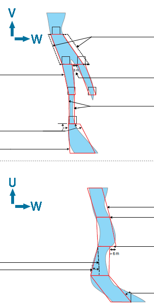
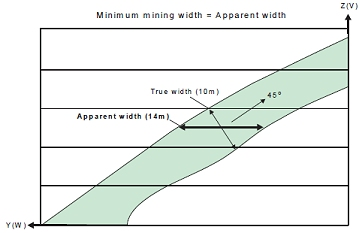
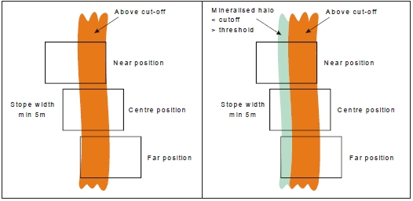
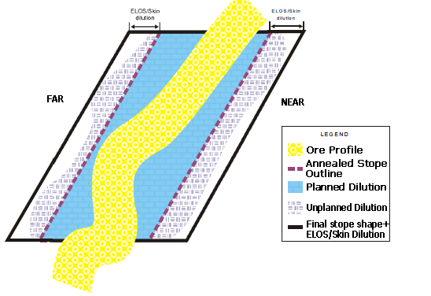
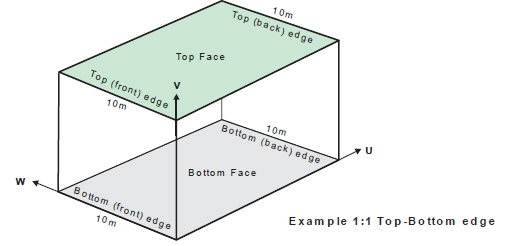
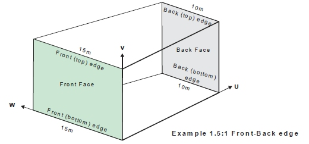

 |  MSO - Key Geometry Parameters A summary of key geometrical concepts used in MSO  
---|---  
  
# MSO - Geometry Parameters

The following diagram conceptualizes important shape parameters that are important to the effective running of MSO.

Further below, these parameters are described in more detail.

  
Example stope shapes: simple 4-point trapezoids using straight lines between the levels   
  
  
90-120 degrees   
  
MSO stope shape Strike angle change: the maximum relative angle between the stope-shape top/bottom wall edges e.g. this example 30 degrees. It typically represents wall (hw/fw, near/far) "twist".   
  
Top edge of FW face  
Bottom edge of the face |   |   
  
Wall (skin) dilution: is added to the stope shape as an equivalent linear-overbreak. The dilutions are added after the optimized stope shape is formed Minimum waste pillar width of 5m. This can alternately create 2 'parallel' shapes separated by a waste pillar, 1 larger stope shape carrying the waste between the lenses or 1 shape around the higher contained-metal lens Minimum Mining Width example of 3m. Note that width represents horizontal trace (not the true mining width) MSO stope shape  
Smoothing: stope-shape end walls are smoothed when the gap is less than target (e.g. <6m)  
Smoothing: stope shape end walls not smoothed when the gap is greater than target (e.g. > 6m) Maximum strike angle: the minimum and maximum range values relative to the stope framework U-axis (i.e. strike direction) - this example +/- 45 degrees  
---|---|---  
  
Minimum Stope Width

The minimum mining width parameter is defined as distance in the horizontal plane on the framework section along the W-axis (and consequently measures the apparent width). If the orebody dip is moderate or the strike deviates from the framework axis, then it would be appropriate to make a correction to the width specified to better approximate the intended true width. As an example, if the minimum stope width in the true-width dip-direction was intended to be 10m and the orebody was dipping at 45o, then setting the minimum stope width to 14.1m (horizontal distance) would approximate the intended minimum stope width.  
  
Note that the true width is a function of both strike and dip orientation in three dimensions for the general case.

If the stope wall angle ranges are the same for both the hangingwall and footwall, or roof and floor, then the minimum stope width is checked at the stope corners.

If the stope wall angle ranges are different, then the minimum stope width is checked at the wall centre, because the optimal seed-shape is measured at the wall centre, and the annealing shape must be measured in the same manner to ensure that a feasible annealing shape is available at the start of annealing.

  
Maximum Stope Width

The maximum mining width parameter is defined as distance in the horizontal plane on the framework section along the W-axis (and consequently measures the apparent width).

An example use for the maximum stope width is to restrict the transverse dimension for geotechnical purposes (e.g. not to exceed the stable hydraulic radius for the crown face or the strike-face walls).

There is also the option in post-processing to split the stope width into smaller intervals without pillars. The maximum stope width should be interpreted as maximum stope width between pillars. The post-processing approach is preferred over the now discouraged approach of specifying a small (non-zero) pillar width, and a maximum stope width equal to the interval sought.  

Narrow Ore

Where the ore grade material is confined to a sharp boundary, surrounded by host rock with zero grade the stope optimisation engine has no way to locate the stope walls relative to that sharp boundary - all positions of the stope about the boundary have equal value.

A way to resolve this issue is to (slightly) penalize waste that falls between the ore and the preferred wall position. If the ore is to be centred in the stope then the penalty for one wall should be balanced by the penalty for the other.

Three parameters control the penalty:

  * waste threshold \- a cutoff to identify "waste"
  * waste threshold grade \- a grade or value to be applied to all cells below the waste threshold. This value should be non-zero.
  * position \- the required position for the ore, with allowed values being near|far|centre|roof|floor

The function has been termed "narrow ore" because this would be the primary application, the material above cutoff is typically less than the minimum stope width. As shown in the figure, if there is material below the cutoff, but above the threshold, and this material falls within the economic stope then that material can be considered part of the "narrow ore".

Narrow ore processing requires a block model for the below waste threshold material to be able to apply the penalty. The penalty is calculated using approximate evaluation techniques.

Narrow Ore Positioning Example.

  
Dilution ELOS/Skin

(ELOS = Equivalent Linear Overbreak Oversloughing)

Dilution refers to material below cut-off grade that gets blended with ore, thus reducing the grade of excavated material. Dilution in general is impossible to avoid in stoping due to geometries of the orebodies and it is therefore divided into planned and unplanned dilution. The annealed stope shape includes planned dilution which is the waste material necessary to extract the ore. Unplanned dilution is material that originates outside the stope boundaries. To factor in unplanned dilution that originates from outside the stope boundaries from the HW/FW or Near/Far a dilution ELOS/Skin can be specified.

An option is provided (using the [Options](<MSOv3_Options.md>) panel) to evaluate if dilution will make the stope shape uneconomic, and only consider shapes that are economic with dilution. The default mode is to optimize the undiluted shape and then add dilution, but with this control a smaller undiluted shape will be produced and the dilution will include more above cutoff material.

Impact of Dilution on the Final Stope Shape

VOS Dilution

An alternative method is available, potentially offering greater flexibility in specifying dilution in different orebody types and stoping methods. In Variable Overbreak/Slough (VOS) dilution, the dilution interval is specified for each vertex in the 4/6/8 point shape. For 4pt shapes the dilution is specified at the midpoint to create a 6pt final stope shape.

Minimum Pillar Width

A pillar will separate seed-shapes or stope-shapes if the maximum stope width would otherwise be exceeded, or low grade/waste can be isolated from stope shapes.

Waste cells (representing mineralisation below cut-off, or rock without mineralisation) surrounding the ore cells are required for runs with sub-stopes, as the location of the mined-out cells is used to force the pillar width between stopes and sub-stopes, and between sub-stopes and sub-stopes.

If the stope wall angle ranges are the same for both the hangingwall and footwall, or roof and floor, then the minimum pillar width is checked at each corner. If the stope wall angle ranges are different, then the minimum pillar width is checked at the wall centre.

Note that the pillar width parameter is defined as the distance in the horizontal plane i.e. the apparent pillar width.  
  
Strike Angle

The strike angle is the angle of any one of the four stope wall edges (measured relative to the U axis of the stope orientation plane).

Ideally the strike angles would be loosely defined (i.e. using broad tolerance range) in a preliminary test SSO run in order to give a reasonable upper limit on the number of stopes produced or to maximise the stope dimensions. The strike angle parameters would then be progressively refined as required.

One example application would be where stope-shapes are formed in a criss-crossing pattern between parallel lenses which have discontinuous mineralization, and the user wanted to force the stopes to not criss-cross between the lenses.

Another example would be the formation of stope-shapes that have rapid or chaotic changes in wall angles, giving the appearance of being malformed (but are actually not).

The above examples may be considered to be impractical stope-shapes to implement, and hence the wall strike angle changes are smoothed out to better approximate a mineable set of stope shapes.

The following sub-sections describe the strike angle parameters in more detail.

  * Strike Angle Range   
This defines the strike angle range of either edge (i.e. top or bottom) of either wall of the stope-shape (i.e. near/far wall or hangingwall/footwall wall) relative to the frameworks strike axis (i.e. the U-axis). The range can be independently defined as positive and/or negative relative to the stope shape framework strike axis.
  * Strike Angle Maximum Change   
This defines the maximum allowable stope-shape twist relative to the top and bottom wall edges.

Side Length Ratio

The ratio is defined by the end-face wall lengths and the axis direction pairing being considered, described further in the following sub-sections.

Ideally the side length ratios would be loosely defined (broad range) on a preliminary SSO run to maximise the number of stopes produced or to maximise the stope dimensions. The side length ratios would then be progressively refined as required.

An example use of the side length ratio is to force walls (i.e. near/far walls or hangingwall/footwall walls) to be parallel to each other (i.e. a sectional parallelogram) so that all production hole drilling is parallel for a narrow tabular orebody. This is achieved by using a 1:1 ratio, but this ratio should only be used in a final run to ensure that all the required shapes are generated in the annealing phase. Likewise, in the U-axis direction plan view parallelograms can also be specified.

  * Side Length - vertical_side_length_ratio, top_bottom_maximum   
For either top-edge divided by bottom-edge or bottom-edge divided by top-edge) and applies to either end-wall face (i.e. front or back). The upper limit for the ratio (longer/shorter) of the top and bottom edges of the front and back strike-face of a stope-shape as shown below:  
  
  
  
Top-Edge to Bottom-Edge Ratio (V-axis pairing)
  * Side Length - vertical_side_length_ratio, front_back_maximum  
The upper limit for the ratio (longer/shorter) of the front and back edges of the top and bottom face of a stope-shape as shown below:  
  
  
Front Edge to Back Edge Ratio (U-axis pairing)

Waste Inclusion Control

The maximum waste fraction of stope-shapes can be defined (i.e. proportion of rock with mineralisation values below specified cut-off included within the stope-shape).

The waste inclusion is defined as:

(Volume of material inside diluted stope shape below cut-off  
---  
  
* * *  
  
(Volume of diluted stope shape)  
  
A default fraction value of 1.0 means any waste proportion is acceptable.

It is good practice to:

  * Start with a test value of 1.0 and gradually refine this in subsequent runs to monitor the impact.
  * If you have back-fill in the voids located within stope-shapes, then do not associate this material with the report_exclusion_field, as it should have a density and grade, and effectively be in one of the three waste categories.

Exclusion Control

The exclusion control can be used to avoid the creation of stope-shapes within say deleterious-processing material or in poor rock-mass zones as a few examples of its use. The material in the model is flagged with a (numeric or alphanumeric) field and a value.

Up to two exclusion fields can be defined in a run. Each exclusion field permits a certain maximum tolerance of inclusion within a stope-shape.

The exclusion control is defined as the maximum fractional proportion of material (by volume) in the stope-shape that is flagged as either exclusion1 or exclusion2 material.

The tolerance for each exclusion field exclusion1 and exclusion2 is set independently, and allows for a maximum fractional proportion of the respective exclusion material to be incorporated into the stope-shape. As an example, you may be mining a secondary pillar stope and the shape of the adjacent primary backfilled stopes may bulge into the secondary, so for practical purposes you may allow say up to 5% (0.05 fraction) of backfill material within the secondary stope-shape.

Stope Optimization Methods

The Mineable Shape Optimizer tool supports the following shape frameworks:

  * "Slice Method" which generates and evaluates thin slices across the mineralized zones that are aggregated into seed-shapes (looking at all possible permutations) that satisfy stope and pillar width constraints. The seed-shapes are then annealed to the final optimized stope-shape satisfying the stope and pillar width, stope geometry constraints (e.g. wall dips angles, strike twist, etc.), and other miscellaneous constraints (e.g. zone mixing, exclusion zones, etc.). The result is a set of stope-shapes constrained to the basic limitations of the envisaged mining method.  
  
Slice method frameworks are available in either Standard or Advanced types.  
  
[Standard Slice Framework Settings](<MSO3_Shape_Framework_Settings_Standard.md>)  
[Advanced Slice Framework Settings](<MSO3_Shape_Framework_Settings_Advanced.md>)  

  * "Prism Method" which optimally combines a set of shapes from a library of stope-volumes within regions without allowing overlapping of the generated stopes. It is typically applicable to massive orebodies or wide/thick deposits whose stopes tend to be designed by blocking out the orebody in a grid-like pattern.  
  
[Prism Framework Settings](<MSO3_Shape_Framework_Settings_Prism.md>)  

  * "Boundary Surface Method" for narrow high grade reefs or lenses, where subcell modelling has some spatial accuracy limitations, it can prove more effective to model stope shapes off the geological wireframes directly. The stope walls are modelled as a mesh of points from [3x3] to [6x6] points. Dilution, orebody positioning in the stope, and an option to split the stope into waste and ore components, are provided.   
  
[Boundary Surface Framework Settings](<MSO4_Boundary_Surface_Method.md>)

 |  Related Topics  
---|---  
| [MSO Introduction](<MSOv3_default.md>)   
[Slice Method Overview](<MSO3_Slice_Method.md>)   
[MSO Shape Frameworks](<MSO3_Frameworks_Concept.md>)   
[MSO Tips and Guidelines](<MSO3_Tips.md>)  
  
Copyright Datamine Corporate Limited  
JMN 20045_00_EN