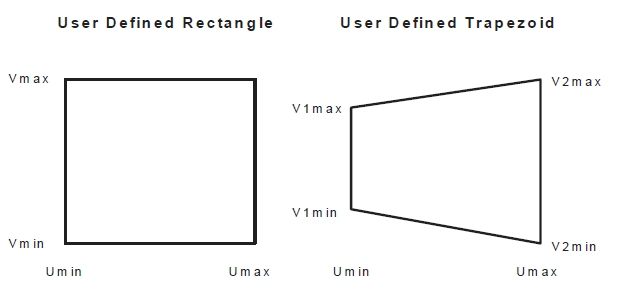
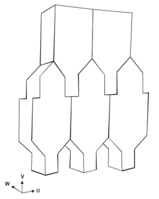
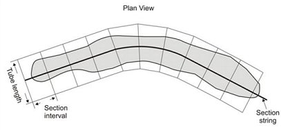
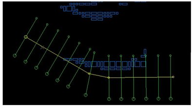
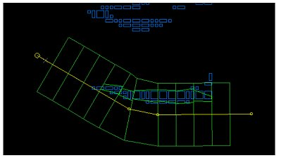
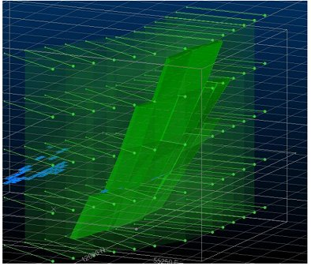
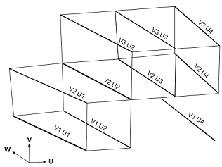

 |  MSO - Advanced Framework Settings Defining MSO Shape Framework details  
---|---  
  
# MSO - Advanced Framework Settings

### To access this dialog:

  * Load an MSO [scenario](<MSOv3_Scenarios.md>) with a predefined [Shape Framework Type](<MSO3_Shape_Stope_Generation_Settings.md>) and select Shape on the MSO ribbon.

  * On the [Stope Generation Settings](<MSO3_Shape_Stope_Generation_Settings.md>) view, select OK.

Stope-shape frameworks generally prescribe the orientation and three-dimensional constraints for determining stope-shapes, their allowable dimensions and the manner in which they are optimized. This panel is shown once a high-level framework has been defined, using the [Stope Shape Selection](<MSO3_Shape_Stope_Generation_Settings.md>) wizard, which offers a choice of either Slice, Prism or Boundary Surface framework types.

For a Slice method, the faces of the stope-shapes produced are sectional outlines defined by four points. For orebodies with vertical orientation this will be two on the floor and two on the back. For orebodies with horizontal orientation this will be two on each of the stope end faces. The points lay in the stope-shape UV-axis plane and the projection of the face is either a rectangle or a trapezoid where the opposite sides are parallel. Rectangular and trapezoidal shapes are special cases of 4 sided polygons. These are commonly referred to as quadrilaterals in MSO. The quadrilaterals form a tube-shape when extruded in the transverse direction representing the stope-shape W-axis. [More...](<MSO3_Slice_Method.md>)

  
Section and Level Intervals Field Details

In MSO, an Advanced Framework is used to specify coordinates that will represent long section (U, V) dimensions of the stope-shape geometry. The coordinates can represent either rectangular shapes (orthogonal), or trapezoidal shapes (non-orthogonal).

  * Stope Rectangles and Stope Trapezoids: for rectangular definitions (Stope Rectangles option), you can define your own U and V minimum and maximum values. The Stope Trapezoids option allows you to determine the additional point settings required to define the non-orthogonal shape. A trapezoid stope-shape has two opposite parallel sides and is defined by the coordinates (umin, umax, v1min, v1max, v2min, v2max). The Position field is reserved for future use.  
  
  
  
Both rectangular and trapezoidal methods define the stope-shape in long section, and the projection of this shape in the W-axis direction (i.e. transverse direction) forms the face of the stope-shape "tube".  
  
Specification of the stope-shape dimensions can be individually specified within the extents of the framework. This may be of particular use for orebodies that require irregularly located/shaped pillars or require an irregular exclusion zone around say a shaft, workshop, and development access or require irregular stopes with say variable section end-walls so that they are at right-angles to the contour.  
  
Use the supplied grid to define each rectangle (4 properties) or trapezoid (6 properties).

  * Stope Quadrilaterals: this option is similar to both the Stope Rectangles and Stope Trapezoids framework options, other than it allows you to fully define the minimum and maximum values for U1, U2, V1 and V2.

  * Stope Face Polygons: polygonal shapes for the stope profile have been possible using sub-stope polygons, but the polygonal shape was constrained to the boundary of the tube dimensions in U and V. A typical application might have been room and pillar mining where the pillar and the non-pillar mining shape could be supplied.   
  
For sublevel caving an interlocking set of shapes (with more points to define the profile) is required. These are referred to as stope polygons. One or more shapes are defined as points to create a closed polygon and stope polygons are replicated within the framework volume by specifying a UV offset from the framework origin for the first shape, and a UV increment for replicating the shape across the framework, e.g.:  
  
  
  
One or more stope polygons can be defined in the table with the assumption that replicated stope polygons do not overlap. The Stope Polygons are processed in the order generated by the replication.   
  
Exact evaluation and reporting is automatically enabled if this option is selected (but can be overridden if required) to ensure that the stope shapes are accurately evaluated. 

    1. Select the Stope Face Polygons option

    2. For each shape to be replicated, create a new table row.

    3. Enter the U Origin Offset and V Origin Offset from the framework origin.

    4. Define the U Step and V Step distance to be used for replication.

    5. If required, enter a cutoff scaling value to be applied.

    6. If required, enter a cutoff scaling adjustment value. This will be applied to the Scaling value as a mutliplier, e.g. 2 = double the scaling value.

    7. Click in the Point List field and select Edit to define a closed polygon shape in local coordinates, using the Point List Configuration dialog.

    8. Repeat steps 3-6 for each row/shape you wish to add.

  * Optimized Regular: the stope-shape framework can be floated in the stope orientation plane (using defined step increments) to optimise the start location for both the level and section without changing the dimensions of the level interval (V-axis dimension) or section spacing (U axis dimension). The stope-shape framework can then be further refined by also changing the level and/or section spacing dimensions. 

**Note** : You can define **Sections** or **Levels** values of zero if you want to test stope sizes but not section/level increments.

[More about regular framework optimization options...](<MSO3_Framework_Optimization.md>)

  * Quad Strings: quad strings are used to pre-define 4 corners of the MSO quad. The optimization is done in W direction. Each string must be closed containing 5 points.

  * Stope Seed Strings / Wireframes: typically used for reprocessing existing stopes, The string file or wireframe file output from a previous run can be supplied as a seed shape input file. The stope shapes are used as the seed shape rather than generate new seed shapes from the default slice/seed method. No new shapes are formed but there is the possibility that some supplied seed shapes may become sub economic, or not satisfy the new geometry parameters.  

 |  Both wireframe and string files have a limitation of 1000 records upon attempting to run the scenario, generating an error if the file has more records.   
---|---  
    * Selecting the Stope Seed Strings option prompts you to browse for a string file and define the attribute that represents the stope identifier using the Stope Number Field drop-down list.

    * Selecting the Stope Seed Wireframes option prompts you to browse for the triangle and point partner files that represent your previously-generated stopes. As above, a Stope Number Field selection is also required. 

  * Complex Stope Shape: in operational mine designs the sections may not be parallel e.g. radial sections, and the gradient may vary across strike as well as along strike for wide orebodies. To accommodate these requirements a more flexible geometry is achieved by using strings, known as "Polytube strings" to define the tube corner lines. Annealing overheads are increased for this flexibility.  
  
With this option, you provide the strings that define the tube corner strings. The Stope Shape Framework is then defined by the volume extent and then a set of strings that, when matched, define the level and section position for every tube. In this way, frameworks can be a mix of parallel and radial sections, for example.   
  
Additional housekeeping is required in the string preparation to provide attributes for each supplied string to identify the level and section for each string. Input is restricted to 2 point strings and output 4 point stope shapes with no support for post-processing.   
  
Complex stope shape management is performed either using a Section Definition or Manual Definition. Both methods require a string file to be specified. Typically, this String File would contain attributes to identify how the strings could be selected to define the geometry for each Polytube.   
  
Section Definition

 |  This option is only available for Vertical slice frameworks.  
---|---  

This option facilitates polytube generation from a section definition string.  
  
Generally, this is a more automated method of generating polytube shapes than by manual definition (see below). You specify the section definition String File and then the Section Interval and Tube Length to be used. A single string can be specified that spans the length of the orebody, or multiple strings can be defined for parallel or discontinuous orebodies.   
  
For example, in the image below, a single string is used in conjunction with Section Interval and Tube Length values to define the polytube (this example is in plan view):  
  
  
  
Three cases are allowed in the vertical direction:   
  
\- Regular sublevels   
\- Irregular sublevels  
\- Gradient strings*  
  
* Typically supplied along the centerline of the orebody to locate the tube shapes on a dipping orebody (whereas for standard frameworks the gradient strings are a projection on to the stope orientation plane).   
  
The long string segments would correspond to strike of past overlapping frameworks, and you are also given the option to Force sections to start at the beginning of string segment, and fit radial sections between these long segments.   
  
The following further example has sections from the beginning of long segments on the section definition string, with blocks above cutoff displayed. Here's the polytube strings:  
  
  
  
...and the resulting polytube wireframes (only generated where model cells are found):  
  
  
  
...and the generated stopes within the polytube strings and wireframes:  
  
  
  
Vertical sublevel definitions can be performed using one of the following methods:  
  
\- a Fixed Increment (displaying the calculated number of levels automatically based on framework extents). Simply enter the increment in measurement units.  
\- a Variable size by defining a vertical coordinate and the sublevel height, then adding a subsequent location and size etc.  
\- loading a Gradient Strings file. If using this method you can optionally specify a Level ID field to define the V intervals  
  
If a Vertical section alignment type has been chosen, you can also elect to Translate Tube to Gradient String, meaning you can define a Gradient String (above) that is different from the current Complex Stope Shape String. If a Non-vertical section alignment is active, you will not be able to define a unique Gradient String and, instead, the Complex Stope Shape String will act as the Gradient String.  
  
  
Manual Definition  
  
In the figure below, the strings have two additional attributes to identify the sections and levels, labelled as U1, U2, U3 and U4 for the sections, and V1, V2, V3 for the levels. A tube is generated where a volume is defined by adjacent sections and levels. If there is a missing section or level for one of the corner strings of a tube then no tube is generated:  

       1. Select the Complex Stope Shape framework option

       2. Select the string file representing the tube corner strings.

       3. Select the attribute within the string file representing the U Identifier and V Identifier.

       4. Choose the default value for the attribute.

       5. For both U and V directions, use the corresponding table to define a numeric value of the selected identification attribute.

 |  Related Topics  
---|---  
| [Stope Shape Selection Wizard](<MSO3_Shape_Stope_Generation_Settings.md>)   
[MSO Shape Frameworks](<MSO3_Frameworks_Concept.md>)[Standard Shape Framework Settings](<MSO3_Shape_Framework_Settings_Standard.md>)   
[Slice Method Overview](<MSO3_Slice_Method.md>)   
[MSO Key Shape Concepts](<MSO3_Shape_Diagram.md>)   
[MSO Slice Method](<MSO3_Slice_Method.md>)   
[MSO Prism Method](<MSO3_Prism_Method.md>)