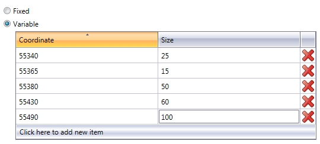
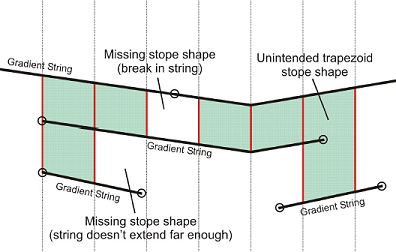
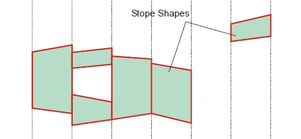
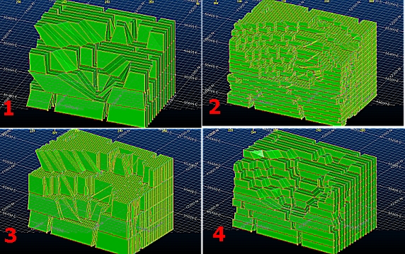
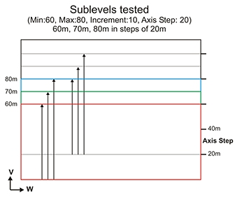
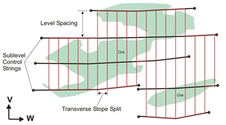
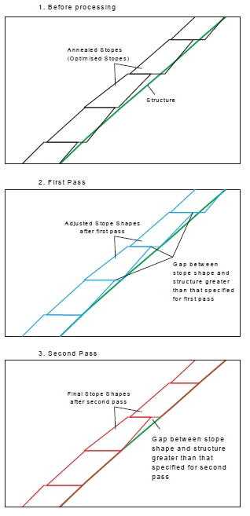

 |  Standard Slice Framework Settings Defining MSO Shape Framework details  
---|---  
  
# MSO - Standard Slice Framework Settings

### To access these functions:

  * Load an MSO [scenario](<MSOv3_Scenarios.md>) that uses a [Slice shape framework](<MSO3_Shape_Stope_Generation_Settings.md>) and select the Standard Frameworks option.

These functions are accessible using the [Shape Framework Settings](<MSO3_Shape_Shape_Framework_Settings.md>) panel.

Stope-shape frameworks generally prescribe the orientation and three-dimensional constraints for determining stope-shapes, their allowable dimensions and the manner in which they are optimized. This panel is shown once a high-level framework has been defined, using the [Stope Shape Selection](<MSO3_Shape_Stope_Generation_Settings.md>) wizard, which offers a choice of either Slice, Prism or Boundary Surface framework types.

For a Slice method, the faces of the stope-shapes produced are sectional outlines defined by four points. For orebodies with vertical orientation this will be two on the floor and two on the back. For orebodies with horizontal orientation this will be two on each of the stope end faces. The points lay in the stope-shape UV-axis plane and the projection of the face is either a rectangle or a trapezoid where the opposite sides are parallel. Rectangular and trapezoidal shapes are special cases of 4 sided polygons. These are commonly referred to as quadrilaterals in MSO. The quadrilaterals form a tube-shape when extruded in the transverse direction representing the stope-shape W-axis. [More...](<MSO3_Slice_Method.md>)

Defining a standard framework is a case of defining the sections and levels properties, and whether you wish to use additional string data to control gradients and/or ore development.

To minimise the number of combinations to be considered, the stope-shape size Increment should be a sub-multiple of the stope dimension. The origin shift should be a sub-multiple of the stope sizes. For example, the stope sizes might be 20-35 in increments of 5 and the origin step size is set to 5. As the run-time for a large set of increment combinations might be prohibitive, a single test scenario should be run to estimate the likely runtime for all combinations, e.g. nominate a single stope size and no origin step to ascertain the run-time for a single iteration.

The stope sections (U-axis) may be regularly spaced or irregularly spaced. At the same time, the stope levels (V-axis) may be regularly spaced, irregularly spaced or irregularly spaced with variable Gradient.

Field Details

Selecting the Standard Frameworks option reveals the following options:

Sections (U): select whether you will defining:

Fixed intervals (see "Standard and Advanced Frameworks", above): specify the interval distance to automatically calculate the Number of intervals along the U axis.

Note that the section interval multiplied by the number of intervals will equal the U model prototype distance as seen on the Orientation panel (e.g. UAxis Distance = 160 and sections Increment = 5 will mean the Number of intervals is 32).

Variable intervals: select this option and you can define the U coordinate at which an interval Increment (Size) can be defined. There is no limit to the number of section intervals you can define - just add and remove table columns as required. In the following example, a 160m U-Axis Distance has been broken up into irregular intervals, starting at the model U origin (55340m coordinate):

Levels (V): levels are defined in a similar manner to sections, with the added option to specify a string file containing variable gradient values (this is known as the Gradient Control String).

For non-transverse frameworks, the following level options are available:

Fixed intervals (see "Standard and Advanced Frameworks", above): specify the interval distance to automatically calculate the number of intervals along the V axis.

Variable: similar to the definition of variable U-axis sections, use the table to define a 'map' of intervals and sizes to define a variable framework. For example, like having 4 x 25m levels and 1 x 15m sill pillar level for a mine block covering 115m vertical extent which is repeated, or like having 15m primary and 20m secondary stopes along strike (for vertical orientations).

Gradient Strings: a gradient control-string can be used to define the gradients of levels along the orebody strike axis (variable V-axis). The strings would typically be used for orebodies with an extensive strike length, such that the difference in elevation from the level access point to the level strike extremity is significant. The gradient control-string will change the framework geometry, as shown in the image below:  
  
  

A stope face is created where a pair of gradient strings intersects adjacent sections. Ideally the control-strings should have the same orientation as the stope-framework U-axis. Care is required to ensure that adjacent strings extend to intersect all sections. This will avoid unintended trapezoidal shapes, or unintended gaps, as shown below:  
  
  

Gradient Strike and Dip Strings: in cases where the orebody is wide it may also be appropriate to have a gradient in the transverse (W direction). A fixed gradient change from the horizontal (in degrees) can be specified for the far and near side for vertical frameworks.  

 |  Gradient Strike and Dip Strings can only be specified if a control surface has been set up in the Dynamic Dip and Strike Controls section of the [Scenarios](<MSOv3_Scenarios.md>) panel.  
---|---  
  
A gradient strike and dip control string is used to model a tube as a 3d shape. The strings are used to locate the corners of the tube. Annealing works by sliding the stope corners along the corner strings, at each increment changing the (x,y,z) coordinate rather than a simple adjustment of the W coordinate for a fixed quadrilateral (U,V). Annealing overheads are increased for this flexibility.  

 |  Gradient Strike and Dip Strings cannot be used in conjunction with shape [refinement](<MSOv3_Refinement.md>).  
---|---  
  
  
[More about MSO Control Strings...](<MSO3_Control%20Strings.md>)

 |  Increasing the number of MSO framework sections and levels, either through decreasing the Increment or setting up a variable increment configuration (on the [Shape](<MSO3_Shape_Shape_Framework_Settings.md>) panel) can have a dramatic effect on the resulting stope-shapes, including the processing time that is required to perform a run. It is good practice to start with a coarse framework (levels and sections) and gradually increase the "resolution" of the calculation until an optimal result is acquired. The image below shows 4 separate runs for the same basic scenario (and equally basic input model). Example timings for each run are as follows - all following a Standard Framework approach and no [post-processing](<MSOv3_Options.md>) options::

  1. Sections: Fixed increment = 20 = 8 intervals (framework = 160m XDistanceas defined on[Orientation](<MSOv3_Orientation.md>)panel).   
Levels: Fixed increment = 40 = 4 intervals (framework = 160m Z Distance)  
Processing time: 1m 2s
  2. Sections: Fixed increment = 5 = 32 intervals  
Levels: Fixed increment = 10 = 16 intervals  
Processing time = 11m 14 s
  3. Sections: Fixed increment = 5 = 32 intervals  
Levels: Fixed increment = 40 = 4 intervals  
Processing time = 2m 47s
  4. Sections: Fixed increment = 20 = 8 intervals  
Levels: Fixed increment = 16 = 10 intervals  
Processing time = 1m 38s

 (Timings from an 8mhz Dell Precision M6800 8Ghz, Intel Core i7 3.00 GHz quad core with NVidia Quadro K4100M)  
---|---  
  
For transverse frameworks, the following level options are available:

Transverse shape frameworks are a special case of XZ or YZ orebody orientations that optimize shapes in both the transverse and vertical directions. This method is suited to gentle/shallow dipping, thicker orebodies. You can define your section spacing either manually, or using imported string data:

Use Sub-Level Section Spacing: selecting this option allows you to define your test for optimal sublevel spacing. Define the extents of the search using the Minimum and Maximum spacing values within which to find the best solution and the Increment to use within that range. Put another way, for framework optimization, the stope-shape minimum and maximum size and increment are supplied for the axes specified by the stope orientation plane, and the Axis step size for the origin shift along the same axes.

For example, the following image represents a test for sublevels of 60, 70 and 80m in increments of 10m and an origin shift of 20m:  
  

Use Sub-Level Section Strings: an alternative to explicitly defining sub-level test parameters, this option allows you to define your level positions (with gradient) using imported string data (which must be in Datamine binary format). Stopes are not optimized in this scenario but are rather controlled by the lateral extent of the section control strings, e.g.:  
  

For all standard frameworks, the following options are available:

Use Ore Development Strings: an Ore Development String is used to define level layouts on fixed elevations (horizontal gradient) using development centrelines. A stope cannot be created unless its floor is located on a control-string, and a stope floor cannot be located on more than one control-string.

Ore development strings do not change the framework, and should be added as an option to a second-pass run. The strings are typically used to control the location of stopes and pillars from section to section. They define practical level layouts by constraining the transverse lateral extents of stope-shapes for parallel lodes (i.e. W-axis direction). The strings can also be used to constrain the strike extents (U-axis) to say remove strike outliers.

Select this option to select a Datamine string file.

[More about MSO Control Strings...](<MSO3_Control%20Strings.md>)   
  

Structure Surfaces

The following controls are available to both Standard and Advanced Slice frameworks, and the Boundary Surface framework:

  
Use Structure Surface Wireframe: select this option to select a Datamine wireframe triangle file. This option is available for both Standard and Advanced Frameworks.

This option results in the stope-shape either snapping-to the structure surface (e.g. include waste that would normally fall into the stope-void due to the presence of the structure) or standing-off (expanding) from the structure surface (e.g. leaving a skin of ore against the structure for dilution control i.e. ore loss).

MSO assesses both options in generating the seed-shape, and applies the same rules to the annealed shape. If the snapping-to shape is sub-economic, then MSO will still consider the standing-off option. This will depend upon the relative position of mineralized material and the structure surface.

Expand option:

You will need to define the range within which expanded stope points are created at the loaded surface. The default option is to set the maximum 'snap distance' from the floor and roof (Max Floor Distance and Max Roof Distance).

You can choose whether to specify a minimum distance from the structure wireframe, within which the stope expands the stope-shape to that structure surface. If one or more corners are within the minimum distance, the remaining corners are tested against the maximum distance. This is the Use Minimum Distances option, which if selected, will require you to set a Min Floor Distance and a Min Roof Distance.

The stope wall is snapped-to the structure position if it falls within the set criteria (minimum - target, maximum - range). This can result in a dip angle that is flatter or steeper than set in the stope geometry parameters.

Snap To option:

With this option, you set the distance range from either the [floor] or [roof] - you just select the wireframe file, and a Min Distance and Max Distance. Stope points that fall within this distance range from the loaded control surface will be 'snapped' to the surface.

Optimize: horizontal deposits, for example mineral sands where the mineralization is found under overlying waste, add additional complexities for generation of the optimal mining surface. 

You can run the Stope Optimizer to find the optimal mineralized profile but not been possible to take into account the cost of removing the overlying waste where it can be mined separately, or the penalty applied when the whole profile is mined and processed as a single unit. Using the topography surface as a Structure surface, and snapping/expanding the optimized mineralized zone to the surface is a valid approach, but this option does not resolve the cost or penalty. 

Instead, you can choose to optimize the horizontal mining unit that has been developed. 

If Optimize is selected, you can choose a wireframe triangle/point file pair to specify a surface that will not be mined past. Typically, this surface is topography, but it doesn't need to be. You can also choose what surface represents using the Position drop-down list.

The following example shows how a Structure Surface Wireframe is used,

 |  Related Topics  
---|---  
| [Stope Shape Selection Wizard](<MSO3_Shape_Stope_Generation_Settings.md>)   
[MSO Shape Frameworks](<MSO3_Frameworks_Concept.md>)[Advanced Shape Framework Settings](<MSO3_Shape_Framework_Settings_Advanced.md>)   
[Slice Method Overview](<MSO3_Slice_Method.md>)   
[MSO Key Shape Concepts](<MSO3_Shape_Diagram.md>)   
[MSO Slice Method](<MSO3_Slice_Method.md>)   
[MSO Prism Method](<MSO3_Prism_Method.md>)