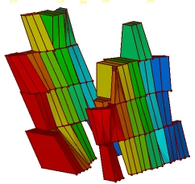
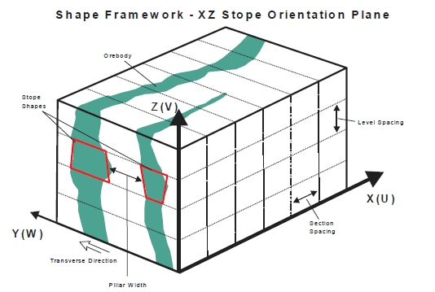
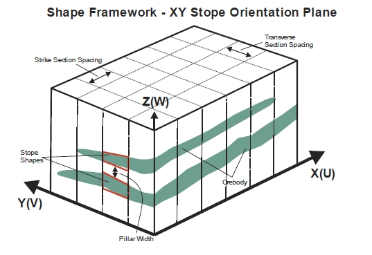
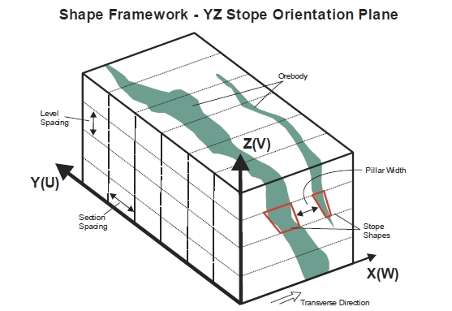
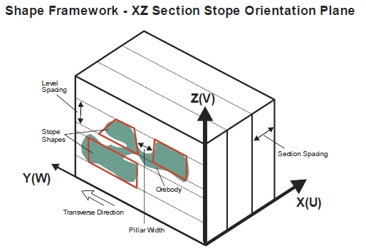
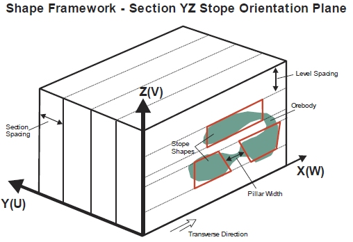
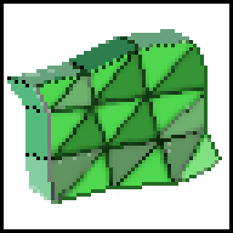

 |  MSO - Stope Shape Selection Defining your high-level MSO Shape Framework  
---|---  
  
# MSO - Stope Shape Selection Wizard

### To access this dialog:

  * Create a new MSO [scenario](<MSOv3_Scenarios.md>) and select Shape on the MSO ribbon, then click the Change button.

  * On the [Shape Framework Settings](<MSO3_Shape_Shape_Framework_Settings.md>) view, Change your Framework Type.

Stope-shape frameworks generally prescribe the orientation and three-dimensional constraints for determining stope-shapes, their allowable dimensions and the manner in which they are optimized. This panel is used to define high-level options for your stope optimization scenario, including the stope arrangement and alignment settings. In essence, this panel will be used to define the high-level 'rules' that will determine the orientation and alignment of stope shapes in the optimized output.

The correct framework orientation to apply is dictated by the orebody orientation within the block model.

This is the view you will see after defining a new scenario, or choosing to Change an existing framework.

It comprises the following steps, which must be completed in sequence, using Next to continue.  

Select a link below for more information:

  * Slice Method Wizard Options
  * Prism Method Wizard Options
  * Boundary Surface Method Wizard Options

Slice Method Wizard Options

The following options represent the choices available to you once a Slice Method has been selected on the front screen of the Stope Shape Selection Wizard.

With the [Slice](<MSO3_Slice_Method.md>) method, MSO generates thin slices (seed-slices) across the mineralized zones that are aggregated into seed-shapes that satisfy stope and pillar width constraints and cut-off. This is why this is known as the "Slice Method". This method optimizes strike-by-height/width projections of stope-shapes in the transverse orebody direction (width / thickness), depending on its orientation (vertical or horizontal).

Stope Shape Geometry

There are two choices; Vertical or Horizontal:

  * Vertical: use this method with sub-vertical orebodies to produce stopes across multiple levels and sublevels for vertical mining methods such as sublevel stoping.
  * Horizontal: use with horizontal orebodies to produce stope shapes for horizontal mining methods such as room and pillar and reef mining. The horizontal orientation is best suited to narrow vein, tabular and lenticular geometry with narrow to moderate thickness and moderate to sub-horizontal dip.

Select Stope Orientation (Slice Method)

The options available here will depend on the stope arrangement choice made above.

  * Stopes Along Framework X Axis (XZ):
  *     * For a vertical arrangement (XZ), use this option to create mining shapes at intervals along the strike of the orebody on each level or sublevel  
  
  

    * For a horizontal arrangement (XY), use to create mining shapes at intervals along the strike of the orebody, as well as up and down dip, where you wish to have greater control over the roof and floor angles up and down dip than along strike.  
  

  * Stopes Along Framework Y Axis (YX):
  *     * For a Horizontal arrangement (YX), this is used to create mining shapes at intervals, where the orebody strike is along the Y axis of the framework as well as up and down dip, where you wish to have greater control over the roof and floor angles up and down dip, rather than along strike.  
  

    * For a vertical arrangement (YZ), this option is used to create mining shapes at intervals along each level or sub-level, where the orebody strike is along the framework Y axis.  
  

  * Transverse Stopes Along Framework X Axis (XZ): a special case of XZ orebody orientations, that optimize shapes in both the transverse and vertical directions. The sublevel height and location are optimized independently between sections. This method is suited to gentle/shallow dipping, thicker orebodies.  
  
This particular case should be selected if you wish to create mining shapes at intervals along each level or sub-level, where the orebody strike is along the framework X axis, while optimizing in the transverse direction.  
:  
  
  

  * Transverse Stopes Along Framework Y Axis (YZ): a special case of YZ orebody orientations, that optimize shapes in both the transverse and vertical directions. The sublevel height and location are optimized independently between sections. This method is suited to gentle/shallow dipping, thicker orebodies.  
  
In this case, mining shapes will be created at intervals along each level or sub-level, where the orebody strike is along the framework Y axis, while optimizing in the transverse direction.  
  

  

Prism Method Wizard Options

The following options represent the choices available to you once a Prism Method has been selected on the front screen of the Stope Shape Selection Wizard.

The [Prism](<MSO3_Prism_Method.md>) Method allows the user to define a library of possible stope-volumes by using permutations of stope length, width and height (as rectangular prisms). The library of stope-volumes can be defined as rectangular-prisms or defined as prisms with a centralised undercut-trough (e.g. a shape like an inverted milk-carton). The stope-library can be developed quickly by using minimum, maximum and step increments for each axis or the library can be explicitly defined giving specific axis dimensions for each stope-volume.

Specification of strike and dip angles is not needed in the Prism method however, a framework orientation (i.e. XZ|YZ) is required to define the orientation of the [trough undercut](<MSO3_Prism_Method.md#Trough>).

Stope Shape Geometry

Only one geometry setting is appropriate for a prism framework. Select Prism Geometry to continue to the Select Stope Orientation panel.

Select Stope Orientation (Prism Method)

The following options are available for a Prism shape framework type, each of which will be used to translate the local UVW intervals specified on the Shape Framework Settings panel into XYZ world axes.

  * Prism XZ Framework: use a prism framework using the X-axis as the U direction, the Z-axis as the V-direction and the Y-axis as the W direction.   

  * Prism YZ Framework: use a prism framework using the Y-axis as the U direction, the Z-axis as the V-direction and the X-axis as the W direction.  

  * Prism XY Framework: use a prism framework using the X-axis as the U direction, the Y-axis as the V-direction and the Z-axis as the W direction.  

  * Prism YX Framework: use a prism framework using the Y-axis as the U direction, the X-axis as the V-direction and the Z-axis as the W direction.

Boundary Surface Method Wizard Options

The following options represent the choices available to you once a Boundary Method has been selected on the front screen of the Stope Shape Selection Wizard.

  * Boundary Surface Vertical Geometry; XZ or YZ orebody orientations are permitted.  
  
An XZ selection enforces a framework using the X-Axis as the U direction, the Z-Axis as the V-direction and the Y-axis as the W-direction.  
  
A YZ selection using the convention Y-Axis = U, Z-Axis = V and X-Axis = W.  
  
Vertical XZ example:  
  
  
  
  

  * Boundary Surface Horizontal Geometry; XY or YX orebody orientations. The selection of YX over XY will be dictated by the ability to have greater control over roof and floor angles along the V-axis.  
  
An XY selection enforces a framework using the X-Axis as the U direction, the Y-Axis as the V-direction and the Z-axis as the W-direction.  
  
A YX selection using the convention Y-Axis = U, X-Axis = V and Z-Axis = W.  

Like the Slice Method, the Boundary Surface method can be applied in all stope-shape framework orientations, vertically for (XZ|YZ) and horizontally for (XY|YX). The correct framework orientation to apply is dictated by the orebody orientation within the block model. The stope sections (U-axis) may be regularly spaced or irregularly spaced. 

At the same time, the stope levels (V-axis) may be regularly spaced, irregularly spaced or irregularly spaced with variable gradient.

Click Finish to return to the [Shape Framework Settings](<MSO3_Shape_Shape_Framework_Settings.md>) panel, where you can refine your shape framework.

 |  Related Topics  
---|---  
| [MSO Shape Panel](<MSOv3_Shape.md>)Stope Shape Selection Wizard[Shape Framework Settings](<MSO3_Shape_Shape_Framework_Settings.md>)   
[MSO Shape Frameworks](<MSO3_Frameworks_Concept.md>)   
[Standard Slice Framework Settings](<MSO3_Shape_Framework_Settings_Standard.md>)[Advanced Slice Framework Settings](<MSO3_Shape_Framework_Settings_Advanced.md>)[Prism Framework Settings](<MSO3_Shape_Framework_Settings_Prism.md>)[Boundary Surface Framework Settings](<MSO4_Boundary_Surface_Method.md>)