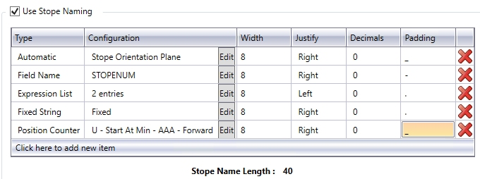
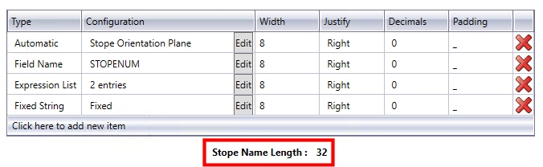
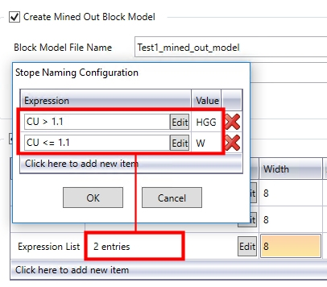

 |  MSO - Stope Naming Using MSO's Stope Naming Functions  
---|---  
  
# MSO - Stope Naming

Stope Naming is a useful function that will generate a textual description, per stope, based on naming conventions determined by yourself.

Ultimately, stope naming settings define the labelling requirements for the resulting stope display, following a successful [run](<MSOv3_Run.md>).

Stope-names (alphanumeric type) can be generated by concatenating component parts (in any combination) of up to a combined total of 40 characters. The stope-name could typically be used to spatially locate stopes (e.g. level position, block position, extraction sequence, etc.) or to categorise as a stope type (e.g. primary or secondary, high grade/value or low grade/value, wide or narrow, measured category, etc.).

Note that the stope-names should be defined so as to be unique. For example, using component parts that describe the mine-name followed by floor-level would result in all stopes on any particular level to have the same stope name.

Each part will need to have some or all of the following parameters specified:

  * The type of naming convention element and its associated configuration

  * The width of the field (maximum) in characters - resulting in concatenation if the element exceeds the stated width

  * The number of decimal places (if numeric),

  * Text justification (left, centre, right),

  * A field name

  * a "padding" character \- the character used to conjoin multiple elements of a naming convention.

A stope name/label will be created based on the table rows that exist (top-bottom order), conjoined to the following table item by the Padding character (unless it is the final element).

 |  The table displayed on the [Scenarios](<MSOv3_Scenarios.md>) panel provides a useful check on the total length of the stope name, as currently defined, e.g.:  
  
  
---|---  
  
Accessing Stope Naming Tools

All of these functions are found on the [Scenarios](<MSOv3_Scenarios.md>) panel, and are available to both [Slice](<MSO3_Slice_Method.md>) and [Prism](<MSO3_Prism_Method.md>) framework projects.

Specifically, you need to enable the Use Stope Naming check box in order to create a naming convention based on standard elements. Select this option if you wish to take advantage of MSO's auto-naming facility.

Selecting this option enables a table that allows you to define the type, configuration, width, justification, resolution and padding elements of your stope name. There are five core naming methods available, as determined by your selection in the first table column.

Each row/item in the table represents one element of a naming convention. For example, the first element could be a static prefix ("Case1Stope_") followed by a second item/row to stipulate a field name (e,g, STOPENUM) followed by a position index/counter. For all items, the Configuration Edit button is used to further define the element.

  * Automatic: you can select a preset template for stope naming with this selection. The corresponding Edit dialog allows you to assign a label based on range of calculate values, e.g. the stope type, the orientation plane, the U/V/W local average value, X/Y/Z average world coordinate and so on. More...

  * Expression List: allows you to define a collection of one or more ('expression', 'value') pairs. More...

  * Fixed String: use this option to specify a fixed suffix/prefix or intermediate text string, using numeric or alphanumeric characters. More...

  * Field Name: select any nominated field name within the block model or contained in the [detailed](<MSOv3_Review.md>) output report. More...

  * Position Counter: this is a generated value that represents a spatial location. For regular model frameworks, this setting evaluates the position of the stope in the framework. It advances forward/backward from the start/end along the specified axis direction, counting the number of "steps" in the stope framework, from the designated configuration Start position.  
  
It represents the number of steps (using the configuration Step value) to define a value to assign for each stope based on its framework position along the defined axis (U|V in the stope orientation plane and uses the PASSSEQ field value on the W axes), or in the reverse direction. The Start value can be numeric or alphanumeric. Letters can be a mixture of upper and/or lower case, and the increment restricted to the supplied case. More...

In all cases, you will need to define the following parameters for each naming element, using the corresponding table column:

  * Configuration \- this displays the current definition for the name element, and will vary depending on the Type of element chosen.
  * Width \- the maximum width of the name element, in characters
  * Justify \- either Left or Right aligned text is required for labelling purposes
  * Decimals \- for numeric values, this column denotes the number of decimal places to which a number should be displayed.
  * Padding \- the character that joins up the elements of a name e.g. "_" or "-" or ":"

Automatic Naming Type

Select this option to access automatically generated field values that can be used from the following list:

  * Stope Type: this will be one of either of the following; "Full" representing full stopes, "Sub" representing sub-stopes and "Dev" representing development stopes.

  * Stope Orientation Plane: this will output a description of the shape framework orientation plane (XZ, YZ etc.)

  * U/V/W Local Avg: this allows the average local U, V or W coordinate for the stope to be part of the stope name

  * X/Y/Z World Avg: derive and use the average world coordinate along the X, Y or Z axis as part of the stope name

  * U/V/W Local Min: this allows the minimum local U, V or W coordinate for the stope to be part of the stope name

  * X/Y/Z World Min: derive and use the minimum world coordinate along the X, Y or Z axis as part of the stope name

  * U/V/W Local Max: this allows the maximum local U, V or W coordinate for the stope to be part of the stope name

  * X/Y/Z: World Max: derive and use the maximum world coordinate along the X, Y or Z axis as part of the stope name

 |  UVW and XYZ fields will be identical if the framework is unrotated, but XYZ world coordinates are required to provide world coordinates for rotated frameworks.  
---|---  
  
Automatic Type - Edit Configuration Dialog

Specifying an [Automatic] naming Type, and then selecting the corresponding ConfigurationEdit button, displays a dialog containing the following fields:

Automatic Type: select an information type from the drop-down list, based on the information above.

When used, the Configuration field of Stope Naming table will show the selected field value, e.g. "Stope Orientation Plane", "X World Max" etc.

Expression List Naming Type

Each expression refers to field names and/or constants connected by relational operators. Expressions are evaluated in turn for the stope until the first match is found, and the associated "value' from the (expression, value) pair is used for the 'part'.

The format of expression text is that same as that used throughout Studio, such as in the [Expression Builder](<../COMMON/Expression%20Builder%20Dialog.md>) dialog.

A simple example for using an expression list for naming stopes based on grade range would be as follows:

Expression | Value  
---|---  
"field AU GT 10.0" | "HG"  
"field AU GT 5.0" | "MG"  
"field AU GT 2.5" | "LG"  
  
Expression List Type \- Edit Configuration Dialog

Specifying an [Expression List] naming Type, and then selecting the corresponding ConfigurationEdit button, displays a dialog containing a table. Select Click here to add a new item then enter the following parameters:

Expression: enter an expression in the expected format, or use the Edit button to display a simple version of Datamine's Expression Builder dialog (displaying MSO-system fields, available block model fields and accepted operators).

Value: where the expression that has been specified is satisfied, enter the naming element value to be used - this can be either numeric or alphanumeric characters.

When used, the Configuration field of Stope Naming table will show the number of expressions currently defined for the name element, e.g.:  
  

Fixed String Naming Type

This is the simplest naming element - once selected, the corrsponding Edit button allows you to enter a text string (remember that your label, overall, is limited to 40 characters). The Configuration table field then shows the text string to be used.

Field Name Naming Type

A data field value part can be any of the nominated fields reported from the input block model or contained in the detailed output report as summarised in Table 4.1. This could typically be any one of:

  * STOPENUM,

  * QUAD, PASSTYPE, PASSNUM, PASSSEQ,

  * XSTOPE, YSTOPE, ZSTOPE (central coordinate at floor position),

  * XCENTRE, YCENTRE, ZCENTRE (centroid coordinate)

  * SLENGTH, SHEIGHT, SAVGWID (or equivalent for horizontal frameworks),

  * CUTOFF, RESULT,

  * ISFARHW, (is the far wall the hangingwall - True/False - 1 or 0),

  * Model evaluation fields (e.g. Au Grade, NSR value, Zone, Rescat, etc.).

Field Name Type - Edit Configuration Dialog

Specifying a [Field Name] naming Type, and then selecting the corresponding ConfigurationEdit button, displays a dialog containing the following fields:

Field: select a data field (reporting, model evaluation) from the drop-down list.

Default: specify a default value to be used in the case of absent data.

Position Counter Naming Type

This is a generated value that represents a spatial location. For regular model frameworks, this evaluates the position of the stope in the framework. It advances forward/backward from the start/end along the specified 'axis' direction, counting the number of "steps" in the stope framework, as defined by the Configuration dialog (see below).

It uses the configured Start value and applies the number of steps (using the Step value) to define a value to assign for each stope based on its framework position along the defined axis (U|V in the stope orientation plane and uses the PASSSEQ field value on the W axes), or in the reverse direction.

The start value can be numeric (Number Count) or letter (Letter Count). Letters can be a mixture of upper and/or lower case, and the increment restricted to the supplied case).

The PASSSEQ field is used to number full stopes, sub-stopes in sequence from the near to the far side of the framework.

Position Counter examples

If an XZ framework has sections along the U-axis of 1000, 1100, 1200, 1300, 1400, 1500 and full stopes are generated between these sections, then the value generated for the position counter for the following cases would be:

  * Start at minimum, Number Count, Start = 50, Step = 100  
  
50, 150, 250, 350, 450

  * Start at maximum, Number Count, Start = 450, Step = -10  
  
50, 150, 250, 350, 450

  * Start at maximum, Number Count, Start = 50, Step = 10  
  
450, 350, 250, 150, 50

  * Start at minimum, Letter Count, Start = A, Step = [Forward]  
  
A, B, C, D, E

  * Start at maximum, Letter Count, Start = Z, Step = [Back]  
  
U, V, X, Y, Z

  * Start at maximum, Letter Count, Start = A, Step = [Back]  
  
E, D, C, B, A

 |  If the letter count exceeds A-Z, then multiple letters can be employed with AA incrementing to AB, AC, .., AZ, BA etc. Aa would increment to Ab, Ac, ..Az, Ba if lowercase was used for the letter start to signify case sensitivity.  
---|---  
  
The Position Counter type leverages the section, level and transverse position from the stope shape framework definition, and consequently will have limited applicability to [Prism](<MSO3_Prism_Method.md>) frameworks

Position Counter Type - Edit Configuration Dialog

Specifying a [Position Counter] naming Type, and then selecting the corresponding ConfigurationEdit button, displays a dialog containing the following fields:

Axis: determine which axis is to be used as the primary axis for counting, either U, V or W.

Progression: do you wish to start at the lowest possible value (Start at Min) or start at the highest and work backwards (Back from Max)

Letter Count: select if non-numeric values are to be used (in alphabetical order), and indicate the starting configuration. e.g. "AAA". Then, specify if the letters should progress through the alphabet, or regress backwards.

Number Count: specify a Starting value, and the step to use, using the above examples for reference.

 |  Related Topics  
---|---  
| [MSO Introduction](<MSOv3_default.md>)   
[MSO Shape Framework Concept](<MSO3_Frameworks_Concept.md>)   
[MSO Slice Method](<MSO3_Slice_Method.md>)   
[The Shape Panel](<MSOv3_Shape.md>)   
[Refinement](<MSOv3_Refinement.md>)   
[Scenarios](<MSOv3_Scenarios.md>)