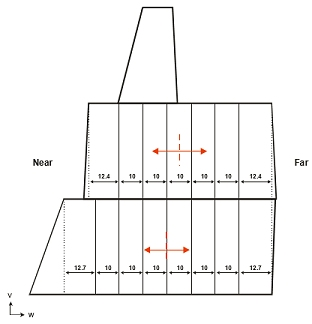
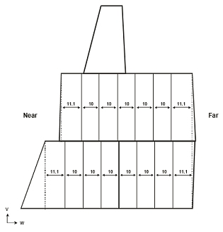
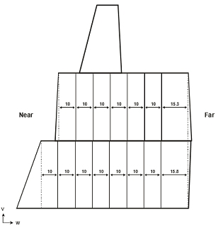
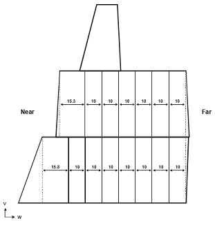
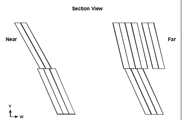
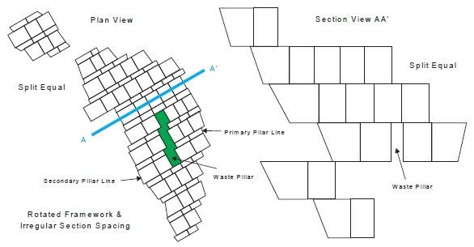

 |  MSO Stope Splitting Using stope splitting options in MSO  
---|---  
  
# MSO Stope Splitting Overview

This function subdivides stope-shapes according to user defined rules. It is generally applicable for stope-shapes that are wider than their maximum stable wall span(s) or for sub-setting very-wide ore bodies. It may also have some conceptual design application for drift and fill and mechanised cut and fill type mining methods by setting split widths to development width and using a minimum and maximum tolerance on the split width. It may also be applicable for establishing shapes that correspond with blast ring increments such as for the transverse SLC mining method. 

Splits can be made in either the transverse or longitudinal directions. Note that longitudinal splitting is equivalent to applying U-axis (and/or V-axis) sub-stopes from a full stope. 

Transverse split options: 

  * Split on a regular stope-framework grid (with optional annealing) to create a checkerboard pattern (for abutting open stoping layouts). 
  * Offset the split wall positions between adjoining stopes (i.e. adjacent in the Uaxis sense) by using an offset from the stope-framework grid for a staggered checkerboard pattern. Only valid for grid splitting. 
  * Split from centre. 
  * Split equally. 
  * Split from the near wall 
  * Split from far wall 
  * Split from hangingwall 
  * Split from footwall 
  * Split fixed width 

Examples of these split options follow

[See the splitting options available on the Options panel...](<MSOv3_Options.md>)

Example: Split on grid - Interval -10m (range 8-15m) using an offset of 5m 

Example: Split from centre with internal vertical walls. Interval -10m (range 815m) 

Example: Split equally with internal vertical walls. Interval -10m (range 8-15m) 

Example: Split from near wall with internal vertical walls. Interval -10m (range 8-15m) 

Example: Split from far wall with internal vertical walls. Interval -10m (range 815m) 

Example: Split fixed width (5m splits) 

   

Example: Split Equal applied to rotated framework with  
irregular section spacing allowing sub-economic stope shapes:

 |  Related Topics  
---|---  
| [MSO Key Shape Concepts](<MSO3_Shape_Diagram.md>)   
[Slice Method Overview](<MSO3_Slice_Method.md>)   
[MSO Shape Frameworks](<MSO3_Frameworks_Concept.md>)   
[MSO Tips and Guidelines](<MSO3_Tips.md>)   
[MSO Control Strings](<MSO3_Control%20Strings.md>)   
[MSO Block Models](<MSO3_BlockModels_Guidance.md>)   
[MSO Rotated Frameworks](<MSO3_Rotated%20Frameworks.md>)  
  
Copyright Datamine Corporate Limited  
JMN 20045_00_EN