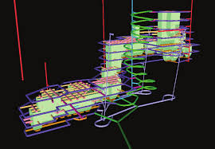

 |  MSO - Good Practice Description of dialog  
---|---  
  
# Using MSO - Tips and General Guidance

  
Every orebody is different, and optimizing stope-shapes to those orebodies to produce realistic shapes is a complex geometric optimization problem.

Datamine's Mineable Shape Optimizer (MSO) provides a tool to produce optimal stope-shapes, with careful selection of parameters, in a rapid and repeatable fashion. The procedure is not fully automatic and sensible selection of parameters and controls will assist to improve the quality of results for complex situations.

This topic outlines some pointers for you to get the most practical results from MSO.  

Block Model

Check the model to ensure that missing or absent data is identified and appropriate defaults are set. A default of zero for a value field is probably not appropriate because the missing blocks or values are probably intended to be treated as waste (e.g. have negative values due to processing cost). Flag areas in the model where stopes should not be optimised e.g. near the surface, close to infrastructure or in poor geotechnical ground. Use model fields like oretype or resource category to allow later classification of stopes.

Processing a model with waste cells adds a significant overhead, but this is necessary if creating full-stopes and sub-stopes. Remove barren waste cells from the input model if only full-stopes are required.

[Further guidance on MSO block models...](<MSO3_BlockModels_Guidance.md>)

  
Framework

For a first run use a restricted framework size on a small test area to verify parameter selections are appropriate, and that the results generated are those expected. Alternatively, use the full framework but select an (x,y,z) coordinate as a validation test cell so that only one quad is optimized, or perhaps select several (x,y,z) coordinates to test several areas. Using a cut-down input model will also speed up this initial testing and allow you to start producing more specific, targeted runs thereafter.

Always do a visual check when using rotated frameworks; in particular, verify that the framework extent and orientation are the expected ones and that the framework extends beyond all the mineralization.

[More about MSO Shape Frameworks...](<MSO3_Frameworks_Concept.md>)

  
Manual Designs

Compare results with manual designs, or have other methods for checking the outputs, especially when there is a lack of familiarity with the data. It is too easy to do optimization work on computers. The modern-day challenge is to have techniques to "prove" that the optimized result is correct/practical.  

Refining and Repeating Optimization Runs

There are many new features for adding controls and fine-tuning the stope optimization process. The first run should have the simplest setup. This should be followed with more detailed optimization runs, where functions are added incrementally to understand the implications of each change (e.g. maximum waste inclusion).

For example; prior to doing a design with gradients on the levels, do a run with fixed sublevels.

Don't perform any post-processing (smooth, split and merge) on the first run. Smoothing typically improves the look of the result, but doesnt significantly affect the overall tonnages that are optimized.

  
Stope Control Surface and Slice Interval

MSO will only produce stope-shapes if seed-shapes are created.

Seed-shapes define the number and approximate location of stope-shapes. A Stope Control Surface is used to locally define the strike and dip orientation of the stope-shapes for the mineralized economic component of the orebody.

Seed-shapes are formed by aggregating seed-slices to model the stope width, pillar width and dilution. The choice of slice interval will affect the accuracy of the seed-shape optimization.

While a geological wireframe can be a good proxy for the Stope Control Surface, in some cases these wireframes can be large, or have local inflections that can incorrectly influence MSO when generating slices. The geological wireframe may be well understood by the geologist but should not automatically be adopted by the Mining Engineer. It is better practice to digitise a set of strings section by section to define the local dip, and create one or more wireframe surfaces.

Also:

  * Make sure that these surface(s) extend past the mineralized zone. One technique for reducing the number of triangles is to use the [wireframe-decimate](<../COMMON/Wireframe%20Decimation%20Guidelines.md>) command.
  * A Stope Control Surface is mandatory for all but the simplest orebodies.

  * The Stope Control Surface need only have a few thousand triangles, and certainly not 20-100,000 triangles, which will result in too many dip and strike indicators with the potential to provide conflicting data. A simple, decimated surface file is a far better option.
  * A stope slice interval where the minimum stope width is 3-5 times the slice interval is usually a good guide.
  * The dip and strike orientation taken from the Stope Control Surface, or the Default Dip and Default Strike parameters, must fall within the minimum and maximum dip and strike ranges set for the stope geometry.

[Further information about MSO Shape Frameworks...](<MSO3_Frameworks_Concept.md>)

  
Model Discretisation Plane and Discretisation

In almost all cases the model discretisation plane and the stope orientation plane for the framework will be identical, but this is not the case if the rotations for model and stope-shape framework are different. Beware the case where one is rotated by 90 degrees relative to the other so that the axes look to be parallel but the XZ plane of one is the YZ plane of the other.

A good rule for model discretisation number (in U and V) is that the number is twice the number of sub-stope intervals. The goal is to ensure that there are a minimum of two discretised cell centres in U and V for each stope or sub-stope shape. The default of 4x4 is suitable for regular sub-stope splits of 2x2. If the model discretisation number is too small, a more suitable choice will be automatically assigned and noted in the log file.  

Stope Geometry

In the first pass, nominate broad tolerance ranges for dip and strike of stope walls, and the geometric ratios of end wall or roof/floor dimensions. If the final strike limits are +/-10 degrees, then still consider a first run with a wider tolerance, even +/-45 degrees. This will typically generate the maximum tonnage and then these values can be tightened up if this is appropriate for the stoping method. Beware of setting tight dip and strike ranges if there is a lot of local variability in the orebody dip and strike.

In the second and subsequent runs tighten the tolerance ranges and parameters. The tighter the stope geometry constraints, the more complex and slower will be the optimization. If the side length ratios are set to one to generate parallel sides this can be a very severe constraint for the optimization. Do several runs with diminishing side length ratios to check if stopes are lost, and establish the threshold where stope-shapes begin to disappear.

  
Different Evaluation Techniques

Because MSO works off the Block Model, the sub-cell modelling and its approximation to wireframe surfaces will be a key determinant in the quality of the output stope-shapes and also the accuracy of the resultant tonnes and grade. Different mining software packages have different capabilities and approximations in sub-cell modelling. A full cell model with percentages for the mineralized fraction cannot be used with MSO - overlay a sub-cell model to model these fractions and derive the spatial position.

Engineers often align stope sections to the axis of the orebody, but geologists do not have the same expectation. This will mean that the stope-shape framework will often be rotated to the block model. For a first pass an unrotated stope-shape framework should yield a similar result to a rotated one, with small discrepancies at the end of ore zones.

  
Stopes Not Generated Where Expected

Firstly, check the log file (after running with the verbose output option) to look for reasons as to why the stope failed or was rejected. Missing stopes might be more likely for narrower orebodies.

Some simple checks to consider:

  * Does the Stope-shape Framework extend to the location of mineralization? Do a visual check for rotated models and/or rotated frameworks in particular.
  * Review the wireframe verification file (if generated - the [Scenarios](<MSOv3_Scenarios.md>) panel will determine this) to examine the slices, slice orientation, and the seed-shape (noting that only slices above cut-off are output).  
  
Perhaps the slice orientation is not correct for the orebody and more detail is required in the Stope Control Surface?  
  
Perhaps the slice interval is too coarse?  
  
The message output to the log file for failed stopes is also output as an attribute in the verification wireframe file for those stopes \- you can define the color the sub-economic shapes using the [Scenarios](<MSOv3_Scenarios.md>) panel - use a contrasting color to make them stand out.
  * Narrow orebodies with inferior sub-celling will prove difficult to optimize because too much waste will be carried in the stope-shape. The problem lies with the geological model, not MSO so the base model may need to be revisited prior to reprocessing in MSO.
  * If using irregular cases of the rotated stope shape framework, particularly where individual sections or level coordinates are nominated, check to ensure the values are in local coordinates (rather than world coordinates).
  * In rare cases, a seed-shape is produced that fails to meet the head-grade in the annealing process.
  * If all else fails, contact your local Datamine representative for further guidance.

 |  Related Topics  
---|---  
| [MSO Introduction](<MSOv3_default.md>)   
[MSO Key Shape Concepts](<MSO3_Shape_Diagram.md>)   
[Slice Method Overview](<MSO3_Slice_Method.md>)   
[MSO Block Models](<MSO3_BlockModels_Guidance.md>)   
[MSO Shape Frameworks](<MSO3_Frameworks_Concept.md>)