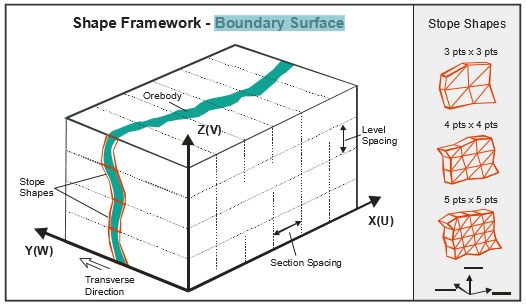
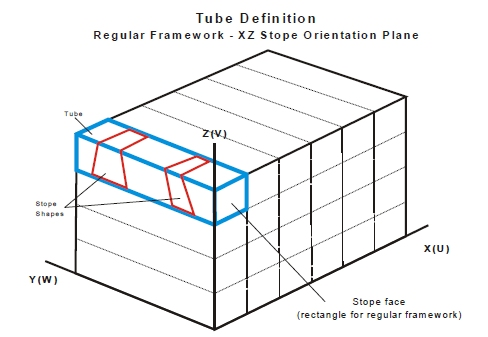
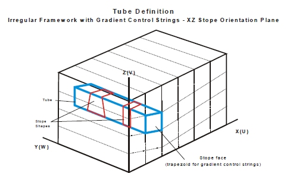

 |  MSO - Boundary Surface Method A detailed overview of MSO's Slice Method  
---|---  
  
# MSO - Boundary Surface Method

Introduction

For narrow high grade reefs or lenses, where subcell modelling has some spatial accuracy limitations, it can prove more effective to model stope shapes off the geological wireframes directly. The footwall and hanging wall geometry is modelled as a surface grid mesh of points with the mesh density provided by the user, with mesh density in the UV range [3x3] to [6x6] and any combination therein. The assumption is that there is a hard ore contact, so no annealing is carried out, and the runs are quick. Multiple lenses can be handled but the pillar width is not honoured, as it is assumed the lenses can be mined independently. 

The framework in which MSO operates can be defined independently for each scenario you create, and is based on the following key criteria:

  * The stope generation method 
  * The Stope Arrangement settings (vertical or horizontal)
  * The Stope Alignment settings (along strike or across strike)

This shape framework is defined using the [Shape](<MSOv3_Shape.md>) panel.

[More about Shape Frameworks...](<MSO3_Frameworks_Concept.md>)

The method is called Boundary Surface because the geological wireframes provide a boundary from which the minimum stope width can be tested on the mesh points. Dilution can be added, the boundary surface can be positioned between the stope walls, and the stopes can be output as a single shape or by splitting the ore and surrounding waste into separate shapes. 

The Boundary Surface method is restricted to the following usage conditions:

  * Only full stopes are generated.
  * 4point shapes are created, not 6/8 point shapes as in other methods.
  * No post-processing options are available although the shapes are smooth by design 
  * No True Width options are supported
  * Dip and strike angles are tested against the 4 point shape vertices, not the intermediate mesh points. 
  * [ELOS](<MSO3_Shape_Diagram.md#ELOS>) dilution only.

Otherwise, all regular framework options, including gradient strings, are supported.

  
Comparison with the Prism Method

As described below, the Boundary Surface method (just like the Slice Method) can be applied in four stope-shape framework orientations, vertically for (XZ|YZ) and horizontally for (XY|YX)., the Prism method supports for just two orientations in total; XZ and YZ.

[More about the Prism method...](<MSO3_Prism_Method.md>)

Boundary Surface Method in Detail

The Boundary Surface Method generates and evaluates thin slices across the mineralized zones that are aggregated into seed-shapes (looking at all possible permutations) that satisfy stope and pillar width constraints. The seed-shapes are then annealed to the final optimized stope-shape satisfying the stope and pillar width, stope geometry constraints (e.g. wall dips angles, strike twist, etc.), and other miscellaneous constraints (e.g. zone mixing, exclusion zones, etc.). The result is a set of stope-shapes constrained to the basic limitations of the envisaged mining method.

Boundary Surface method frameworks are sub-categorized as:

  * Vertical; XZ or YZ orebody orientations are permitted.  
  
An XZ selection enforces a framework using the X-Axis as the U direction, the Z-Axis as the V-direction and the Y-axis as the W-direction.  
  
A YZ selection using the convention Y-Axis = U, Z-Axis = V and X-Axis = W.  
  
Vertical XZ example:  
  
  
  
  

  * Horizontal; XY or YX orebody orientations. The selection of YX over XY will be dictated by the ability to have greater control over roof and floor angles along the V-axis.  
  
An XY selection enforces a framework using the X-Axis as the U direction, the Y-Axis as the V-direction and the Z-axis as the W-direction.  
  
A YX selection using the convention Y-Axis = U, X-Axis = V and Z-Axis = W.  

Like the Slice Method, the Boundary Surface method can be applied in all stope-shape framework orientations, vertically for (XZ|YZ) and horizontally for (XY|YX). The correct framework orientation to apply is dictated by the orebody orientation within the block model. The stope sections (U-axis) may be regularly spaced or irregularly spaced. At the same time, the stope levels (V-axis) may be regularly spaced, irregularly spaced or irregularly spaced with variable gradient.

The faces of the stope-shapes produced are sectional outlines defined by four points. For orebodies with vertical orientation this will be two on the floor and two on the back. For orebodies with horizontal orientation this will be two on each of the stope end faces.

The points lay in the stope-shape UV-axis plane and the projection of the face is either a rectangle or a trapezoid where the opposite sides are parallel. Rectangular and trapezoidal shapes are special cases of 4 sided polygons. These are commonly referred to as quadrilaterals in MSO. The quadrilaterals form a tube-shape when extruded in the transverse direction representing the stope-shape W-axis.

The Boundary Surface Method XZ | YZ | XY | YX framework orientations can be mapped or visualized with a generic naming convention related to the axis direction:

  * U-axis is the primary strike direction of the stope-shapes (i.e. length),
  * V-axis is the secondary vertical direction of the stope-shapes (i.e. height for vertical / width for horizontal),

The first letter of the framework orientation is the U direction and the second is the V direction. So for example with the XZ orientation, X is the U-axis and Z is the V-axis.

Boundary Surface frameworks for Vertical and Horizontal orientations are further sub-categorized as:

  * Regular frameworks, where both axes use fixed intervals (the U-axis intervals and V-axis intervals are fixed) like having fixed section spacing and fixed level spacing for vertical orientations or fixed strike sections and fixed wall spacing for horizontal orientations.
  * Irregular frameworks; where either or both of the U and V-axis intervals is variable. For example like having 4x25m levels and 1x15m sill pillar level for a mine block covering 115m vertical extent which is repeated, or like having 15m primary and 20m secondary stopes along strike (for vertical orientations).
  * User Defined frameworks; where coordinates are provided to define long section (U, V) dimensions of the stope-shape geometry. The coordinates can represent either rectangular shapes (orthogonal), or trapezoidal or quadrilateral shapes (non-orthogonal).

MSO framework orientations are defined using the [Orientation](<MSOv3_Orientation.md>) panel.

Irregular Boundary Surface method frameworks can also use control strings for defining variable level elevations (gradients for vertical orientations) or variable side-wall spacing likened to topographic contours (for horizontal orientations).

The framework and stope geometry are described in the following terms:

  * stope orientation plane, a two dimensional plane defined by the framework orientation (XZ, YZ, XY or YX)
  * stope face, the (fixed) U and V dimensions of the stope-shape
  * The tube, a three-dimensional volume defined by the stope face and the framework extents in the W direction (transverse). The seed-slice, seed-shape

Boundary Surface Method \- Tube Definitions

The following depicts the tube shape within regular and irregular stope-shape frameworks for the Boundary Surface method. The controls for stope-shape geometry are located on the [Shape](<MSOv3_Shape.md>) panel, with additional controls found in both the [Controls](<MSOv3_Control.md>) and [Refinement](<MSOv3_Refinement.md>) panels.

 |  Related Topics  
---|---  
| [MSO Introduction](<MSOv3_default.md>)   
[MSO Shape Framework Concept](<MSO3_Frameworks_Concept.md>)   
[MSO Prism Method](<MSO3_Prism_Method.md>)   
[Scenarios](<MSOv3_Scenarios.md>)