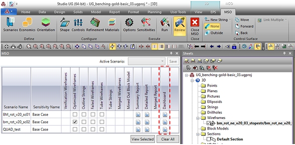
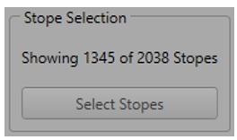
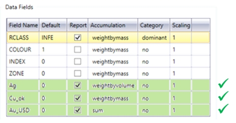
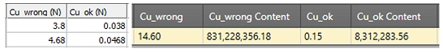
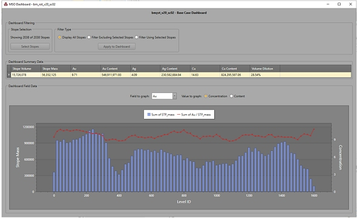
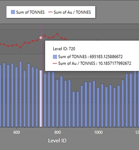

 |  MSO Dashboard View summary statistics relating to MSO  
---|---  
  
# MSO Dashboard

### To access this dialog:

  * On the [MSO Review](<MSOv3_Review.md>) panel, select an existing item in the Dashboard column.

The MSO Dashboard is accessed through the [MSO Review](<MSOv3_Review.md>) panel and specific to each scenario.

The MSO Dashboard is only displayed if a [Detailed Report] was generated ([Options](<MSOv3_Options.md>) panel) and the LEVELID field populated.

To open the MSO Dashboard click on the icon for the corresponding scenario on the Review panel (example above) and a new window will popup. Both summary table and chart can be updated based on the selected stopes, providing an interactive and easy way to analyze your optimization scenario.

  
Dashboard Filtering

Interactively select displayed stopes in the 3D view using Select Stopes.

After selecting stopes, in order to filter the Dashboard results, choose one of the three filtering options from the Filter Type group and click Apply to Dashboard.

The message will inform the number of stopes used to generate the summary table and chart below in comparison to the total number of stopes generated in the scenario, e.g.:  
  
  

There are 3 options to filter the summary table and chart based on prior stope selection:

  * Display All Stopes: calculates results for all stopes, regardless of any prior 3D view selection..
  * Filter Excluding Selected Stopes: displays results for stopes that are not selected in the 3D view. This option is useful to exclude areas of no interest, for example, due to a long distance from the main orebody.
  * Filter Using Selected Stopes: displays results only for selected stopes. This option is useful to analyze a specific region or even select a single stope and check its results.

Dashboard Summary Data

The summary table displays basic information for the optimization scenario, including:

  * Stope Volume: the overall volume that correspond to the BINDESC field DILUTED_TOTAL (total rock inside the diluted shape).
  * Stope Mass: the tonnage that corresponds to the associated Stope Volume.
  * Volume Dilution: same as the WASFRAC field, a proportion (by volume) of sub cut-off rock in shape; (volume of waste within diluted stope) / (total volume of diluted stope).
  * Optimization Field: as specified on the [Scenarios](<MSOv3_Scenarios.md>) panel.
  * Additional Fields: as specified on the Scenarios panel | Data Fields table.

Regarding additional reporting field it is important to note that not all field types are displayed on the Dashboard, only numeric fields with the accumulation methods depicted below. The other field types can be visualized on the Detailed Report file as usual.

For weighted fields the summary table displays the concentration and the content. The concentration is displayed as defined on the Scenarios panel | Data Fields table and it can be by mass or volume.

The content is the concentration multiplied by either mass or volume. This being said, for percentage fields it is important to make sure the number is represented as a fraction in order to have the Dashboard displaying the correct content value.

For example:

Dashboard Field Data

The summary chart is displayed by LEVELID, grouping stopes that belong to the same level.

The left axis is for the stope mass, represented by the blue bars. The right axis is related to the selected field element, represented by the red line, e.g.:

The field element can be changed using the Field to graph dropdown list that contains the same fields displayed on the summary table. In case a field is weighted by volume, when selected, it will change the left axis to Stope Volume instead of Stope Mass.

The Value to graph allows the value to be displayed as a Concentration or Content format.

Moving the mouse arrow over the summary chart will display window with detailed values for stope mass (or volume) and the selected field element for each level, for example:

 |  Related Topics  
---|---  
| [Scenarios](<MSOv3_Scenarios.md>)[Options Panel](<MSOv3_Options.md>)[Review Panel](<MSOv3_Review.md>)