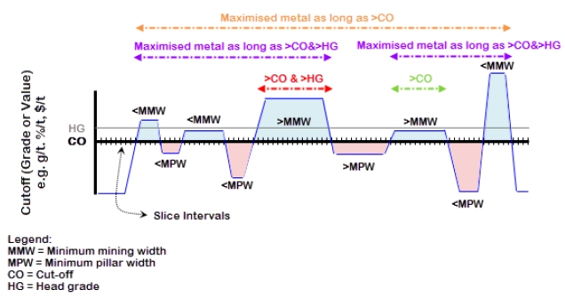

 |  MSO - Economics Define the optimization objective for your run  
---|---  
  
# MSO - Economics

### To access this dialog:

  * Using the MSO ribbon, select Economics. A [scenario](<MSOv3_Scenarios.md>) must be defined beforehand.

This panel is used to define the economic objectives for your stope shape optimization scenario. Using this panel, you will define your overall objective i.e. are you attempting to optimize your shapes to capture the highest possible stope grade or recover the highest possible volume of metal?

  * Grade maximization will mean that the grade or value per tonne will be optimized based on material that is above the specified cut-off grade. This is the recommended selection in most optimization scenarios.
  * Metal recovery optimization will mean the recovered metal or value will be maximized whilst considering material below the cut-off grade.  
  
In more detail: the metal recovery objective is applied to the cut-off or (cut-off + head-grade) to optimize the total value or total metal while satisfying the cut-off or head-grade.  
  
As described, this function maximizes recovery of metal (i.e. kilograms) or total dollar value (i.e. $s) and will attempt to recover all possible metal or dollar value while still meeting the overall cut-off or cut-off with head-grade criteria for the stope (your decision as to whether the head grade is included is made on this panel).  
  
Selecting the metal recovery option does not maximise the metal grade per tonne (i.e. gm/t) or value per tonne (i.e. $/t). This option is likely to be desirable if you value (i.e. rank) maximizing metal recovery above maximizing head-grade. For example, it could be used to answer the question "how many grams can be mined at a profit?" rather than "which grams should be mined to maximise profit?"

By default, the optimization method used will maximize the cut-off grade, but this can be changed to cut-off value, or even a calculation based on the following formula:

value = Block Tonnes x (Mining Recovery x Price x Processing Recovery x (1.0 - Royalty) x Optimization Field - Mining Cost - Processing Cost)

A cut-off method will be used to define the boundaries of the stope-shape, by defining rock as either ore (above cut-off) or waste (below-cut-off).

Optionally, you can specify a head grade target. If specified, this can be used to influence the stope volume.

A head grade setting could be used to exclude marginal results when calculating optimal stope shapes, for example, you might not want to have marginal grade or marginal value stopes, and so setting the head-grade higher than cut-off will return the more profitable stopes (e.g. it might relate to a desired profitability), or stopes that have a higher probability of meeting the cut-off grade.

 |  The cut-off grade can be supplied without the head-grade, but a head-grade cannot be supplied without a cut-off grade.  
---|---  
  
Example: Simplified Cut-off, Head-grade Maximized Metal-Value

The image above illustrates, at a high-level, the general cut-off, head-grade and optimized total value / optimized total metal concepts.

Intervals above (blue) and below (red) cut-off are identified, and the length of the interval relative to the minimum stope width (<MMW,>MMW) and the minimum pillar width (MMPW,>MPW) are identified. The area contributions above the cut-off (blue) have a positive contribution and the areas below the cut-off (red) have a negative contribution, with the goal to have a net positive area outcome.

A head-grade is specified in addition to a cut-off grade. Four different outcomes are possible for this data set:

  * Interval greater than cut-off grade   
  
Includes both ">CO", and ">CO & >HG"

  * Interval greater than cut-off and head-grade   
  
Only ">CO & >HG"

  * Interval greater than cut-off grade with optimise total value or total metal option   
  
Includes both "Maximised metal as long as >CO" and "Maximised metal as long as >CO & >HG"

  * Interval greater than cut-off grade and head-grade with optimise total value or total metal option   
  
Only "Maximised metal as long as >CO & >HG"

Both cut-off and head-grade numbers can be supplied as:

  * A fixed number (either as a grade per mass unit e.g. gm/t, or currency value per mass unit e.g. $/t) - using the Discrete option in the Economics panel.

  * A calculated relationship between the value and some other variable related to the stope dimension, specified as points on a curve e.g. the cut-off is a function of stope- using the Variable option in the Economics panel. The secondary value can be specified as either:

  *     * Stope Tonnage

    * Stope Thickness

    * Stope Height

    * Cross-sectional Area

    * Roof Hydraulic Radius

    * Wall Hydraulic Radius

    * Cross-section Hydraulic Radius

  * Values from the block model so that the value has a spatial property e.g. to vary cut-off with depth (with a default value applied if the field value for a given cell is absent or if cells are absent from the model) - using the Value from Block Model option in the Economics panel

Field Details:

Summary descriptions of the fields on this panel can be found below - consult the section above for more detailed information and background:

Objective: selective the overall optimization objective here, either maximization of stope grade, or the recovery of metal.

Method: select to optimize against a cut-off grade or value.

Cut-off: determine how the cut-off value is assigned for your scenario:

  * a specified, constant value (Discrete)

  * a (Variable) calculated value (based on the selected variable in the drop-down list)

  * calculated based on any numeric field in the specified model (Value from Block Model)

  * define a series of grade values to generate a Nested output. Selecting this option reveals a grid to allow multiple cut-off values to be specified. If this method is selected, it is not necessary (or possible) to specify a head grade target (see below). When nested grade values have been set, you can control stope merging on the [Options](<MSO3_Options_Merging.md>) panel using specialised controls to determine the maximum offset, gap and overlap to apply in U and V directions, and the maximum gap (only) in the W direction.

Use Head Grade Target: if you choose to specify a head grade target, you will need to choose from one of the following options:

Discrete: enter an explicit Value target

Variable: derive the head grade target value from an existing attribute (which must be specified)

Value from block model: derive the target value from the input block model file.

Negative cut-off and head grade values are permitted..

 |  Related Topics  
---|---  
| [MSO Introduction](<MSOv3_default.md>)   
[Slice Method Overview](<MSO3_Slice_Method.md>)   
[Scenarios](<MSOv3_Scenarios.md>)