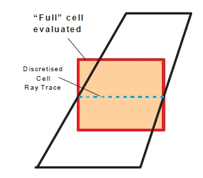
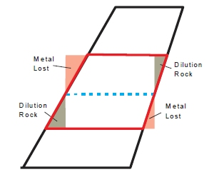
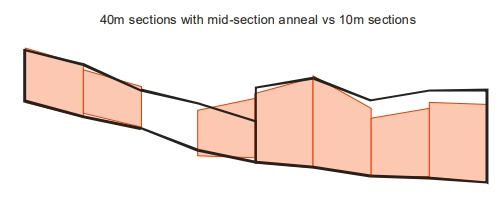

 |  MSO - Options Evaluation and stope generation settings  
---|---  
  
# MSO - Options

### To access this dialog:

  * Using the MSO ribbon, select Options.

This panel is used to define general and post-processing options for MSO.  

General Options

Evaluation Method (Slice and Boundary Surface frameworks only)

 |  Prism framework types will always be reported using a Precise, Detailed report. Evaluation options are not configurable for this framework type.  
---|---  
  
There are two methods of evaluation available; high precision and low precision. The low precision option will allow you to report in either high or low detail, hence there are three options available for evaluation overall.

Field Details for Evaluation Method

Report Type: select the general format fo report that you want; you can either report only [Total] amounts, [Summary] information or [All] possible data. The default is [All]

Evaluation Method: only available if a[Slice](<MSO3_Slice_Method.md>)framework type is being configured. The options are:

  * Run Precision \- Approximate | Report Detail - Detailed uses a ray-trace procedure (likened to a drill-hole trace) passing through each cell-centroid in the discretised block model, to evaluate the proportion of a cell in a wireframe shape. The distribution of the ray-traces plays a significant role in various MSO processes, output accuracy and processing effort.

About Approximation

For either of the Approximate options listed, the [TRIFIL](<../Process_Help_XML/trifil.md>) process is used to create sub-cell models within a wireframe. Using the same cell-centreline for evaluation of stope wireframes means that the sub-cell approximations are common between the original model creation procedure and the stope evaluation technique in MSO. Hence, geometric errors are minimized. This is less the case if model cells are split in the discretisation process. Where smaller sub-cells are used at the wireframe boundary, the better the approximate method becomes at replicating the wireframe shape for the case of sharp grade boundaries.  
  
It is important to note that the "Approximate" description applies not to the results, but rather of the volume calculation technique applied.  
  
Below is an example of the Approximate method after discretisation:  
  
  
  
This option will produce a low-level report whereas the Precise option utilizes an exact geometric (or Boolean) intersection of cells overlapping with the stope wireframe. A high-level of reporting detail is always produced with this option.  
  
This method is actually the more conservative evaluation method as it evaluates only the proportion of the cell within the wireframe surface used. Accuracy depends on the sub-celling detail as the evaluation method cuts the corners off cells that lay outside of the wireframe surface (this understating metal inventory) and can also include additional wedges of rock with no grade from the absent cell portions inside the wireframe surface.  
  
Below is an example of the Precise method after discretisation:  
  

Report Detail: choose from either a Concise or Detailed report.  
[More about reporting levels...](<MSOv3_Review.md#Reports>)  

Model Discretisation Intervals: this panel is also used to set the discretisation intervals in the U and V directions. A good rule for model discretisation number (in U and V) is that the number is twice the number of sub-stope intervals. The goal is to ensure that there are a minimum of two discretised cell centres in U and V for each stope or sub-stope shape. The default of 4 x 4 is suitable for regular sub-stope splits of 2 x 2.  
  
If the model discretisation number is too small, a more suitable choice will be automatically assigned and noted in the log file.

Field Details for Discretisation Intervals

U/V Direction:set the number of discretisation intervals in the U/V direction

  
Discretisation Plane: for rotated shape frameworks (only), this option becomes available and allows you to define the orientation of the discretization plane to be used.

Use Output Test Stopes: configure how many quads are done in a run using Start from Stope and Number of Stopes. Specify to start at a certain quad, and run until a number of quads have been processed.

Use Testing Shapes: for small test runs, an individual region can be selected by defining the index to the Region (like the QUAD number for Slice except that this index is a three dimensional index).

Alternatively, a smaller test problem can be run by selecting the Use Cell Centers option, then specifying one or more three dimensional (x,y,z) coordinates which will be used to select the region number that encloses the point(s), and only the subset of feasible stope-shapes that enclose this coordinate will be selected for the optimization. 

While the latter is not automatically part of a feasible solution to the full problem, the solution can be inspected and it is still a useful verification that the process has been formulated as expected. Only stope-shapes that overlap with one or more of the coordinates will be processed for the optimization.

It is good practice on a first run to select an (x,y,z) coordinate as a validation test cell so that only one quad is optimized, or perhaps select several (x,y,z) coordinates to test several areas. Alternatively, you can define the Quad Number instead, which is effectively a region index.

Allow Zero Density Values in Block Model: disabled by default, you can enable this option to allow zero-density values to be processed by MSO. If disabled, the model DENSITY field will be validated to ensure non-zero values are present.

Output Sub-economic Shapes: note that for marginal stopes, the differences in High Precision and Low Precision evaluation methods may result in a stope becoming sub-economic because the High Precision evaluation can produce a more conservative result - select this option to output marginally sub-economic stopes in addition to the viable shapes.

Advanced Boundary Surface Options ([Boundary Surface](<MSO4_Boundary_Surface_Method.md>) method only): if selected you can choose whether or not to smooth the input boundary surface. By default, this averaging is performed but you can choose to disable it.

  
Advanced Slice Options (only available for [Slice](<MSO3_Slice_Method.md>) Frameworks)

Special options are available for slice frameworks that let you fine-tune your stope optimization and data output.

  * Ignore pillar requirement between adjacent full and sub shapes: use this control to relax the pillar width constraint between stoping units and stoping sub-units. The default is to assume these are to be mined separately (disabled). If adjacent stoping units and stoping sub-units can be mined together then enable this option.
  * Ignore pillar requirement between split shapes: Control to not maintain the pillar width around the boundary of split stopes. Allows the ends of a sequence of split stopes to use a different pillar width.
  * Skip structure test on seed: control to allow seeds to be generated without being constrained by the structure. Useful when seeking to identify cases where adding structure makes the output shape become sub-economic.
  * Check result with dilution included: test if dilution will make the stope shape uneconomic, and only consider shapes that are economic with dilution. The default mode is to optimize the undiluted shape and then add dilution, but with this control enabled, a smaller undiluted shape will be produced and the dilution will include more above cutoff material.
  * Deep Search: introduces additional tests and steps into the seed generation process. These are: 

    * Iterate through seed cutoff reductions to find all seed shapes at all cutoff reductions, rather than accept the seed shapes found at the first successful cutoff reduction where none have been found at the original cutoff.

    * For different near/far or footwall/hangingwall angle ranges, test shapes within the angle range for all feasible stope intervals rather than just apply the test to seed shapes assembled from the wall angles dictated by the Stope Control Surface.

  * Override Fixed Split Width: the slice interval is calculated automatically by MSO. By enabling this option a zero-width fixed pillar is set.
  * Preanneal: this seed optimization method intends to minimize the reliance on a stope control surface(s) to generate seed-shapes. [More...](<MSO3_Preanneal.md>)
  * Force dilution to honour waste fraction specified: rather than the standard fixed ELOS dilution intervals for near/far or hangingwall/footwall, there may be a need for the dilution to meet the specified waste fraction. The dilution intervals in this case are treated as a maximum and the interval in that range that best matches the waste fraction is found.  
  
This calculation can have a significant overhead for a run.   
  
Three different cases will apply:   
  
\- The waste percentage of the undiluted shape is equal to the waste percentage specified so no dilution is added. (A valid shape must have a waste percentage <= to that specified)   
\- The undiluted shape + maximum dilution intervals is <= waste percentage specified   
\- The undiluted shape + reduced dilution interval = waste percentage specified 

  * Use minimum offset distance for annealing: control to use a minimum offset distance in the annealing of stope shapes. Sequences of seed shapes that are more than the minimum offset distance apart are considered independently in the annealing stage. Stope shape annealing run times increase dramatically as the number of stopes evaluated together increases. Where there are a large number of adjacent lenses in the orebody, and many seed shapes in the transverse direction, this technique can be used effectively.
  * Override Slice Interval: override the automatically calculated slice interval by selecting this box and entering an interval value.  
  
The seed-slice interval should ideally be a sub-multiple of the minimum stope width, the dilution widths on both sides of the stope-shape (near/far or hangingwall/footwall) and half of the minimum pillar width. This requirement at the seed-slice generation stage becomes more important if there are many lenses that will form narrow stope-shapes with a minimum pillar width between lodes. As a general rule, a seed-slice interval that generates a minimum of 3-5 seed-slices for the minimum stope width is recommended. Typically generating more will increase the run time for little benefit, and conversely, generating less will reduce the result quality  

  * Override Model Discretisation Intervals: override the default settings and enter your model discretisation intervals in U and V directions.  
  
A good rule for model discretisation number (in U and V) has that the number is twice the number of sub-stope intervals. The goal is to ensure that there are a minimum of two discretised cell centres in U and V for each stope or sub-stope shape. The default of 4x4 was only suitable for regular sub-stope splits of 2x2. With user defined substopes, substope polygons, and now stope polygons the best discretisation is less clear and hence the need for automation.  

  * Override Discretization Plane: select this option and manually define the model discretization plane using one of the available drop-down list options.  
  
In almost all cases the model discretisation plane and the stope orientation plane for the framework will be identical, but this is not the case if the rotations for model and stope shape framework are different, and in that case the model discretisation plane should be the plane most closely aligned to the Stope Shape Framework UV plane

  
Post-processing Options (only available for [Slice](<MSO3_Slice_Method.md>) Frameworks)

 |  It is not recommended to undertake post-processing (smooth, split, mid-section anneal or merge) on the first run. Smoothing, for example, typically improves the look of the result, but doesnt significantly affect the overall tonnages that are optimized.  
---|---  
  
The following Post-processing functions are only available for Slice method frameworks.

Stope Splitting

This function subdivides stope-shapes according to user defined rules. 

It is generally applicable for stope-shapes that are wider than their maximum stable wall span(s) or for sub-setting very wide ore bodies. It may also have some conceptual design application for drift and fill and mechanized cut and fill type mining methods by setting split widths to development width and using a minimum and maximum tolerance on the split width. It may also be applicable for establishing shapes that correspond with blast ring increments such as for the transverse SLC mining method.

[More about Stope Splitting...](<MSO3_Options_Splitting.md>)

[Examples of Stope Splitting...](<MSO3_Stope_Splitting.md>)

Stope Smoothing

MSO stope shapes are optimized on a tube-by-tube basis independently, and consequently, the abutting stope walls will typically not match exactly in position. This may be ideal for abutting stopes that can be mined independently of each other (e.g. primary and secondary long-hole stopes) but this does not occur commonly for geotechnical reasons and/or for the mining method practicalities. A typical example would be a continuous retreat long-hole benching mining method.

[More about Stope Smoothing...](<MSO3_Options_Smoothing.md>)

  
Stope Mid-Section Anneal

The mid-section annealing operation works by introducing intermediate sections and annealing those sections while the section end points remain fixed. In irregular orebodies this approach can improve the contiguity of stope shapes.

This option is available for both Horizontal and Vertical frameworks.

For example, the image below compares the output from mid-section annealing against independent stopes:

If you select Stope Mid-Section Anneal, you get to choose how may intermediate sections you wish to employ (select either 1, 2, 3 or 4).

Enabling this option will cause the Number of Cross Section Intermediate Slices on the [Scenarios](<MSOv3_Scenarios.md>) tab to be disabled and fixed at the value used here.

Stope Merging

Merge may be used for the following reasons:

  * To define a maximum that is determined by geotechnical stability (e.g. not to exceed a hydraulic radius criteria).

  * To define a minimum that is determined by economics or mining practicalities (e.g. combining stope-shapes that required small intervals due to variability of the orebody)

  * To define a regularised extraction sequence for stope-shapes (e.g. vertical stacking of primary and secondary stopes)

[More about Stope Merging...](<MSO3_Options_Merging.md>)

 |  Related Topics  
---|---  
| [MSO Introduction  
](<MSO3_Prism_Method.md>)[Splitting Options](<MSO3_Options_Splitting.md>)   
[Stope Splitting](<MSO3_Stope_Splitting.md>)   
[Stope Smoothing Options](<MSO3_Options_Smoothing.md>)   
[Stope Merging Options](<MSO3_Options_Merging.md>)