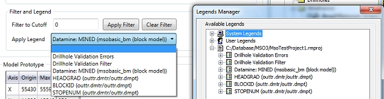
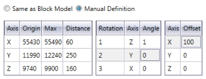
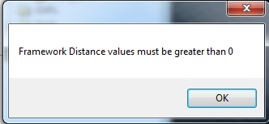
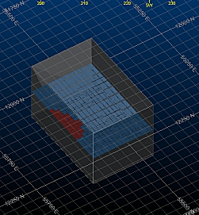
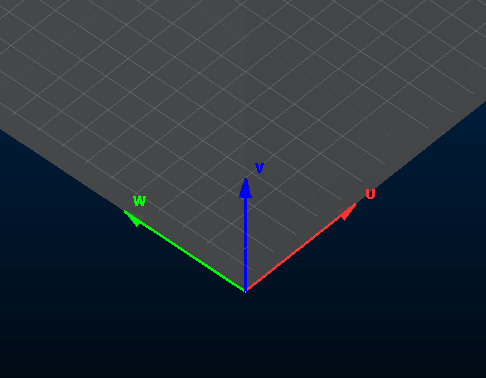
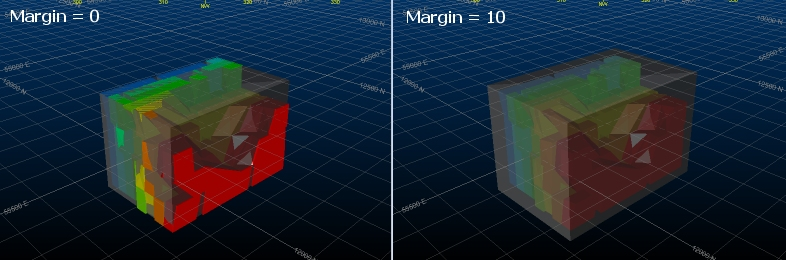

 |  MSO - Orientation MSO shape framework orientation settings  
---|---  
  
# MSO - Orientation

### To access this dialog:

  * Using the MSO ribbon, select Orientation

This panel is used to load and view some of the key components of your MSO scenario. It is also used to define the shape framework extents, within which MSO stope shapes will be calculated and generated.

Important concepts:

  * The model extents displayed on this panel represent the overall bounding box for the specified input model
  * The MSO shape framework extents can be identical, but are specified independently - the Framework Extents are represented by a cuboid within which your stope shapes will be generated. Normally, the shape framework will extend beyond the extents of the model in each direction, fully encapsulating it. You can easily check this is the case using the Extents Visualization controls at the bottom of the panel.

You can set up independent orientation settings for each scenario that you have [specified](<MSOv3_Scenarios.md>), with each scenario selectable in the drop-down list at the top of the panel.

If your input block model (and/or shape framework) is rotated, you can also use this panel to view the discretization plane.

Field Details:

The Orientation panel contains the following options:

Load Model: either load or unload a model or control surface file (not Boundary Surface method) - these will be displayed in the 3D window automatically, in their current geospatial context.   
  
Note that the Load Control Surface (and corresponding unload button) will only be available if a surface file was specified on the [Scenarios](<MSOv3_Scenarios.md>) panel.

Model Filtering: these controls are used to refine the view of your loaded model and/or control surface. Enter a value in the Filter to Cutoff field to eliminate all data that corresponds to Optimization Field value is greater than that value. For example, if you selected "CU" as the Optimization Field (Scenarios panel) and a value in this field of "1", this is the same as specifying a display filter legend equal to "CU > 1".

Once a value has been set, you will need to Apply Filter to update the view of the 3D window - this is a useful way of showing which model cells will meet certain optimization targets. You can Clear Filter at any time to revert the view.

You can also apply a display legend to the loaded model using the drop-down list. Any legend currently associated with the active project will be listed here, e.g.:  
  
  

[More about legends...](<../COMMON/FormatLegendsDialog.md>)

Framework extents: this table provides a summary of the parameters used to define the cuboid within which stope shapes will be generated. Also referred to as a 'Shape Framework', you can either choose to copy the model extents (meaning an exact fit with the model boundary, resulting in a read-only table of values, or you can select the Manual Definition option which will allow you to edit the existing values.

 |  If you choose to manually edit the framework extents parameters (Manual Definition option), these changes will be undone if you subsequently select the Same as Block Model option.  
---|---  
  
For a Manual Definition, the table describes the origin and maximum values of the framework extents in XYZ space, and if appropriate, framework rotation parameters.  
  
  

You can also apply an offset in any direction, providing either the block model and/or framework is rotated (if an unrotated framework and unrotated model represent the scenario, the Offset column will not be available.

You can see the impact of manual changes using the Extents Visualization controls (see below).

 |  A negative Distance value is not permitted in any direction. The Max value must always be greater than the Origin value - you will be alerted to any instances of negative values and you will need to reload the extents cuboid after correcting them:   
---|---  
  
Extents Visualization: view a temporary cuboid based on the contents of the Framework Extents table, above. Once the extents cuboid has been generated and displayed (Load Extents), you have the further options to Unload Extents or Refresh Extents (useful if you have just edited the table above).

   
Simple loaded model with loaded Framework Extents (copied from the model)

When viewing the framework extents cuboid, the UVW framework can be identified using an in-view axis indicator at the local origin (0,0,0) of the framework, for example:   
  

Fit to Filtered Blocks: available if the Manual Definition method is selected, this setting lets you define a framework margin to extend the hull of your overall framework. Enter a Margin value and click Update Framework Extents to incorporate it into the extents table.  
  
For example:  
  
  

Import Extents From Block Model: set the extends of the framework to any selected block model file using Select Block Model. This option is available if either Same as Block Model or Manual Definition options are selected above, however, selecting a model will automatically force MSO to use the Manual Definition option.

Model Prototype: the values in this table are extracted from the specified input model ([Scenarios](<MSOv3_Scenarios.md>) panel). You cannot edit these values, which show the XYZ origin, maximum value (extent) for each axis and the calculated length (Distance) of the model in each direction).

If a rotated model is specified, you will also be able to see axis rotation/angle properties.

[More about rotated block models...](<../STUDIO_RM/Grade%20Estimation%20Rotated%20Models.md>)

 |  Related Topics  
---|---  
| [Scenarios](<MSOv3_Scenarios.md>)   
[MSO Key Shape Concepts](<MSO3_Shape_Diagram.md>)   
[MSO Shape Frameworks](<MSO3_Frameworks_Concept.md>)   
[Slice Method Overview](<MSO3_Slice_Method.md>)   
[MSO Block Models](<MSO3_BlockModels_Guidance.md>)