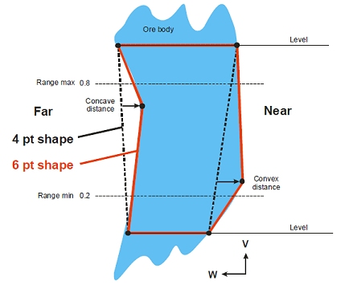
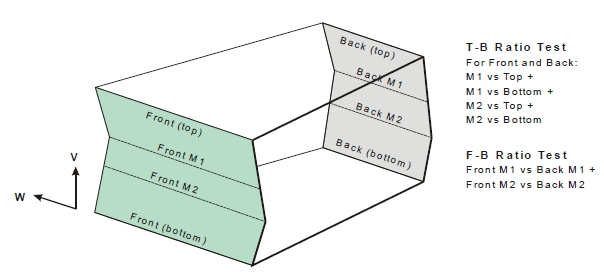
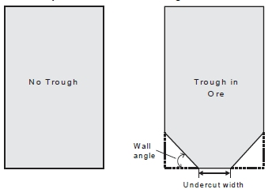
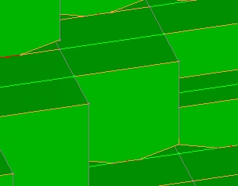

 |  MSO - Refinement Extending stope shapes to 6 or 8 points  
---|---  
  
# MSO - Refinement

### To access this dialog:

  * Using the MSO ribbon, select Refinement.

The contents of this panel will differ depending on whether a [Slice](<MSO3_Slice_Method.md>) or [Prism](<MSO3_Prism_Method.md>) framework is being configured.

  * Slice method refinement options
  * Prism method refinement options
  * Refinement options are not available for the [Boundary Surface](<MSO4_Boundary_Surface_Method.md>) method

 |  If any post processing options are enabled on the [Options](<MSOv3_Options.md>) panel, all options here will be hidden as they cannot be used in conjunction with post-processing functions. Similarly, refinement options are unavailable in any of the following scenario types:

  * If the Use Narrow Ore option is selected on the [Controls](<MSOv3_Control.md>) panel.
  * Frameworks using a gradient along (and across) strike.
  * Where a Stope Seed String or Stope Seed Wireframe has been specified in advanced Shape framework settings.
  * You are using the [Boundary Surface optimization method](<MSO4_Boundary_Surface_Method.md>).

  
---|---  
  
Refinement \- Slice Method

In previous versions of MSO, you were restricted to generating only 4-point stope shapes. Now, you can choose to generate more organic shapes that align more accurately to the orebody, by extending the geometry of stope shape outlines to 6 or 8 point.

The number of points is specified by defining the number of points on each wall, being either 2, 3 or 4 points. In MSO version 3, outlines are set as 2+2 (=4), 3+3 (=6) or 4+4 (=8) points.  

Slice Method - Vertical Arrangement

The position of the additional points is defined relative to the original 4 points, hence the operation is referred to as a 'refinement'. The position is defined by a vertical range, as shown in the diagram below, where a range fraction of 0.2-0.8 is depicted:

A special case is the 6 point shape where the additional points are constrained to the mid-height by specifying the range 0.5-0.5.

The lateral position of the points can be constrained relative to a line joining the stope corners (see the dotted lines). The lateral position can be constrained to an outwards limit (the "convex" distance), and/or to an inwards limit (the "concave" distance). In this way each wall (near, far, hangingwall or footwall) can be constrained to be either concave only, convex only, or any position in between a convex/concave limit. A straight wall would logically be specified with a 2 point wall, but until this is available, the concave/convex distance can be specified as a small non-zero value to restrict the lateral movement.

A check is made to ensure that the concave and convex values to ensure that, when combined, they are greater than zero.

In the seed generation phase, no lateral or vertical adjustment is made to the additional points so the seed shape remains effectively a 4 point shape. This means that more complex shapes can be generated in the annealing phase, but no stope will produced if an economic 4 point seed shape cannot be found.

The stope (and pillar) widths are evaluated at each vertex on the stope outline using a horizontal projection to the opposite wall.

As with 4 point outlines it is possible to test the ratio of the stope widths at the additional vertices against the top-bottom widths, and also the ratio of front-back widths, known in Studio as the "Middle Length Ratio".

Using the 4-point seed shape as the starting point for six and eight point shapes can return poorer results than the 4-point annealed shape. You can force the annealed shape to be used as the starting point using the Perform Refinement from 4-Point Annealed Shape option.   

Slice Method - Horizontal Arrangement

The horizontal case can be depicted by rotating the diagram by +90 degrees with the Near wall then being the floor and the Far wall being the roof. The choice of arrangement (vertical/horizontal) is determined by the Hangwall/Footwall and Near/Far exclusive options (see below).

Slice Method - Field Details:

In relation to the background information provided above, you can set the following properties on the Refinement panel:

Use Horizontal/Vertical Shape Refinement: by default, your scenario will only utilize 4-point shapes. Select this check box to refine your shape outlines further:

Number of points: specify a 6- or 8-point refinement.

Apply to: using the information above as a guide, choose whether the refinement is being applied to the Hangwall/Footwall (vertical refinement) or the Near/Far wall (horizontal case).

Footwall | Near settings: determine the Concave Distance, Convex Distance and Min/Max distance range for the Footwall or Near wall (see diagrams above for guidance).

Hangwall | Far settings: determine the Concave Distance, Convex Distance and Min/Max distance range for the Hangwall or Far wall (see diagrams above for guidance).

Middle Length Ratio: set the top-bottom and front-back distances using the diagram above as a guide.  

Use Trough Undercut: only available when performing a refinement of a horizontal framework, selecting this option allows you to define a trough geometry and position.

Width: enter the width of the trough

Min Depth: enter the depth at the shallowest point of the trough undercut

Depth Step: determine the maximum vertical distance that can be used to create the trough in steps from the trough rim.

Position: select a position (e.g. [Centre]) relative to the geometry of the stope. If you select either [Left] or [Right] options, you can also specify an Offset value.

Angle: enter an alignment (dip) angle for the undercut.

Max Depth: enter the depth of the trough at its deepest.

Optimize Trough Position: for Horizontal frameworks a trough undercut can be appended to the output of the Slice anneal. If enabled, you can use the controls in this section to set the gradient and smoothing of adjacent troughs (along strike). Gradient control can create a large optimization problem so the [CPLEX solver](<MSO3_Global_Options.md>) may be required:  
  

Refinement - Prism Method

Use Troughs

MSO) accounts for the waste dilution and/or ore loss regarding the shape of the a trough-undercut or -overcut during the optimization process. The undercut provides an optimized rectangular stope-shape with the two bottom edges bevelled off parallel to the orientation axis to form the trough-undercut side walls, as shown above. A trough overcut has an identical definition but is applied to the roof.

As such, you can choose between Trough Undercut and Trough Overcut options.

A Prism shape can be understood as wireframe generated from two 8 point outlines, with two points introduced for the trough, and two equally spaced located on the stope roof, and this shape can be used as a seed shape for further annealing.

Example of trough undercuts in output stope wireframes

One thing to look out for when setting up the trough undercut is to be sure that this doesn't give rise to a trough height that is greater than the overall stope (you'll be warned of this before a run is executed if this is the case, in which case you will have to reduce the undercut width and/or reduce the angle).

If the Use Trough Undercut check box is selected, the following options are available:

Width: set the undercut width, which cannot be greater than the stope width as defined on the Controls panel

Angle: set the wall angle for the trough in ore. As mentioned above, be aware that the trough undercut cannot extend beyond the overall height of the stope. The risk of this increases with the specified angle.

**Max Distance** : define the maximum distance (default is 10 measurement units) over which the trough can extend, either overcutting or undercutting.

Position: set the position of the trough to be [Centre], [Left] or [Right]

Optimise without trough: if enabled, a solution will be calculated for optimal stope shapes without regarding the setup for troughs.

 |  Related Topics  
---|---  
| [MSO Introduction](<MSOv3_default.md>)   
[The Shape Panel](<MSOv3_Shape.md>)   
[MSO Key Shape Concepts](<MSO3_Shape_Diagram.md>)   
[MSO Shape Frameworks](<MSO3_Frameworks_Concept.md>)   
[MSO Prism Method](<MSO3_Prism_Method.md>)   
[MSO Slice Method](<MSO3_Slice_Method.md>)