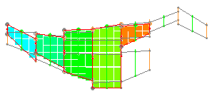
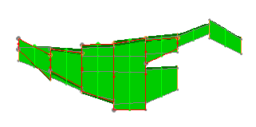
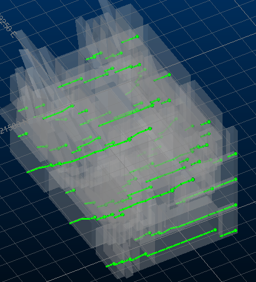
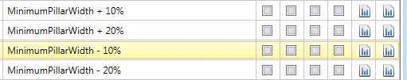
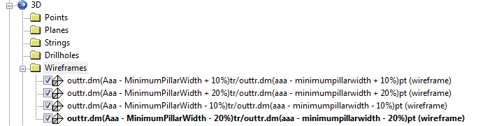
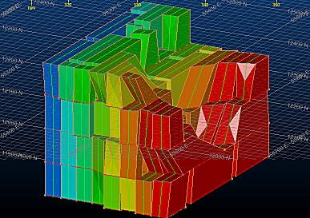
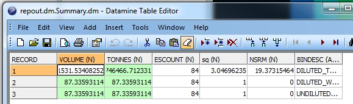
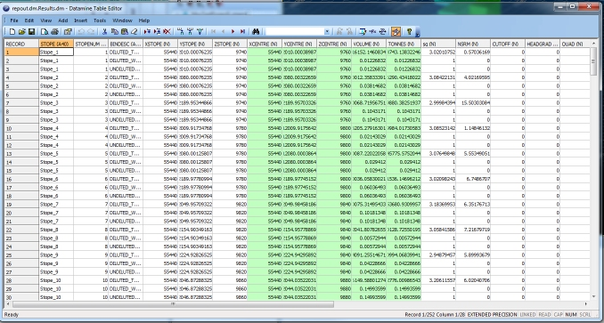

 |  MSO - Review Viewing the results of your optimization run(s)  
---|---  
  
# MSO - Review

### To access this dialog:

  * Using the MSO ribbon, select Review

This panel is used to review the results of your MSO optimization runs.

The contents of this panel are determined by the runs completed on the Runs panel, with the results of each optimization run represented as a row in the predominant feature on display; a table sorted by run results. Runs are listed in a top-bottom order corresponding to when they were generated, with newest run results at the bottom.  
  
  
Example of a Mined Out model shown with associated optimal stope outlines  
  
  
Same data - this time showing the Optimized Stope Shapes instead of the model  

Each report allows you to view both output 3D data plus a corresponding results table (in either summary or detailed format).

For each report, choose from the following by selecting the corresponding check box in the grid, providing a report exists for that category (otherwise there will be no check box displayed):

  * Verification Wireframes \- if you chose to generate verification wireframes on the Scenarios panel, you can load them into the 3D window by selecting this check box.
  * Optimized Wireframes \- the all-important stope shapes! If you want to load the shapes generated by MSO for the given optimization run parameters, select the corresponding version of this check box.
  * Outline Strings: the strings used to surface the optimal stope shapes are also output by MSO - you can use these for visualization and evaluation purposes if you wish
  * Failed Wireframes: if you chose to output failed wireframe data ([Scenarios](<MSOv3_Scenarios.md>) panel), you can load this data for further review.
  * Tube Wireframes: if you chose to output tube wireframe data ([Scenarios](<MSOv3_Scenarios.md>) panel), you can load this data for further review.
  * Tube Strings: load and review tube string data if it has been output.
  * Merged Wireframes: merged wireframe data (if output) can be selected/loaded/reviewed. This output is only generated if the Stope Merging option is selected on the [Options](<MSOv3_Options.md>) panel. You can configure the output of merged wireframes (file name, data colour) using the [Scenarios](<MSOv3_Scenarios.md>) panel.
  * Merged Strings: as for merged wireframes, but this lets you review merged wireframe string data. Again, this output can be configured using the Scenarios panel.  
  
  
An example of output merged wireframe and string data
  * Mined Out Block Model(Slice Method only): if you have chosen (within the corresponding scenario) to generated a mined out model (on the Scenarios panel) you can choose to view it by selecting this check box.

 |  Mined-Out Block Models that MSO creates as output are not sorted on IJK value. This can cause problems if you try to visualize the Mined-Out Model, say, using the 3D window, outside of the MSO workflow. Within MSO, if you visualize the Mined-Out Model using this panel, a sorted version is automatically created on disk.  
---|---  
  
  * Summary Report: show a summary report of the MSO results by clicking this cell - Table Editor will be displayed showing the results (more on this report type below).
  * Detailed Report: show a detailed report of the MSO results by clicking this cell - Table Editor will be displayed showing the results (more on this report type below)
  * Merged Report: only displayed if one or more runs resulted from [stope merging](<MSO3_Options_Merging.md>).
  * Dashboard: display the MSO dashboard. The MSO Dashboard is only displayed if a [Detailed Report](<MSOv3_Options.md>) was generated and the LEVELID field populated:  
  

For data options, once you have made your selection(s), click View Selected to load the corresponding data into the 3D window. From here, you can access Sheets control bar properties as with any other geospatial data file, e.g.:

   
  
Note that 3D Sheets (display overlays) for the chosen data are created "on-demand" i.e. they will be created when you click View Selected.

Concise Reports and Detailed Reports

Note that, for a [Prism](<MSO3_Prism_Method.md>) framework, only a detailed report is available.

The Concise Report and Detailed Report options can be used to show summary/detailed statistics in the form of a Datamine file.

The Summary Report will contain values corresponding to the selected optimization run, including the following data fields:

  * VOLUME: the overall volume that corresponds to the stope shape representing the BINDESC field, where the BINDESC field is either:
  *     * DILUTED_TOTAL: total rock inside the diluted shape
    * DILUTED_WASTE: waste rock (below cut-off) within the diluted shape
    * UNDILUTED_WASTE: waste rock (below cut-off) within the pre-diluted shape
  * TONNES: the tonnage that corresponds to the associated BINDESC
  * ESCOUNT: the total number of stopes produced for the given BINDESC
  * sg: the specific gravity calculated for the stope shapes of the given BINDESC
  * NSRM: the optimization field as selected on the [Scenarios](<MSOv3_Scenarios.md>) panel.

   

The Detailed Report provides analysis per stope shape.

This table describes, for each unique stope shape (STOPE), values corresponding to DILUTED_TOTAL, DILUTED_WASTE and UNDILUTED_WASTE report types.

Here's the full list of attributes found in this report file:

  * STOPE: an automatically generated description for the generated optimal shape.
  * STOPENUM: a numeric value (useful for sequencing purposes) that represents a stope shape
  * BINDESC: the report type, as described above.
  * X/Y/ZSTOPE: a stope's floor-level X, Y or Z centroid-value
  * X/Y/ZCENTRE: a stope centroid X, Y or Z value
  * VOLUME: the overall volume that corresponds to the stope shape representing the BINDESC field.
  * TONNES: the overall tonnage that corresponds to the stope shape representing the BINDESC field.
  * sg: the specific gravity calculated for the stope shapes of the given BINDESC
  * #OPTIMIZATION FIELD#: a data column will appear in the report corresponding to the optimization field specified on the Scenarios panel.
  * CUTOFF: the cutoff value for the optimization field.
  * HEADGRADE: the head-grade value for the optimization field.
  * QUAD: the quadrilateral number
  * PASSTYPE: the type of stope shape, which will be either:
  *     * 1=Full Stope
    * 2=Sub-stope
    * 3=Development Shape
    * 4=Prism Stope (not yet supported)
  * PASSNUM: this will either be 1, indicating a full stope shape, N meaning a development shape or >1, indicating a substope value for a given QUAD.
  * PASSSEQ: rhe sequence number (near to far) of the PASSNUM i.e. full stopes and sub-stopes are numbered from 1 as each pass is completed.
  * RESULT: this will either be 1 (successful stope generation) or 0 (no stope generated as seed failed to meet stope criteria).
  * SURFACE: the surface number within the wireframe file
  * GROUP: the wireframe group number
  * SLENGTH: the strike length of the stope
  * SHEIGHT: the height of the stope for XZ/YZ orientated frameworks, or the height of the stope at the centroid position for XY/YX frameworks
  * SAVGWID: width of stope at centroid position for XZ|YZ, width of stope in XY|YX
  * WASFRAC: proportion (by volume) of sub cut-off rock in shape; (volume of waste within diluted stope) / (total volume of diluted stope).
  * LEVELID: an integer representing the shape framework level to which the stope shape belongs.

 |  Related Topics  
---|---  
| [MSO Run Panel](<MSOv3_Run.md>)[MSO Sensitivities Panel](<MSOv3_Sensitivities.md>)