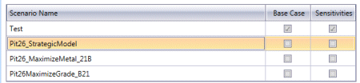
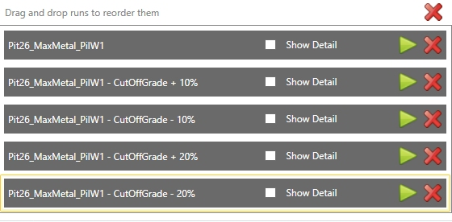
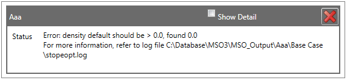
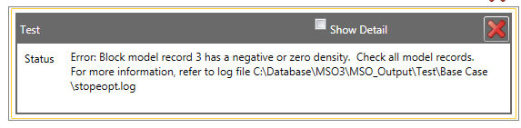
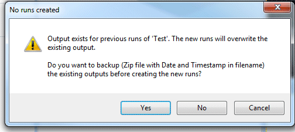
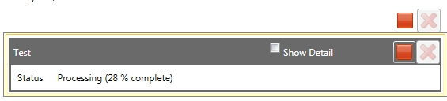
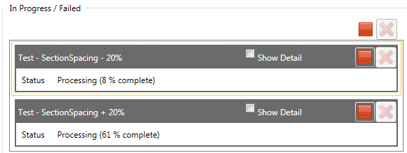
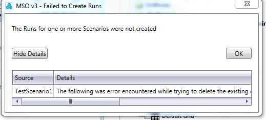

 |  MSO \- Run Setting up and executing optimization runs  
---|---  
  
# MSO - Run

### To access this dialog:

  * Using the MSO ribbon, select Run

This panel is used to configure and schedule one or more optimization 'runs' for MSO.

All scenarios defined within the active project are listed at the top of the screen, and you have the choice of simply reporting against the Base Case, or whether you wish to also include Sensitivities in your run:  
  
  

 |  If no sensitivities have been defined for a run, the corresponding check box is not displayed.  
---|---  
  
Using this panel, you execute a run in two stages:

  1. "create a run" for any defined scenario (1 or more) by making the appropriate selection(s) in the table at the top of the screen.
  2. Execute the run or runs either manually or as a batch, in sequence.

Once a run has been defined, it appears in the Queue at the bottom of the screen from where it can be launched manually (if not part of an automatic batch process). MSO will, where possible, make the most effective use of your hardware in order to solve multiple runs simultaneously, but by default, only 1 run is processed at a time.

A 'run' is, essentially, an attempt made by MSO to find the optimal stope shape and arrangement for a given set of input values, such as those defined on the previous panels in the MSO workflow. These parameters, as defined by you, represent the "base case" for the scenario. For example, the base case will generate optimal stope shapes and a report for a horizontal shape framework with fixed sublevel spacing, to achieve a maximal stope grade with a given cut-off of...etc.

This "base case" can be reported in isolated, or as part of a more involved study that includes additional reporting against a range of parameters to which the scenario may (or may not) be sensitive. This could be useful, for example, if you wish to see the impact of a slight change in the Minimum Pillar Width on the geometry of the generated stope shapes. In this situation, you will have enabled Minimum Pillar Width as an Active sensitivity on the [Sensitivities](<MSOv3_Sensitivities.md>) panel.

Here's an example of where both Base Case and Sensitivities are selected for a Slice framework type, and the scenario in question has been set up to include sensitivity calculates for section spacing. Note that the extra runs represent a variation in the assigned attribute (+/- 10% or 20% in section spacing = 4 additional runs):  
  
  
Example of sensitivity runs for a slice framework - section spacing is one of several sensitivities available

Also note that the above options are not available for a [Prism](<MSO3_Prism_Method.md>) framework type. In this situation, it is only possible to report runs showing results for a series of cut-off grades and only then if the cut-off grade is non-zero (as defined using the [Economics](<MSOv3_Economics.md>) panel).

Example of sensitivity runs for a prism framework - only a cut-off grade sensitivity can be specified

 |  The runtime for a large number of sensitivity combinations can be prohibitive, so it is recommended that you investigate the impact of sensitivities in isolation to begin with, and then set up a scenario with multiple sensitivities thereafter. Otherwise, you run the risk of over-reporting and extending processing time beyond an acceptable limit.  
---|---  
  
[More about sensitivities...](<MSOv3_Sensitivities.md>)

System Feedback

Feedback is provided before, during and/or after the run, and if a run cannot be completed for any reason, MSO will alert you to either the specific issue, or a more general indicator where this isn't possible. For example, if you have neglected to set a DENSITY value during scenario setup, your run will not be executed, but you will see the following report in the Queue:

In the following example, the DENSITY column specified on the [Scenarios](<MSOv3_Scenarios.md>) panel contains negative numeric values (not permitted):

There are a wide range of possible messages that can be provided to explain where a run cannot be started due to missing and/or incorrect parameters; a trough undercut angle that can't be completely encompassed within the stope, incompatible output file names on the scenarios panel, a mining width that is impossible to accommodate are just some examples of this aspect of the MSO system.

MSO Log Files

In the above images, you will see a reference to the log file that is generated by MSO during run execution. This is a useful document in situations where a run has failed, or has not produced expected results. This log file is project-specific, and is stored within the "MSO_Output" sub-folder of your project. From there, it will be located within a folder of the scenario name to which it is relevant.

For example, in the second of the two failures (the negative density instance), a fatal error was spotted during pre-validation of the block model, where a negative value was found at the 3rd record in the block model table. In this example, the output log file ended up with the following contents:

Info...| StopeOpt - AMS Stope Optimisation.

Info...| Run Started on Mon Sep 05 09:58:18 2016 (LogFile="C:\Database\MSO3\MSO_Output\Test\Base Case\stopeopt.log")

Info...| Executable : C:\Program Files (x86)\Datamine\StudioRM\Bin\MSO3\StopeOpt.exe (Build 3.0.1599.0 [32 bit Release]) (Target input XML schema version 3.0.0)

Info...| Working Dir : C:\Database\MSO3\MSO_Output\Test\Base Case

Info...| Activity File : C:\Database\MSO3\MSO_Output\Test\Base Case\MsoSettings.xml (XML schema version 3.0.0)

Info...| Description : Test

Info...| ____________________________________________________________________________________________________________________________________________

<!DOCTYPE Activity SYSTEM "file:///C:/PROGRA~2/Datamine/StudioRM/Bin/MSO3/STOPEOPT_Activity.dtd" >

<Activity xmlns:xsi="http://www.w3.org/2001/XMLSchema-instance" xmlns:xsd="http://www.w3.org/2001/XMLSchema" description="Test" version="3.0.0" create_guid="no" xmlns="http://schemas.datacontract.org/2004/07/com_cae.Mining.Mso"><License><vendor name="datam

Info...| ____________________________________________________________________________________________________________________________________________

Info...|

Info...| Using vendor = 'datamine' product suite = 'studio' licensing.

Info...| ============================================================================================================================================

Info...| Scenario 1 : Base Case

Info...| ============================================================================================================================================

ProMon.| 0% (Starting scenario processing)

Info...| BlockModelFramework : nxyz = (16, 1, 4) xyzmorig = (55430.0, 11990.0, 9740.0) xyzinc = (10.0, 250.0, 40.0)

Info...| StopeModelFramework : nxyz = (8, 1, 4) xyzmorig = (55430.0, 11990.0, 9740.0) xyzinc = (20.0, 250.0, 40.0)

Info...| Block & Stope Model Frameworks are both unrotated (1)

Info...| CellIndex Framework : nxyz = (8, 1, 4) xyzmorig = (55430.0, 11990.0, 9740.0) xyzinc = (20.0, 250.0, 40.0)

Fatal..| Block model record 3 has a negative or zero density. Check all model records.

Fatal..| For more information, refer to log file C:\Database\MSO3\MSO_Output\Test\Base Case\stopeopt.log

  
The log file provides additional information about the cell XYZ location of the origin of the cell containing the negative density (XMORIG, YMORIG, ZMORIG), plus the index of that cell within the MSO shape framework.  

Executing a Run

Whenever you launch a run, a check will be made to see if a run of the same name has been run previously. 

You then have an opportunity to archive the results of this run to a 'zip' file that will sit alongside newly generated output folder contents. If a previous run is detected, you are asked to confirm if you wish to remove or keep the old run data:

Selecting Yes will backup the existing run folder with the scenario name and a date and time suffix, within the appropriate project sub-folder.

Once a run is underway, a progress counter will be shown against it in the Queue:

Threads and Concurrent Runs

The Threads per Run drop-down list allows you to choose the number of separate processing threads (you can think of a thread as a processing channel, where multiple channels allow for more simultaneous processing and, generally, shorter overall run times. By default, a single thread will be targeted, but you can choose up to as many cores as you current PC provides (minus one - one thread will always be left available for background processing by the operating system and other running services).

The Max. Concurrent Runs drop-down menu is populated based on the number of Cores (not Processors) the computer has. If the computer only has 1 processor, then only 1 is displayed. If they have more than 1, then the maximum number increases. This defines how many parallel computations your host machine can utilize in order to generate results.

 |  The behavior of MSO when it intercepts an error in a run can be controlled using the [Global Settings](<MSO3_Global_Options.md>) dialog.  
---|---  
  
Accessing the Run Panel after Recent Changes

If changes have been made to optimization settings since the last run of the active scenario, you will see the message when you access the **Run** panel; "The current Scenario has been modified. Save Scenario before moving to the Run tab?".

In this situation you can either:

  * Choose **Yes** to save the latest changes and display the **Run** panel.
  * Choose **No** to revert any previous made changes and display the Run panel. Running the scenario will use the original settings.
  * Choose **Cancel** to maintain the most recent changes without activating the **Run** panel.

Stopping an Active Run

You can stop any run during processing but if you confirm that you wish to Cancel it, it will be removed from the Queue. If you wish to re-run it, it will need to be recreated using the table at the top of the panel.

Deleting a Run

When you delete a run (processed or otherwise) you are asked if you wish to maintain the run data or to delete it. If you elect to maintain it, you will be given a further choice of whether to archive it or not if a subsequent run of the same name is performed (see above).

Run Failures

If one or more runs fails to complete, a pop-up dialog will be shown on completion of the process. This will indicate, for each failed run, an explanation of why it did so.  

   

In the above example, a run for a base scenario (no sensitivities) failed because the block model associated with the scenario was already in use by another process (actually, by a separate Datamine application, but the same could occur if the model was loaded into the 3D window by another process, for example \- if you see this error, unload your data and try again.).

Completed Runs

Completed runs are removed from the Queue as they complete. Once complete, they are available as reports and data, using the [Review](<MSOv3_Review.md>) panel.

Auto-starting Runs

The Auto start runs option will, when selected, initiate the first run (top-bottom) in sequence without requiring additional input from you \- this is a great option when you wish to run a series of analyses across multiple run parameters, say, for sensitivity analysis. Queue items will be processed and cleared from the Queue after completion if there are no issues to report.

Where a failed run occurs, the system will behave as dictated in the Global Settings panel - meaning failed runs will either remain in the Queue as an alert message, before attempting the next run in sequence, or all processing will stop.

Note that this option can be used in conjunction with the Max. Concurrent Runs option to batch up and parallel-process multiple runs at once (up to 3 at a time).

 |  Related Topics  
---|---  
| [The MSO Review Panel](<MSOv3_Review.md>)   
[Global Settings](<MSO3_Global_Options.md>)   
[MSO Prism Method](<MSO3_Prism_Method.md>)   
[MSO Slice Method](<MSO3_Slice_Method.md>)   
[Economics](<MSOv3_Economics.md>)   
[Sensitivities](<MSOv3_Sensitivities.md>)   
[Review](<MSOv3_Review.md>)