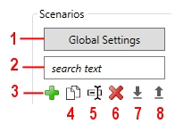
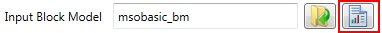
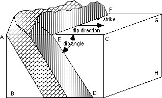
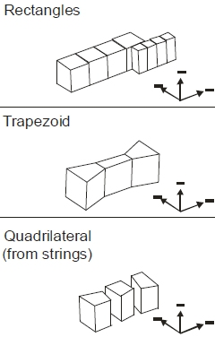
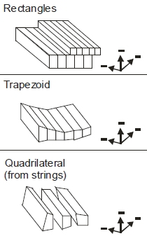
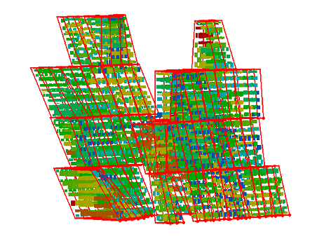

 |  MSO - Scenarios Setting up your stope optimization scenarios  
---|---  
  
# MSO - Scenarios

### To access this dialog:

  * Using the MSO ribbon, select Scenarios.

Use this panel to define your stope optimization scenarios and set up the general (global) options for each stope optimization scenario, such as the input block model, optimization field, dip and strike control etc.

You can set up as many scenarios as you wish, using the management console on the left of the panel:

  1. Access MSO [Global Options](<MSO3_Global_Options.md>) (see below)
  2. Enter search text to locate a particular scenario - useful if you have used a standard naming convention, for example, and a long list of scenarios
  3. Add a new scenario to the list below. See the note below regarding scenario naming.  
  
Scenario names cannot contain "^" or "\" characters.
  4. Copy an existing scenario (e.g. to make comparative adjustments). Copying a scenario will introduce new default names, based on the scenario name. You can still edit these afterwards if you wish.
  5. Rename the active scenario. 
  6. Delete the selected scenario
  7. Importan MSO configuration file in XML format (as saved using 7, below). Importing a Scenario that uses files that are not part of the current Project will prompt you to add these files to the current project.
  8. Exportcurrent scenario settings to a portable XML file which can be shared across different projects/systems.

Once a scenario has been defined, it becomes selectable in the drop-down list on the right and from there you can start to define input settings for your run:

 |  Naming scenarios   
Only alphanumeric characters, "_" and spaces can be part of scenario names and output files.  
---|---  
  
Saving Scenarios and Validating Input

Scenarios are saved either manually or automatically; whenever you change tabs on the MSO ribbon, data in the previous step will be automatically saved. You can manually save your data at any time using the Save button in the top right corner (which will always be available).

In terms of validating your input, MSO knows what it needs and any field that doesn't match the requirements for a successful MSO run will be highlighted on the panel in question. Look out for the red outlines - this indicates that data is either missing, or in a format that can't be used (for example, an alphanumeric character in a numeric field, or where a maximum value is less than the minimum, that kind of thing).

In most cases, this validation is performed "on-the-fly", meaning you will be alerted as soon as you type the specify erroneous or unexpected data within a given field. Sometimes, this validation can only be performed after you have entered other data, say, in a table.

In the example, below, the Default Dip field contains a letter, which isn't permitted. The Default Strike field is fine, so no red outline.

  

If you attempt to manually Save your scenario where invalid data exists, you will be alerted to the problematic data.

Setting up Global Options

You can also use this panel to access a set of Global Options that determine general operating rules for all MSO functions on the MSO ribbon. This includes how data is created or unloaded, the level of error reporting and general error reporting behaviour, plus general settings for the core solving engine that is used to determine the optimal stope shapes as a result of your run. [More about Global MSO Options...](<MSO3_Global_Options.md>)

The bulk of functionality on this panel is used to define the general operating parameters for your optimization scenario.

Field Details:

Select a link for more information:

  * Scenario Settings
  * Block Model Settings
  * Dip and Strike Controls
  * Data Fields
  * Output Stopes
  * Report
  * Create Verification Wireframes
  * Create Failed Wireframes
  * Create Tube Wireframes
  * Create Tube Strings
  * Create Mined Out Block Model
  * Create Merged Wireframes
  * Create Merged Strings
  * Use Stope Naming

Scenario Settings

Scenarios: this group of commands on the right side of the panel are used to maintain the list of scenarios available for configuration and processing. See above for more information.

Active Scenario: this drop-down list contains every scenario that has been defined so far (using the tools described above).

Block Model Settings

Input Block Model: the model containing the grades or values to be used as a basis for optimal stope shape calculations. The configuration of the block model file is important and you should consult [MSO Block Models - Guidance](<MSO3_BlockModels_Guidance.md>) to ensure your input is configured correctly for the MSO functions that lie ahead

Browse for a location and file name for the model.

Model Statistics: the button on the far right of the Input Block Model field is used to generate summary statistics for the model, using your application's [STATS](<../Process_Help_XML/stats.md>) process.  

Optimization Field: this can either be a grade field or a value field, and is a mandatory reporting item. This control will only list numeric fields.

  * If the Optimization Field is a value field then the optimization objective is to maximise the total value of the stope above the cut-off, and a stope value less than the cut-off would be sub-economic. It is the maximization of the profitability of the stope relative to the cut-off.

  * If the Optimization Field is a grade field, then the equivalent objective is to maximize the total metal above the cut-off. You can specify the default value to be used in case of absent data.  
  
You can define the objective and method using the [Economics](<MSOv3_Economics.md>) panel.

 | 

  * Care should be taken to ensure that the default value for the Optimization Field is realistic for ore-only block models. For example; if the Optimization Field is a metal grade field then zero may be appropriate, but if the Optimization Field is a value field (e.g. net smelter return dollar value) then a negative number representing the cost to mine (and process) waste may be more appropriate than a zero value.
  * If you are optimizing for maximum grade using a [Prism](<MSO3_Prism_Method.md>) method, and wish to generate cut-off-grade variant sensitivity runs, the [cut-off grade](<MSOv3_Economics.md>) must be a positive value (non-zero) otherwise you will not be able to produce [sensitivity runs](<MSOv3_Sensitivities.md>) for that scenario and framework type.

  
---|---  
  
Density Field: select the field that represents density values within the input block model. Density is also a mandatory report item, and only numeric fields are available for selection. You can specify the default value to be used in case of absent data.

 |  Ideally, the Density field will not contain absent data (e.g. "-" values). If absent values are found within the specified data column, the nominated default value will be substituted which could cause unexpected results.  
---|---  
  

Dip and Strike Controls

Dip and Strike Controls (Slice method only): if a [Slice](<MSO3_Slice_Method.md>) method framework is used, you can specify a stope control surface (Use Dynamic Dip and Strike Control \- Use Control Surface), which is a Datamine format wireframe triangle file, selected from disk using the folder icon.

The easiest, most intuitive and most accurate method of specifying the strike and dip angles is to provide a Stope Control Surface wireframe over the full extent of the orebody where stope-shapes are to be generated.

This simple wireframe is used to define the general orientation expected for the stope-shapes in the mineralized zones of the orebody. This is often a good option as it is customized to the specific requirements of MSO and is independent of model cell size.

Stope Control Surfaces can typically use the geology surfaces, although this will depend on complexity. If the surface is overly complex with reversal of dip and/or strike orientations over short distances the localized surface orientation may be at odds with the practical stope orientation. It is generally good practice to decimate the surface to simplify it beforehand (you can use the Structure ribbon's [Decimate](<../COMMON/Wireframe%20Decimate%20Dialog.md>) option to do this). An excellent alternative is to generate the wireframe from widely spaced sectional strings that are oriented to the expected stope orientation.

If a control surface wireframe is not available, another option is to specify Dynamic Anisotropy fields contained within the input block model (Use Dynamic Dip and Strike Control - Use Control Surface). This generates a local strike and dip at each cell centre from the orientation of bounding geological wireframes. It is typically used to deal with anisotropy in folded orebodies and can have minor advantages over the Stope Control Surface approach, but has the possible disadvantage of being dependent on the model cell size.

 |  If you intend to use polytube strings in your shape framework, a control surface must be specified.  If polytube strings have been specified, the Dynamic Dip and Strike Control group of controls become read-only.  
---|---  
  
Regardless of whether you are determining dip and strike from input wireframe or block model information, you can choose to set a default value as the Default Dip/Strike. The default dip is set to 90 degrees and the default strike is zero. Both are editable.

Use Block Model Bounding Wireframe: check to pick a wireframe volume file that will constrain the input model when optimizing stope shapes. Only model data within the selected wireframe will be considered.

This can be a useful way of optimizing a subset of an input wireframe.

Data Fields

Data Fields: use this table to define optional numeric data fields within the model (other than the Optimization and Density field that have been defined above). These settings will dictate how each field is treated during the optimization process (and, by definition, how it is reported). For each field name listed, you will need to define the following:

  * Default: the default value that will be assumed in the case of absent data.

  * Report: enable or disable a field to include or exclude the field as a reporting item

  * Accumulation: each option report field will be accumulated using one of the following options:

  *     * Weight by mass

    * Weight by volume

    * Sum of values

  * Category: specify if the field should reported with respect to its dominant (majority) value, or the four most common values for up to three reporting fields (ranked). Dominant can be ticked to indicate that the field represents a categorical value that should not be averaged. When checked, the Mode or most frequently-occurring value will be reported, e.g. a rock type code.

  * Scaling: you can, if you wish scale the values held within the model attributes by a factor (the default is 1 = no scaling). 

Output Stopes

Output Stopes: specify the base name for the output wireframe (triangles and points) file that will contain the generated stope geometry for the selected scenario. A standard naming convention is advisable to associate output data with the run specification (scenario) that generated it.

An outline string file will also be generated, and requires a name.

You can color both wireframe and string data using the default settings (viable shape = green, sub-economic shape = yellow) or you can select the Customize option to select a Datamine color field for each data category.

Report

Report: this section is used to set up parameters for an output stope optimization reporting table. This table can be generated as either a Datamine or comma-separated values file (CSV).

Optionally, you can rename the mass field that is included in the report output, and a scaling factor can also be applied to the values of this field if required.

  * Report File Name: enter the name of the file to be generated. The data file will be generated within the current project directory on completion of each [Run](<MSOv3_Run.md>).  
  
The characters "^" and "\" cannot be used in this field.

  * Mass Field Name: enter the name of a field (up to 24 characters) that will identify the mass field within the output report.   
  
This field cannot contain a space or any of the following characters: ",", "!", ":", "*", "&", "=", "(", ")".

  * Scaling Multiplier: multiply the contents of the mass field by a multiplier, which must be between 0 and 1.

Use Custom Output Fields

All stope shape methods include the option to generate an output field containing the results of a calculation based on existing fields. To do this, click Build and use the Custom Output Fields to construct an expression based on Fields, Operators and Functions.

[More about creating expressions in Studio products...](<../COMMON/Expression%20Builder%20Dialog.md>)   

Create Verification Wireframes

Create Verification Wireframes (Slice method only):

This option is only available if a [Slice](<MSO3_Slice_Method.md>) shape framework has been selected (using the [Shape](<MSOv3_Shape.md>) panel).

Verification wireframe output is optional but can assist in the interrogation of run results. It can output one or more of the following (the information below requires a basic understanding of MSO's [Slice Method](<MSO3_Slice_Method.md>)):

  * Slice intervals based on the default strike and dip or Stope Control Surface

  * Aggregated slices

  * Aggregated slices that failed to meet stope criteria

  * Annealed stope-shape prior to skin dilutions

  * Far side skin dilution shape for the Global definition case

  * Near side skin dilution shape for the Global definition case

  * Hangingwall side skin dilution shape for the Local definition case

  * Footwall side skin dilution shape for the Local definition case

By filtering the output wireframes (using the various filtering options available on the [Format](<../COMMON/Ribbon_Format.md>) ribbon, for example), individual features can be extracted for further analysis; a good example of this is evaluating the annealed stope-shape prior to the dilution skins. You can also choose which of the verification wireframe types are to be generated using the corresponding check box(es).  
  
You can use default colours for your verification wireframes, or you can Customize the colours for each of data category in the drop-down list.

Create Failed Wireframes

Create Failed Wireframes (Slice method only): separate stope wireframe and report output files can be generated for stopes that fail. 

Specify a Failed Shape Wireframes (tr/pt) name and then decide on a colour to be used to represent the failure type. You can choose any colour for shapes that are Sub-Economic, Failed Sub-Economic and Failed Economic wireframe outputs.

When using Failed Wireframes the Failed Sub-Economic Color and Failed Economic Color options are only configurable if using a Result Filter (defined using the [Materials](<MSOv3_Materials.md>) panel). 

Create Tube Wireframes

Create Tube Wireframes (Slice method only): stope quadrilaterals form a tube-shape when extruded in the transverse direction representing the stope-shape W-axis. For the [Slice Method](<MSO3_Slice_Method.md>), the stope-shapes are constrained to the tube geometry when extruded in the transverse direction (W-axis). The face or projected wall shape will be defined by the four corners in the wall plane (i.e. hangingwall/footwall or near/far wall for vertical orientation, roof/floor wall for horizontal orientation). The shape of the tubes can be rectangular or trapezoidal or based on quad strings and will depend on the orientation of the framework and whether it is of the regular or custom type. 

For example, tube shapes for a horizontal irregular framework could be:  
  
  
In comparison, tube shapes for a vertical irregular framework (for the same input data) could be:  
  
  
  
  

The stope-shape tube volumes are defined by the framework [options](<MSOv3_Options.md>) and optional control-string combinations.

If you choose to Create Tube Wireframes, you will need to specify a base name for your triangle and point files, plus a Color for the output wireframe data.

If you want, you can choose to Only output Tube wireframes for this run. If this check box is selected, the Create Verification Wireframes, Create Failed Wireframes, Create Tube Strings and Create Mine Out Block Model options will be disabled.

Create Tube Strings

Create Tube Strings (Slice method only): similar to the Create Tube Wireframes option (see above), this will output a set of hull strings representing your generated stope tube shapes. Specify a name for your output string file.

Create Mined Out Block Model

A mined out model can optionally be output to identify the portion of the model that is mined, is part of a pillar or is otherwise unmined. The output model represents the sub-cells after the discretisation process, split according to the portion that falls within the stopes and the pillars.

Mined-out block models can be output for both slice and prism frameworks.  
  
  
Example of a mined out model surrounding by outline strings for optimized stope shapes  

The mined out model has values of 0 or 1 in the MINED and PILLAR fields to indicate exclusion or inclusion.

It is useful to review the mined out model to assist understanding what the discretisation process is doing. The mined out model may also have many other downstream uses. Beware that the mined out block model can be much larger than the input block model because it provides the discretised model cells.

Create Merged Wireframes

This option is available if Stope Merging is selected on the [Options](<MSOv3_Options.md>) panel.

Select the check box to generated merged wireframes with each run. Merged wireframes are also listed on the [Review](<MSOv3_Review.md>) panel.

If selected, you can name your output merged wireframe object and set a Color value.

This option is supported by stope naming (see below).

Create Merged Strings

This option is available if Stope Merging is selected on the [Options](<MSOv3_Options.md>) panel.

Select the check box to generated merged wireframe strings with each run. These can be generated as well as, or instead of merged wireframe output (see above).

This option is supported by stope naming (see below).

Use Stope Naming

Stope-names can be generated by concatenating component parts (in any combination) of up to a combined total of 80 characters. The stope-name could typically be used to spatially locate stopes (e.g. level position, block position, extraction sequence, etc.) or to categorise as a stope type (e.g. primary or secondary, high grade/value or low grade/value, wide or narrow, measured category, etc.). Note that the stope-names should be defined so as to be unique. For example, using component parts that describe the mine-name followed by floor-level would result in all stopes on any particular level to have the same stope name.

Select Use Stope Naming if you wish to take advantage of MSO's auto-naming facility. Selecting this option enables a table that allows you to define the type, configuration, width, justification, resolution and padding elements of your stope name. There are five core naming methods available, as determined by your selection in the first table column.

Each row/item in the table represents one element of a naming convention. For example, the first element could be a static prefix ("Case1Stope_") followed by a second item/row to stipulate a field name (e,g, STOPENUM) followed by a position index/counter. For all items, the Configuration Edit button is used to further define the element.

  * Automatic: you can select a preset template for stope naming with this selection. The corresponding Edit dialog allows you to assign a label based on range of calculate values, e.g. the stope type, the orientation plane, the U/V/W local average value, X/Y/Z average world coordinate and so on.

  * Expression List: allows you to define a collection of one or more ('expression', 'value') pairs. Each expression refers to field names and/or constants connected by relational operators. Expressions are evaluated in turn for the stope until the first match is found, and the associated "value' from the (expression, value) pair is used for the 'part'.

  * Fixed String: use this option to specify a fixed suffix/prefix or intermediate text string, using numeric or alphanumeric characters.

  * Field Name: select any nominated field name within the block model or contained in the [detailed](<MSOv3_Review.md>) output report.

  * Position Counter: this is a generated value that represents a spatial location. For regular model frameworks, this setting evaluates the position of the stope in the framework. It advances forward/backward from the start/end along the specified axis direction, counting the number of "steps" in the stope framework, from the designated configuration Start position.  
  
It represents the number of steps (using the configuration Step value) to define a value to assign for each stope based on its framework position along the defined axis (U|V in the stope orientation plane and uses the PASSSEQ field value on the W axes), or in the reverse direction. The Start value can be numeric or alphanumeric. Letters can be a mixture of upper and/or lower case, and the increment restricted to the supplied case.  
  
[More about Stope Naming...](<MSO3_Stope_Naming.md>)

 |  Related Topics  
---|---  
| [MSO Introduction](<MSOv3_default.md>)   
[MSO Global Options](<MSO3_Global_Options.md>)[Options Panel](<MSOv3_Options.md>)   
[Review](<MSOv3_Review.md>)   
[MSO Shape Frameworks](<MSO3_Frameworks_Concept.md>)   
[MSO Stope Naming](<MSO3_Stope_Naming.md>)