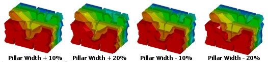
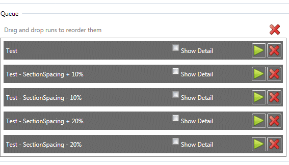
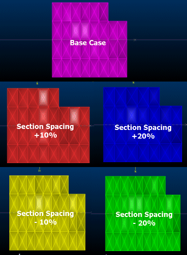
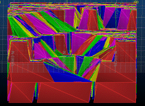

 |  MSO - Sensitivities Description of dialog  
---|---  
  
# MSO - Sensitivities

### To access this dialog:

  * Using the MSO ribbon, select Sensitivities

Typically, MSO will be used to assess multiple optimization scenarios.

These scenarios can be entirely independent, operating across separate orebody model compositions, or the same input model and vastly different mining parameters.

MSO can also be used to demonstrate the impact of parameter changes on the resulting stope shapes, which will be optimal for each setup. A useful way of determining how "sensitive" your scenario is to a particular parameter (such as slice interval, dilution settings, pillar widths and so on) is to create a report that indicates the results of a run where the value of a certain parameter, or group of parameters is slightly different each time.

Regardless of the attribute(s) chosen, sensitivity analysis will take place across 4 additional runs based on -20%, -10%, +10% and 20% value variations. In addition to a set of standard +/- report variations, this panel also provides access to

Such Monte Carlo-style simulations are a valuable tool when assessing the sensitivity of the optimal stope shape set to your data and input parameters.

Use this panel to automatically assess the sensitivity of your scenario to key mining parameters

For [Slice](<MSO3_Slice_Method.md>) Method frameworks, the following predefined mining parameters are available for sensitivity-study:

  * Cutoff Grade/Cutoff Value: either [Cutoff grade] is displayed as a possible sensitivity (if aDiscrete Gradehas been configured) or [Cutoff Value] (if aDiscrete Cutoffhas been configured).   

  * Section Spacing: the combination of level spacing and section spacing define the cuboid framework for MSO.
  * Level Spacing: level spacing, combined with the slice interval is a primary consideration when defining an MSO shape framework.
  * Minimum Stope Width: The minimum mining width parameter is defined as distance in the horizontal plane on the framework section along the W-axis (and consequently measures the apparent width).
  * Minimum Pillar Width: this parameter is defined as the distance in the horizontal plane i.e. the apparent pillar width.
  * Dilution - FW/Far/Floor: the slice interval ideally should be an integer divisor of the dilution width. Note that dilution is added to the stope-shape as an equivalent linear-overbreak. The dilutions are added after the optimized stope-shape is formed.
  * Dilution HW/Near/Roof: the slice interval ideally should be an integer divisor of the dilution width.
  * Slice Interval: the choice of slice interval can significantly affect the accuracy and result of the seed-shape optimization.

For [Prism](<MSO3_Prism_Method.md>) method frameworks, the following predefined mining parameters are available for sensitivity study:

  * Cut-off grade: generate a series of results based on the [optimization field](<MSOv3_Scenarios.md>) cut-off value. If this option is selected, a series of 4 additional runs will be created (if you choose to create sensitivity runs) using the Run panel. These runs will encompass 4 grade cut-off reports spanning cutoff -20% to cutoff +20% in steps of 10% (-20, -10, Base value, 10, 20).

 |  If you have chosen to generate a series of sensitivity studies based on cut-off grade, but no cut-off value has been specified on the [Scenarios](<MSOv3_Scenarios.md>) panel, only the base case run will be created.  
---|---  
  
For [Boundary Surface](<MSO4_Boundary_Surface_Method.md>) Method frameworks, the following predefined mining parameters are available for sensitivity-study:

  * Cutoff Grade/Cutoff Value: either [Cutoff grade] is displayed as a possible sensitivity (if aDiscrete Gradehas been configured) or [Cutoff Value] (if aDiscrete Cutoffhas been configured).

As each item is selected/deselected, the number of Additional Mining Scenarios is calculated - this will be summarized as Total Scenarios underneath by adding a further case - the base scenario).  

Slice method - run setup example

The number of seed-slice intervals across the orebody can be up to a maximum of 4096. The seed-slice generation process gets proportionately slower as the number of slice intervals increases. Hence, careful selection of seed-slice interval, minimum stope width, minimum pillar width between stopes and dilution skin intervals is required to not exceed this limit and/or to keep the processing time reasonable.

Once you have defined the attribute sensitivities for your scenario, they will appear as additional runs on the [Run](<MSOv3_Run.md>) panel, if you choose to include those sensitivity options at that time, e.g.:  
  

Continuing this very basic example, the output wireframes for each run will honour the section spacing variants, generating a total of 5 separate data and reports:

   

Concluding this particular example, the stope arrangements in a North-South view are impacted quite significantly by adjust the section spacing of the MSO shape framework; as indicated in other topics, this property and interval/level spacing will generally widely impact the resulting calculation of optimal stope shapes.

The above example optimized wireframes shown overlapping, from a North-South direction:

[More about MSO shape concepts...](<MSO3_Shape_Diagram.md>)

Conditional Simulation options (All Methods)

The most common method of defining geological risk is to simulate the uncertainty associated with estimation of grade into a model cell.

MSO provides access to a Conditional Simulation option, which in turn can be fine-tuned to offer Multiple Indicator Kriging (MIK) geostatistical assessment.

The MSO geological risk techniques enable either stope-shapes to be designed to a geological confidence level (that is, maximizing optimization field values while meeting confidence criteria) or evaluated to ascertain their geological confidence level (maximizing optimization field values and reporting the confidence level). This level is defined within your product as a Minimum Probability Percentage Target.

The key difference between estimation and simulation is that:

  * Estimation aims to provide the best local grade estimate, which has the effect of smoothing the grade variance, while
  * Simulation is specifically designed to reproduce the grade variability and examine its effects.

Therefore, estimation aims to maximize accuracy of the sample estimate, while conditional simulation investigates possible sample estimation variance, hence precision. In addition, one approach to risk evaluation is to generate stope inventories for each of the simulation fields (often referred to as realizations).

The confidence level would be expected to have a high correlation with resource category. As a consequence, the results of this type of analysis may be very challenging because the level of confidence associated with stope designs may be significantly different to the resource classification. The differences however may often be attributed to categorisation limitations and/or practicalities (such as avoidance of spotted dog classification or QA/QC issues that require re-classification). It however provides an independent alternative view regarding the certainty of the resource modelling.

Field Details - Conditional Simulation

Conditional Simulation: this option, if active, will typically provide 20-50 equi-probable realizations of the cell grades within the block model. The maximum number of realizations is currently 50.

If making comparisons regarding the appropriate number of realizations, it should be noted that, if alternate models are used, they must have the same starting seed position. It is therefore preferable when making such comparisons that the model with largest number of realizations is used and other sub-sets extracted in lowest sequential order to make correct comparisons.  
  
if Conditional Simulation is selected, you will be able to specify both a Minimum Probability Percentage Target and the fields to be considered. You can choose from all qualifying (numeric) fields contained within the input model (as determined by the [Scenarios](<MSOv3_Scenarios.md>) panel).

In summary: the purpose of this field is to define a numeric field for each model realization.

Multiple Indicator Kriging (MIK): select this option to provide the frequency distribution of the grades in a block.  
  
This is expressed as, and configured using a table that displays the following editable fields:

  * The percentage of material - as determined by the Proportion Field table column...

  * ...above cut-off - as determined by the Cut-off Value column...

  * ...taking into account the Proportion Default value.

It is not possible with this option to identify the location of the grades, only the proportion.

 |  MSO manipulates the MIK model to produce conditional-simulation-like outputs using a technique called Pfield Simulation, which is documented in the Stanford University GSLIB package (<http://www.gslib.com/>). In GSLIB it is sufficient to have the set of cutoff grades and percentages above cutoff.  
---|---  
  
Distribution Limits: the MIK method provides the frequency distribution of the grades in a block. This is expressed as the percentage of material above cut-off and the head-grade of this material. Use the Minimum and Maximum field values to determine the range of values to be considered. By default this is 1 (Minimum) to 10 (Maximum).

Lower/Middle/Upper Tail: report the distribution of grade and tonnes across all realizations. The approach to using these inventories is to do a mine design for a small subset of the inventories, ideally selecting a subset that has the median position (the Middle option in the table) when the runs are ranked, and two that represent Upper and Lower confidence intervals - described in your product as the "Upper Tail" and "Lower Tail"..

While this approach can be undertaken with MSO, another method is to analyze all the simulations concurrently. The criterion for each run is that the final stope-shapes must satisfy the selected cut-off/head-grade at a selected level of confidence, and produce the optimal set of stopes to maximise value/metal.

The single set of stope-shapes that return maximum value is reported at the requested level of confidence, rather than reporting a stope optimization on each and every realization. At 100% confidence the stope-shape will satisfy the cut-off value for every realization. At 80% confidence the stope-shape will satisfy the cut-off in 80% of the realizations. The trade-off between risk and return is found by graphing the stope tonnage and value against confidence, and is a way to generate a "nested" set of stopes.

For either method, conditional simulation and/or multiple indicator kriging, a complete set of realizations is analyzed in a single run, with a single set of stope-shapes output. All the stope grades for each realization can be reported at that confidence level.

 |  Related Topics  
---|---  
| [MSO Key Shape Concepts](<MSO3_Shape_Diagram.md>)   
[MSO Slice Method Overview](<MSO3_Slice_Method.md>)   
[MSO Shape Frameworks](<MSO3_Frameworks_Concept.md>)   
[MSO Tips and Guidelines](<MSO3_Tips.md>)   
[MSO Control Strings](<MSO3_Control%20Strings.md>)   
[MSO Block Models](<MSO3_BlockModels_Guidance.md>)   
[The MSO Run Panel](<MSOv3_Run.md>)