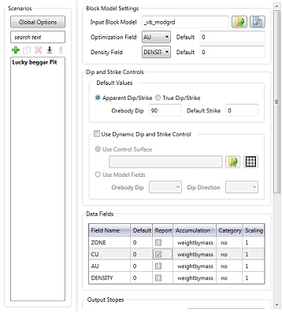
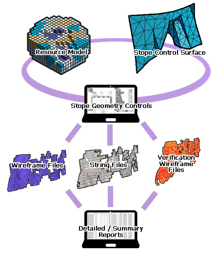
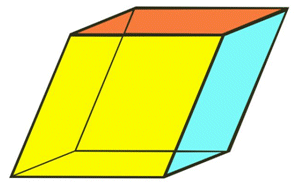

 |  Mineable Shape Optimizer (MSO) An explanation of fields and properties  
---|---  
  
# Mineable Shape Optimizer

### To access this function:

  * You can access MSO using the **Report** ribbon.

  * The MSO ribbon can also be displayed using the command "mineable-shape-optimizer-v3"

Background

MSO is used to generate the optimal size, shape and location of stopes for underground mine design using an input of block model grades or values. Previous methods like Datamine's Floating Stope Optimizer (as implemented in Datamines MRO application) define an envelope from floating a minimum stope shape. This method is well suited to preliminary reserve estimation work, but does not assist with detailed stope design to optimize the final location of stopes and pillars, allow for mining dilution, deal with narrow or dipping orebodies, or the maximization of recovered value.

Every orebody is different, and optimizing stope-shapes to those orebodies to produce realistic shapes is a complex geometric optimization problem.

Datamine's Mineable Shape Optimizer (MSO) provides a tool to produce optimal stope-shapes, with careful selection of parameters, in a rapid and repeatable fashion. The procedure is not fully automatic and sensible selection of parameters and controls will assist to improve the quality of results for complex situations.

MSO computes the optimal size, shape and location of stopes for an underground mine using an input block model which contains grades or values.  

MSO is used to produce stope-shapes and stope inventories from a block model that spatially represents the location of the mineralization. The MSO algorithms rely on a sub-cell block model to define the spatial location of mineralization (usually defined from a geological wireframe).

 |  MSO is not applicable for regularised block-models that use a percentage-populated field for contained metal (grade) or value (dollars). [More information about MSO block models...](<MSO3_BlockModels_Guidance.md>)  
---|---  
  
  
MSO v3 - Licensing

  
---  
MSO - Version 3  
  
The MSO ribbon contains functions that are licensed separately from your core system license. 

To use the MSO functions provided by the MSO ribbon, you will need to register a standalone MSOV3 license and make it available to the host machine.

An MSO license (for version 3) is available from your local Datamine representative. If you are a previous user of MSO functionality, contact your Datamine office to discuss how to upgrade your existing license to allow the latest version.

Please note that MSO ribbon functions cannot be accessed with an MSO (version 2) license

MSO - How it Works

MSO mimics what an engineer would do, generating strings on sections, linking these to create a wireframe shape and then evaluating the wireframes against a block model. MSO provides a stope-shape that maximizes recovered resource value above a cut-off while also catering for practical mining parameters such as; minimum and maximum mining width, anticipated wall dilutions, minimum and maximum wall angles, minimum separation distances between parallel and sub-parallel stopes, minimum and maximum stope heights and widths, etc.

[Key Geometrical Concepts in MSO...](<MSO3_Shape_Diagram.md>)

The Shape Optimizer searches for the optimal mineable shapes taking into account the orebody geometry. The stope shape is parameterized, and mimics what an engineer might do generating outlines on adjacent sections, and linking these to create a wireframe shape for evaluation against the block model. The sectional outlines are defined by four points on the roof and floor. Constraints can be applied on the dip and strike of the final stope shape. Multiple stopes can be generated on a level section with minimum pillar dimensions enforced.

Stope Optimization Methods

The Mineable Shape Optimizer tool supports the following shape frameworks:

  * "Slice Method" which generates and evaluates thin slices across the mineralized zones that are aggregated into seed-shapes (looking at all possible permutations) that satisfy stope and pillar width constraints. The seed-shapes are then annealed to the final optimized stope-shape satisfying the stope and pillar width, stope geometry constraints (e.g. wall dips angles, strike twist, etc.), and other miscellaneous constraints (e.g. zone mixing, exclusion zones, etc.). The result is a set of stope-shapes constrained to the basic limitations of the envisaged mining method.  
  
Slice method frameworks are available in either Standard or Advanced types.  
  
[Standard Slice Framework Settings](<MSO3_Shape_Framework_Settings_Standard.md>)  
[Advanced Slice Framework Settings](<MSO3_Shape_Framework_Settings_Advanced.md>)  

  * "Prism Method" which optimally combines a set of shapes from a library of stope-volumes within regions without allowing overlapping of the generated stopes. It is typically applicable to massive orebodies or wide/thick deposits whose stopes tend to be designed by blocking out the orebody in a grid-like pattern.  
  
[Prism Framework Settings](<MSO3_Shape_Framework_Settings_Prism.md>)  

  * "Boundary Surface Method" for narrow high grade reefs or lenses, where subcell modelling has some spatial accuracy limitations, it can prove more effective to model stope shapes off the geological wireframes directly. The stope walls are modelled as a mesh of points from [3x3] to [6x6] points. Dilution, orebody positioning in the stope, and an option to split the stope into waste and ore components, are provided.   
  
[Boundary Surface Framework Settings](<MSO4_Boundary_Surface_Method.md>)

Regardless of the method used for optimization, the input block model must have a VALUE field, or a GRADE and DENSITY field for optimization, and can also be a standard rotated block model. If the model cells do not fill the model space, as defined in the model prototype, or some grade fields are not defined, then the default grade, density or value field values are assumed.

The level spacing and section spacing for stope evaluation is defined by the defined shape framework. The shape framework prototype is assumed to have a single cell in the transverse direction, to allow the internal stope annealing process to locate stopes and pillars in the transverse direction.

Four configurations are possible for the block mode, and shape framework definition:

  1. Neither the input block model or the framework are rotated.

  2. Both input block model and framework are rotated, and have identical rotation definitions.

  3. Both input block model and framework are rotated, and have identical rotation definitions, but have a different origin.

  4. One or both are rotated but do not have compatible rotation definitions. This case introduces additional complexity in the stope evaluation calculations and is significantly slower. A block model PLANE definition must be supplied to control the direction of model discretization. For the other three cases the model PLANE and the prototype PLANE are identical, and only the prototype plane definition is required.

For rotated models the PLANE is parallel to one of the model axes.

Three methods are provided for determining the optimal stopes, depending on whether just a grade value is available; a value can be calculated from the grade taking into account price, mining and processing costs etc; or if the user can supply a calculated value estimate for the blocks in the model. A cutoff grade or value must be supplied. 

Multiple passes through the model are used to identify stopes and sub-stopes (also referred to as stoping units and stoping sub-units), and development in economic ore. First the wireframes for the stope geometry are defined for full sized stope shapes ie with the sublevel and section spacing defined from the stope shape framework, using the defined stope and pillar width parameters. 

Sub-stopes can then be defined to identify ore that would satisfy a portion of the full height, or portion of the full strike after the ore in full stopes is removed from consideration, in the simplest case generating half or quarter stopes. A further pass can be completed to identify economic ore on the levels outside the stopes that could be mined during development.  

Shape Annealing

Once the approximate size, location and shape of the stopes has been determined, the Shape Optimizer internally uses an annealing process to refine the stope shapes. The annealing process takes the seed shapes and anneals the shape to the final stope shape. 

The seed shapes are generated by an internal search procedure that creates slices aligned with the dip and strike of the orebody, that are subsequently merged taking into account the lateral stope and pillar dimensions. The dip and strike values can be supplied as an average parameter, be calculated from a geology structure wireframe, or be supplied as a field in the block model to define the local orientation (e.g. as evaluated with the Dynamic Anisotropy modeling option). 

[More about the MSO Shape Framework...](<MSO3_Frameworks_Concept.md>)

[Key Geometrical Concepts in MSO...](<MSO3_Shape_Diagram.md>)   

MSO Outputs

The process outputs the wireframes for each stope, the section strings used to generate the stope shape (in plan, section or both), and a report table of insitu tonnes and other selected reporting fields.

Nominated grade fields can be reported on for the stopes. Other fields can be nominated for evaluation as dominant fields, ie the field value with the greatest tonnage contribution is reported for characteristics like resource category, geological domain and ore types where a weighted average is not appropriate.  

Rotated Models

If the block model is supplied as a rotated block model, then the stope optimization is carried out within the local coordinate system of the rotated block model. The stope wireframe and strings are transformed into the world (rather than being output in the local) coordinate system.

[More information on MSO block models...  
](<MSO3_BlockModels_Guidance.md>)

Excluding Sterile or previously mined areas

Areas of the model can be flagged for exclusion from the stope optimization process. In a partially mined orebody, the as-built or depletion wireframes can be used to flag void volumes for example. An exclusions field in the block model identifies the depleted or sterilized area. The void model blocks can then be used to define a barrier for the stope optimizer.  

The Basic MSO algorithm

MSO fills the defined shape framework with a set of equally-sized sloped prisms whose dimensions are defined by the shape layout and discretization settings. In general the prisms will be smaller than the minimum allowed stope size; there is a trade-off between the number of prisms used, and the granularity with which the orebody is evaluated.

MSO then uses a path optimization algorithm to group together prisms that make up potential stopes or pillars.

Figure 1: A sloped prism \- the slope depends of the dip of the orebody.  
This example shows a 4-point shape - 6 and 8 point shapes are also possible.

The second stage of optimization involves annealing the stopes to produce practical stope shapes that more accurately fit the geology. The verification wireframe produced by MSO contains the potential stopes above cut off.  

What about Mineable Reserves Optimizer?

Datamines Mineable Reserves Optimizer (MRO) computes an envelope by floating a minimum stope shape within the input resource model. MRO is entirely suitable for preliminary reserve estimation but does not optimize the detailed final location of stopes and pillars, allowing for mining dilution.   

  
MSO Control Bar & Ribbon

The MSO ribbon contains a series of functions that allow you to define optimal stope shapes based on your selection of model, mining method and economics. Specifically, it provides access to the MSO "v3" engine, a major update to MSO functionality available in earlier versions of Studio (see above for information on licensing).  

The Mineable Shape Optimizer task bar is populated according to the selection made in the MSO ribbon:

  * Scenarios: define your stope optimization scenarios here, and set up the general (global) options for each scenario, such as the input block model, optimization field, dip and strike control etc. [More...](<MSOv3_Scenarios.md>)

  * Economics: for the active scenario, define the optimization objective (grade or recovered metal) and method (cut-off grade, cut-off value, calculated value). Also determine how cut-off is calculated. [More...](<MSOv3_Economics.md>)

  * Orientation: for your MSO scenario, specify the control surface, cut-off filter and legend. You also use this panel to specify stope-shape framework parameters. [More...](<MSOv3_Orientation.md>)

  * Shape: this panel is used to define the stope generation method, stope arrangement and alignment settings for your MSO scenario. [More...](<MSOv3_Shape.md>)

  * Controls: for the specified shape framework, use this panel to define the interval slices for your MSO method, including the stope width range (including minimum pillar width), height, dilution settings and more. [More...](<MSOv3_Control.md>)

  * Refinement: in this update to MSO, shapes are no longer restricted to 4 point outlines. This panel allows you to define the additional parameters required to support your 6 or 8 point shape definitions, including footwall and hangwall definitions. [More...](<MSOv3_Refinement.md>)

  * Materials: define your MSO materials. Define which material to include and exclude, and specify non-mixable materials and waste settings. [More...](<MSOv3_Materials.md>)

  * Options: set up up your MSO evaluation method, discretization intervals and other post-processing options. [More...](<MSOv3_Options.md>)

  * Sensitivities: use this panel to define the parameters to which your active MSO scenario will be sensitive. [More...](<MSOv3_Sensitivities.md>)

  * Run: execute an MSO run based on the previously-defined settings. [More...](<MSOv3_Run.md>)

  * Review: review your MSO scenarios, include per-scenario sensitivity settings, optimization data. View both summary and detailed reports. [More...](<MSOv3_Review.md>)

Once details have been specified for a particular panel, you can move to another panel to complete configuration and, ultimately, process your run and review the results. Data is saved automatically when changing tabs, changing scenarios, or when closing MSO.

 |  Related Topics  
---|---  
| [MSO Block Models - Guidance](<MSO3_BlockModels_Guidance.md>)   
[Slice Method Overview](<MSO3_Slice_Method.md>)   
[MSO Key Shape Concepts](<MSO3_Shape_Diagram.md>)